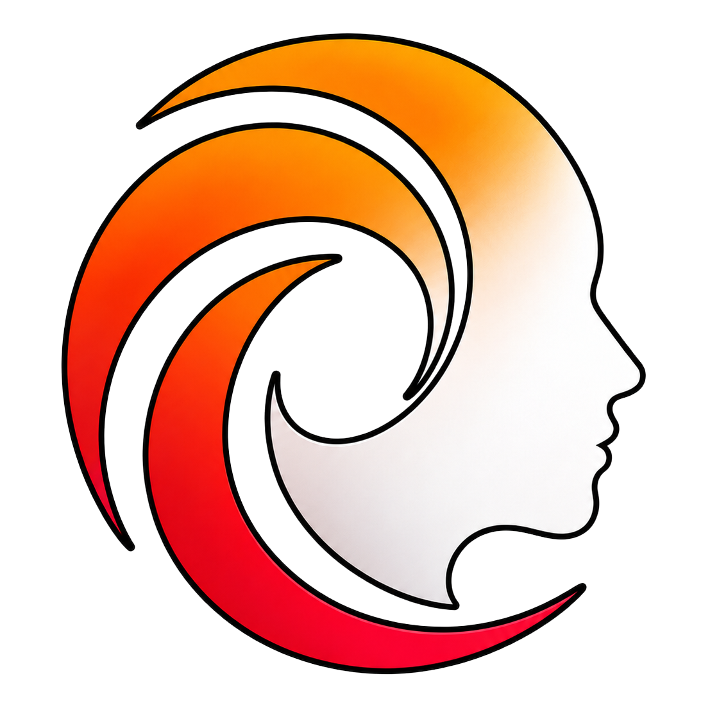

  

<h1 align="center">DTH Character Studio</h1>

  <strong>Define your character once. Generate a flawless, frame-exact Range of Motion in seconds.</strong>

  The companion app for the <a href="https://www.artstation.com/marketplace/p/BLM5K/daztohue">DazToHue</a> workflow — Daz&nbsp;Studio&nbsp;→&nbsp;Houdini&nbsp;→&nbsp;Unreal&nbsp;Engine.

  <a href="https://polynaut.github.io/dth-character-studio/"><strong>🌐 polynaut.github.io/dth-character-studio</strong></a> 
  features · downloads · getting started

  
  
  
  

---

## How it works

From one declarative character definition, the studio generates **both sides** of a
Range of Motion — the Daz Studio apply-script and the Houdini PoseAsset CSV —
frame-aligned **by construction**, so they cannot drift out of sync.

1. **Describe** your character — pick the Genesis version, add ROM sections and body morphs.
2. **Generate** — one click produces the Daz apply-script and the Houdini PoseAsset CSV.
3. **Apply** — run the script in Daz Studio, import the CSV in Houdini.
4. **Export** to Unreal Engine — with every frame already matching, by design.

## Get it

**[🌐 Get it from the website](https://polynaut.github.io/dth-character-studio/)** — it detects your OS and offers the right installer. Or grab the
**[latest release](https://github.com/polynaut/dth-character-studio/releases/latest)** directly (Windows installer / macOS build). The app self-updates from there.

**[📖 Getting started guide](https://polynaut.github.io/dth-character-studio/guide/)** — from install to your first generated ROM. (Also readable [right here in the repo](./docs/guide/README.md).)

> Prefer to run it yourself or build from source? See the [Development guide](./docs/development.md).

## Status

| Figure | Status |
| --- | --- |
| **Genesis 9 female** | ✅ Feature-complete, validated end-to-end — in Daz Studio, in Houdini, and byte-for-byte against hand-built artifacts |
| **Genesis 9 male** (Dicktator) | 🧪 Implemented — end-to-end validation in progress; gates v1.0 |
| **Genesis 8 / 8.1** | ✅ Usable today for full morph ROMs (the G8.1 preset path was validated against the DazToHue 1.9.x pipeline) — genital (GEN) sections wait on DazToHue itself adding G8 support |
| **Genesis 3** | 🧪 Selectable — DazToHue ships a subset of G3 pose assets; not yet validated end-to-end |

DTH Character Studio is **Windows-first** — the installer, updater and code
signing are all Windows-built — and releases also ship a **macOS** build of the
app. Note that the Daz-side **DTH Exporter Plugin** is Windows-only, so the
export step into the DTH pipeline still needs a Windows machine.

## Share definitions, not assets

Character definitions and the files the studio generates are **recipes** — they
reference Daz assets by morph name, frame number and bone, and contain no
licensed content. That makes them freely shareable; bring your own licensed
assets.

> **Don't share full Houdini projects or export folders.** Those contain baked
> licensed content (Alembic/FBX geometry, copied textures) and redistributing
> them violates the Daz / Renderotica asset licenses. Share the definition, not
> the assets.

## Built for the DazToHue workflow

- **[DazToHue](https://www.artstation.com/marketplace/p/BLM5K/daztohue)** by *mrpdean* — the Houdini/UE toolset this studio targets (the PoseAsset node, ROMs and pose presets).
- **[Guide To Creating Custom ROMs](https://docs.google.com/document/d/1e8B9uDSmiS-v5si0YLEnnAhcnhnfGl9m0RsgCE5EDWA/edit?tab=t.0)** — DTH's extended learning resource: the manual, step-by-step way to build a custom ROM, with the theory behind categories, generation methods and reference skeletons. Everything it walks through by hand is what this studio automates.
- **[DazToHue-Scripts](https://github.com/soltude/DazToHue-Scripts)** by *Soltude* and contributors — the Daz Studio scripting framework the studio's bundled runtime descends from. Everything the workflow needs now ships with the studio.

## Documentation

- [Development guide](./docs/development.md) — run, build, and architecture
- [DevOps](./docs/devops.md) — release pipeline, signing, branch policy
- [Contributing](./CONTRIBUTING.md)

## License

[MIT](./LICENSE) © Polynaut
