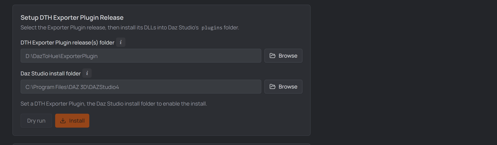

# 2 · One-time setup

Open **Settings** (top right) → **General** tab. Three things get wired up here:
your **Daz installation**, the **DTH release** (the content your ROMs are built
from) and the **DTH Exporter Plugin** (for exporting out of Daz). The last two
come from your
[DazToHue](https://www.artstation.com/marketplace/p/BLM5K/daztohue) purchase —
extract the downloaded archives somewhere permanent first.

The first two are usually already done for you: the tab opens with every Daz
Studio and every Houdini on the machine listed as a card. Click the one you
want and its paths are filled in and saved.

  
   
  <em>Both detections, each with a card activated: DAZ Studio 6 and Houdini 22.0.368, with the paths they derive shown read-only beneath.</em>

## Daz installation — pick it once

You already told the **DAZ Install Manager** where Daz Studio, your content
library and its product database live. The studio reads that rather than asking
again: every Daz Studio DIM has installed appears as a card at the top of
**Settings → General**.

  
   
  <em>Both Daz Studios found; DAZ Studio 6 activated, and the paths it derives shown read-only.</em>

Click one to **activate** it. Three paths are filled from it and saved
immediately — there is no Save to press, because the paths follow from the
choice:

| Path | Where it comes from |
| --- | --- |
| **My DAZ 3D Library** | the library DIM currently installs into |
| **Daz Studio install folder** | that card's own install folder |
| **DAZ Install Manager manifests folder** | DIM's product database (see [Product scanning](./product-scanning.md)) |

They show read-only underneath the cards while an installation is active — an
editable copy of a derived path is one that can quietly disagree with what
produced it.

> **Both Daz Studio 4 and 6 installed?** Both get a card and the newest is
> marked *recommended*, but nothing is activated until you click. Only the
> **install folder** follows the card — the library and product database belong
> to DIM, not to one Studio version, so switching cards leaves them alone.

**Nothing detected, or a machine DIM doesn't describe?** The section says so and
the three paths stay ordinary editable fields, exactly as before. The same
applies on purpose after activating: **Set the paths manually** hands them back,
keeping their current values.

## Houdini installation — same idea

Directly below, and the same deal: SideFX registers every installed Houdini, so
each one gets a card. Activating one fills **both** Houdini paths at once —
the installation folder and the matching
`houdini<major>.<minor>` documents folder.

  
   
  <em>Houdini 22.0.368 activated — its installation folder and the matching <code>houdini22.0</code> documents folder, filled together.</em>

**Filling them together is the point, not a convenience.** The studio runs
Houdini's `hython` with that documents folder as its preferences directory;
pointed at another version's, it loads the wrong DazToHue assets — or none — and
every DazToHue node comes back as an unknown type. Pairing them by hand is
exactly how that goes wrong, so the card does it for you.

> **An install whose documents folder doesn't exist yet** is still offered, with
> the missing folder named on the card. Houdini creates it on first launch, so
> the usual fix is to start that Houdini once and press **Rescan**. The
> *recommended* card skips it in the meantime.

**Extra Houdini folders stay yours.** The list further down is untouched by
activating — it exists so an older Houdini can keep an older DTH release, which
is a decision about the *other* versions. A `houdini<major>.<minor>` folder with
no installed Houdini behind it is reported below the cards rather than dropped;
it's usually left over from an uninstall.

## Setup DTH Release

  
   
  <em>The DTH release section in Settings → General.</em>

1. **DTH release(s) folder** — point it at the extracted DTH release, or at a
   folder holding several versions; then pick the **active** one in the
   dropdown. A release added later must be selected (and installed) yourself —
   the selection never changes on its own.
2. **Where it installs** — your Daz content library. With an installation
   activated above there is no field here at all: the line above the buttons
   names the destination it derives. Press **Install** to copy the release's Daz
   content into the library; **Dry run** previews what would be copied.

   Without an activated installation this is a **My DAZ 3D Library** field you
   fill in yourself (e.g. `…\Documents\DAZ 3D\Studio\My Library`).
3. **Houdini documents folder** *(optional)* — your Houdini user folder
   (e.g. `…\Documents\houdini20.5`). Press its **Install** to merge the
   release's Houdini assets (otls, presets, toolbar) into it. Skip this if
   Houdini isn't on this machine.
4. **Add another Houdini folder** *(optional)* repeats step 3 for a second
   Houdini version: each extra folder installs its release independently, so
   an older Houdini can keep an older DTH release.

## Setup DTH Exporter Plugin

Needed for exporting the ROM out of Daz (step 5) — including the studio's
automatic direct export.

1. **DTH Exporter Plugin release(s) folder** — the extracted Exporter Plugin
   download.

   

     
      
     <em>Point it at the extracted DTH Exporter Plugin download.</em>
   

2. **Which Daz Studio it installs into** — the card you activated decides, and
   the line above the buttons names the folder. Without an activated
   installation, a **Daz Studio install folder** field is there for you to fill
   in (e.g. `C:\Program Files\DAZ 3D\DAZStudio4`).
3. Press **Install**. Daz Studio usually sits in an admin-protected folder on
   `C:` — the app tells you when that's the case: close Daz, then reopen
   DTH Character Studio as administrator and install again.

   

     
      
     <em>The app warns when installing into Program Files needs admin rights.</em>
   

   

     
      
     <em>Open DTH Character Studio as administrator to install into a protected folder.</em>
   

## Install the DTH Character Studio Runner Plugin

The **Runner plugin** ships **inside the app** — nothing to download. It lets
the studio drive Daz Studio: the
[**DTH Export** batch](./05-rom-in-daz.md#batch-export--dth-export),
[**Tools → Scan & index → Scan project**](./tools.md#tab-1--scan-amp-index),
and opening scenes in an already-running Daz all go through it. With the Daz Studio install
folder set (above), press **Install** — the panel shows the bundled version,
the exact version installed in Daz, and says when an update is pending. The
same admin note as above applies, and Daz must be closed (a running Daz locks
its plugins).

## Save

Press **Save** at the top. The studio scans the release's pose presets — you're
ready to create a project.

## The App Data tab

Settings also has an **App Data** tab — the app's own on-disk state:

- **App data folder** — machine settings, the recent-projects list,
  network-drive mappings and scan outputs (project data lives in each project's
  own folder). The path chip copies it; Alt+click reveals it.
- **Storage & housekeeping** — the studio ages out **its own** generated data
  so it can't fill your disk: **Clean up now** deletes per-scene
  [product-scan](./product-scanning.md) files and `Scan_Frames` keyframe CSVs
  older than 30 days, plus **note media no note references anymore** after
  7 days (all three also swept automatically on every launch).

(Mapped **network drives** the app remembers show as their own pane at the
bottom of the **General** tab, with a "Re-map missing now" action.)

&nbsp;

> [!NOTE]
> **Extras (later):** the **[Tools](./tools.md)** page can also install your
> own Daz assets, custom morphs, and Daz/Houdini presets into the right
> places — none of it is needed for your first character.

&nbsp;

[← Install the app](./01-installation.md) · [Next: Your first project →](./03-first-project.md)
