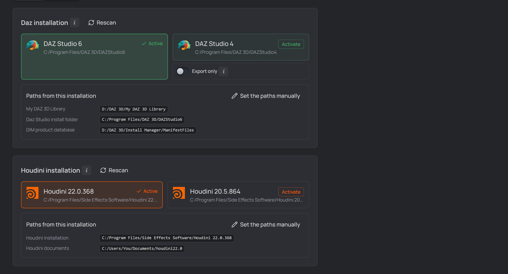
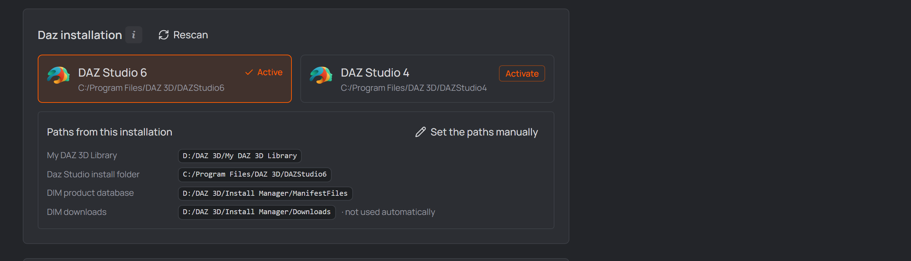
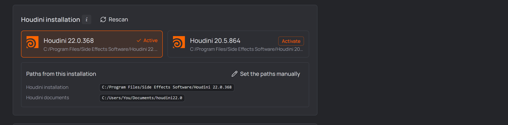
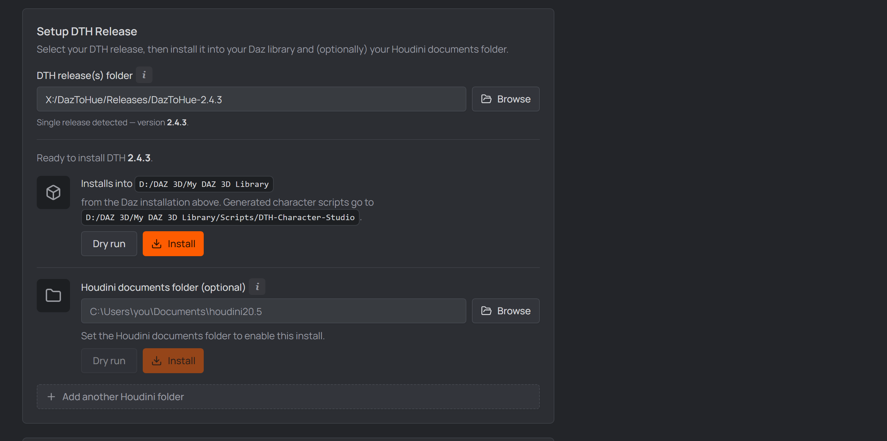
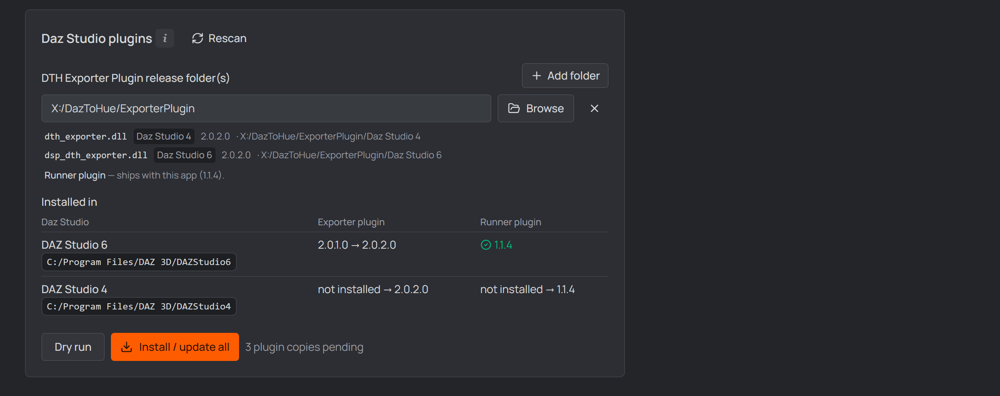

# 2 · One-time setup

Open **Settings** (top right) → **General** tab. Four things get wired up here:
your **Daz installation**, your **Houdini installation**, the **DTH release**
(the content your ROMs are built from) and the **Daz Studio plugins** (for
exporting out of Daz, and for letting the studio drive it). The last two come
from your [DazToHue](https://www.artstation.com/marketplace/p/BLM5K/daztohue)
purchase — extract the downloaded archives somewhere permanent first.

The **two installations** are usually already done for you: the tab opens with
every Daz Studio and every Houdini on the machine listed as a card. Click the one
you want and its paths are filled in and saved.

  
   
  <em>Both detections, each with a card activated: DAZ Studio 6 and Houdini 22.0.368, with the paths they derive shown read-only beneath.</em>

## Daz installation — pick it once

You already told the **DAZ Install Manager** where Daz Studio, your content
library and its product database live. The studio reads that rather than asking
again: every Daz Studio DIM has installed appears as a card at the top of
**Settings → General**.

  
   
  <em>Both Daz Studios found; DAZ Studio 6 activated, and the paths it derives shown read-only. The older card carries the <strong>Export only</strong> switch described below.</em>

Click one to **activate** it. Three paths are filled and saved on the spot —
there is no Save to press:

| Path | Where it comes from |
| --- | --- |
| **My DAZ 3D Library** | the library DIM currently installs into |
| **Daz Studio install folder** | that card's own install folder |
| **DIM product database** | DIM's manifests folder (see [Product scanning](./product-scanning.md)) |

They stay read-only while an installation is active, and they follow DIM: move
your library later and opening Settings picks it up, with nothing to
re-activate. The newest Studio is marked *recommended*, but nothing activates
itself, and switching cards changes only the install folder — the other two
belong to DIM, not to one Studio version.

**No DIM, or a machine it doesn't describe?** The section says so and the three
paths stay ordinary editable fields. **Set the paths manually** does the same
after activating, keeping the values.

### Export only — run the batch in an older Daz Studio

Skip this unless you have **two** Daz Studios installed.

The [DTH Export batch](./05-rom-in-daz.md#batch-export--dth-export) is the one
thing that needs the **Runner plugin**, and a Daz plugin is built against a
single Studio major version. So moving to a brand-new Daz Studio used to mean
waiting for a Runner build before you could export at all — or putting the whole
app back a version.

With the newest installation active, each **older** card that can still run a
batch carries an **Export only** switch. Turn it on and DTH Export starts its
batch **in that installation**; everything else — opening scenes, running
scripts, installing content — keeps using the active one. It saves on the spot
like Activate, and only one installation can carry it: turning it on for one
card turns it off everywhere else.

Two things follow the switch, and have to — the Runner plugin is **installed
into** whichever installation runs the batch, and the export panel **checks for
it there**. A Runner sitting in the other Daz would let the panel report
"ready", then start a Daz with nothing to claim the job, and wait for a batch
that never begins.

The switch is offered only on installations **older** than the active one, only
while the active one is the **newest** detected, and never on one whose folder
has gone missing. With a single Daz Studio it never appears — it exists for the
machine that has two and whose newer one has no Runner yet.

**Daz Studio 4 can carry it.** It needs the Exporter plugin's scripted export,
which mrpdean shipped in the Daz Studio 4 build with **Exporter 2.0.2.0** — with
an older one a DS4 batch opens every scene and exports nothing. Keeping every
installation on the newest build (below) is what settles that.

If the flagged installation later disappears from the machine, Settings says so
and offers to send exports back to the active one, rather than leaving every
export pointed at a folder that isn't there.

> [!NOTE]
> Don't confuse this with the **Export only** *mode* inside the
> [DTH Export panel](./05-rom-in-daz.md#batch-export--dth-export). That one
> decides *what* a batch does (export the saved ROM animations without
> rebuilding them); this switch decides *which Daz Studio* runs it.

## Houdini installation — same idea

Every Houdini SideFX registered gets a card directly below. Activating one fills
**both** paths together: the installation folder and its matching
`houdini<major>.<minor>` documents folder.

  
   
  <em>Houdini 22.0.368 activated — its installation folder and the matching <code>houdini22.0</code> documents folder, filled together.</em>

Pairing them is the point: the studio runs Houdini's `hython` with that
documents folder as its preferences directory, and pointed at another version's
it loads the wrong DazToHue assets — or none — leaving every DazToHue node an
unknown type.

> **Documents folder not there yet?** The card says so and stays on offer.
> Houdini creates it on first launch, so start that Houdini once and press
> **Rescan**.

The **extra Houdini folders** list further down is yours and is never touched by
activating — it exists so an older Houdini can keep an older DTH release. A
`houdini…` folder with no Houdini behind it is reported there rather than
dropped; usually an uninstall left it.

## Unreal Engine — detected, nothing to pick

Every Unreal Engine version the Epic Games launcher has installed is listed
below the Houdini section. Unlike Daz and Houdini there is **nothing to
activate**: each linked `.uproject` names its own engine version, and the
studio matches DTH content and plugins to it per project, at install time. The
list is your confirmation that detection sees what the launcher sees. An engine
whose folder is gone (uninstalled outside the launcher) is flagged rather than
hidden.

Detection reads **two** sources: the launcher's registry entries and its
`LauncherInstalled.dat` manifest. Both, because either can be incomplete — a
machine with 5.6, 5.7 and 5.8 installed had no registry key for 5.8 at all, so
an engine that was plainly there could not be picked.

## Setup DTH Release

  
   
  <em>The DTH release section in Settings → General — one release, and the destinations it installs into.</em>

Pick the release first; everything below it is a **destination**. Once one is
selected the panel says *Ready to install DTH x.y* and lists each install target
on its own row — the Daz library, then the Houdini documents folder — so the
section reads as one release going to two places.

1. **DTH release(s) folder** — point it at the extracted DTH release, or at a
   folder holding several versions; then pick the **active** one in the
   dropdown. A release added later must be selected (and installed) yourself —
   the selection never changes on its own.
2. **Where it installs** — your Daz content library. With an installation
   activated above there is no field here at all: the line above the buttons
   names the destination it derives. Press **Install** to copy the release's Daz
   content into the library; **Dry run** previews what would be copied.

   Without an activated installation this is a **My DAZ 3D Library** field you
   fill in yourself (e.g. `…\Documents\DAZ 3D\Studio\My Library`).
3. **Houdini documents folder** *(optional)* — your Houdini user folder
   (e.g. `…\Documents\houdini20.5`). Press its **Install** to merge the
   release's Houdini assets (otls, presets, toolbar) into it. Skip this if
   Houdini isn't on this machine.
4. **Add another Houdini folder** *(optional)* repeats step 3 for a second
   Houdini version: each extra folder installs its release independently, so
   an older Houdini can keep an older DTH release. It is offered only while the
   Houdini paths are **yours to edit** — with a Houdini installation activated
   above, the destination follows that card and no new folders can be added
   (folders added earlier stay, with their own Install buttons). Use
   **Set the paths manually** in the Houdini installation section if you want to
   drive several folders by hand again.

## Daz Studio plugins

Two plugins live inside Daz Studio, and the studio installs both — into **every**
Daz Studio it finds on this machine:

- the **DTH Exporter** (mrpdean's), which exports the ROM out of Daz — you point
  the studio at its release folder;
- the **DTH Character Studio Runner** (ships inside the app, nothing to
  download), which lets the studio drive Daz: the
  [**DTH Export** batch](./05-rom-in-daz.md#batch-export--dth-export),
  [**Tools → Scan & index → Scan project**](./tools.md#tab-1--scan-amp-index),
  [**Import from Daz scene**](./05-rom-in-daz.md), and opening scenes in an
  already-running Daz all go through it.

1. **DTH Exporter Plugin release folder(s)** — **Add folder** and pick the
   extracted download. Both Daz Studio 4 and Daz Studio 6 builds are handled: if
   your download holds a folder per version (`ExporterPluginDaz Studio 4` beside
   `ExporterPluginDaz Studio 6`), point at the folder ABOVE them and the studio
   finds both. Keep the versions somewhere else? Add one folder each.

   Which Daz Studio a build is for is read from the DLL itself — Daz Studio 6
   only loads plugins named `dsp_*.dll`, so the name is the answer. The list
   under the field shows what was found, and flags a folder whose name disagrees
   with the DLL inside it.

   

     
      
     <em>One release folder, both builds found — and every Daz Studio on the
     machine listed with what it has and what it would get.</em>
   

2. **Installed in** — one row per Daz Studio on the machine, with what each has
   now and what it would get. A Daz Studio with no matching build says so rather
   than being handed the wrong one (a Daz Studio 6 cannot load a Daz Studio 4
   plugin at all).

3. Press **Install / update all**. Only what is pending is copied; when
   everything is current the button becomes **Reinstall all**. Each copy is its
   own line in the report, named after the installation it went into, so one Daz
   needing admin rights while another doesn't reads as exactly that.

   Daz Studio usually sits in an admin-protected folder on `C:` — the app tells
   you when that's the case: close Daz, then reopen DTH Character Studio as
   administrator and install again. **Daz must be closed either way** — a running
   Daz Studio locks its loaded plugin DLLs.

   

     
      
     <em>The app warns when installing into Program Files needs admin rights.</em>
   

   

     
      
     <em>Open DTH Character Studio as administrator to install into a protected folder.</em>
   

   Once the elevated install succeeds, the app offers **Restart normally** —
   take it: while the studio runs as administrator, Windows silently blocks
   drag-and-drop from Explorer into its window (nothing happens, no error).
   The restart reopens your project without elevation and drops work again.

## Unreal Engine Plugins

The folders the studio looks in for **Unreal Engine plugins** to offer when
installing into a linked Unreal project. A folder can be:

- a **plugin itself** (its `.uplugin` at the top), with the UE version it was
  built for usually in the path — `…\DazToUnreal_5.7`;
- a **folder of plugins**, one subfolder per plugin;
- a **multi-build root** with one subfolder per engine version — e.g.
  `…\DazToUnrealBridge\UE_5.7\Plugins` next to `…\UE_5.6\Plugins`. The studio
  picks the build matching each project's engine version at install time, so a
  new build dropped in later is found on the next install.

**A plugin shipped as a `.zip` counts too.** Some vendors hand you
`…\Unreal Engine 5.7 Plugin\DazToHue.zip` and nothing else. The studio reads
inside the archive, lists the plugin like any other (with a **zip** marker), and
**extracts** it at install time into `Plugins\<Plugin>\` — a wrapping folder
inside the zip is stripped, so the `.uplugin` lands where Unreal expects it
either way. Leave it zipped; there is nothing to unpack by hand.

Under each folder the panel previews exactly what was recognized, with the
engine version each build was matched to (from a version in its path — deepest
wins — falling back to the `.uplugin`'s own `EngineVersion`; no version
anywhere means the build is offered for every engine). A number that could not
be an engine version is skipped rather than believed: `KawaiiPhysics_5.7_1.21.0`
names the engine *and* the plugin's own version, and only `5.7` is one — so is
a year like `2024.1`. When nothing in a name is a possible engine version the
build is offered everywhere, which is the safe answer: a version no engine has
would quietly hide it from every project instead. Nothing installs from
here: the install dialog on a project's Unreal card does that, per project —
see [Linking Unreal projects](./03-first-project.md#linking-unreal-projects).

> **A name is a label; the binaries are the truth.** A built plugin carries a
> **`BuildId`** in `Binaries\Win64\UnrealEditor.modules`, and Unreal refuses to
> load one whose id differs from the engine's — that is the *"missing or built
> with a different engine version"* dialog. The install dialog checks it, marks
> a mismatch **built for another engine build** and leaves it unchecked (you can
> still tick it; it is a warning, not a refusal). This is the only check that
> catches a folder whose name says nothing — `KawaiiPhysics_5_7_1_…` writes its
> version with underscores, so it reads as *any engine* and would otherwise be
> offered for a project it cannot load in.
>
> It also decides **which** build you are offered when two of them look alike:
> with `KawaiiPhysics_5_7_1_…` and `KawaiiPhysics_5_8_…` both reading as *any
> engine*, the one whose BuildId matches your project's engine is the one that
> gets listed.

## Save

Press **Save** at the top. The studio scans the release's pose presets — you're
ready to create a project.

## The App Data tab

Settings also has an **App Data** tab — the app's own on-disk state:

- **App data folder** — machine settings, the recent-projects list,
  network-drive mappings and scan outputs (project data lives in each project's
  own folder). The path chip copies it; Alt+click reveals it.
- **Storage & housekeeping** — the studio ages out **its own** generated data
  so it can't fill your disk: **Clean up now** deletes `Scan_Frames` keyframe
  CSVs and any leftover [product-scan](./product-scanning.md) drop files older
  than 30 days, plus **note media no note references anymore** after
  7 days (all three also swept automatically on every launch). Product-scan
  files are normally deleted the moment the studio reads them, so that folder
  is usually empty — the age-out is a safety net for one that was locked.
- **DTH Exporter job file** — the same section can clear a **stuck batch
  handoff**. DTH Export and the scans hand Daz Studio their work through one
  file in your Daz library's `Scripts/DTH-Character-Studio` folder, and if a
  batch never starts (Daz was closed mid-handoff, or the Runner plugin never
  picked it up) that file stays behind — after which every export and scan
  refuses with *"a batch is waiting for Daz Studio"*. The readout names the file
  that's there, how old it is, and whether Daz might still be working through
  it; **Delete job file** removes it. Nothing in Daz is undone — the file is a
  to-do list, not a result.

(Mapped **network drives** the app remembers show as their own pane at the
bottom of the **General** tab, with a "Re-map missing now" action.)

&nbsp;

> [!NOTE]
> **Extras (later):** the **[Tools](./tools.md)** page can also install your
> own Daz assets, custom morphs, and Daz/Houdini presets into the right
> places — none of it is needed for your first character.

&nbsp;

[← Install the app](./01-installation.md) · [Next: Your first project →](./03-first-project.md)
