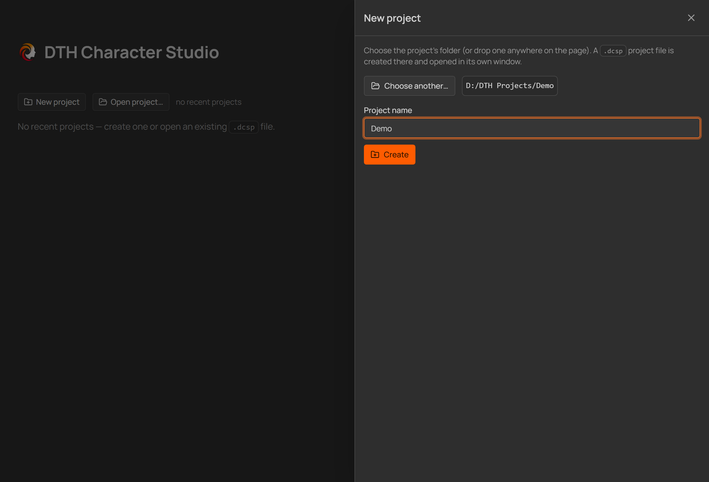
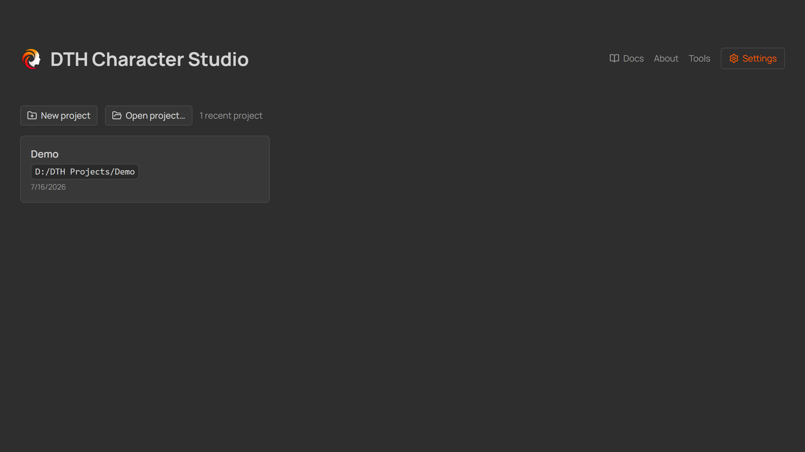
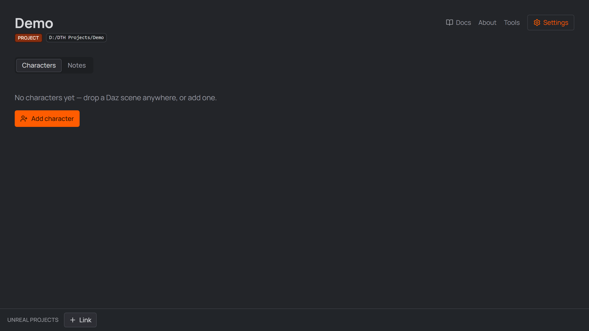
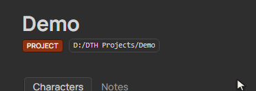
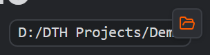
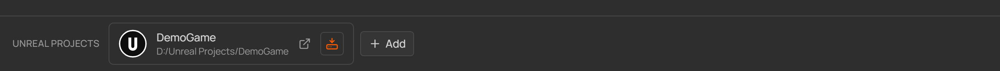

# 3 · Your first project

A project groups the characters of one production (a game, a film, a series of
commissions). On disk it is simply a **folder you choose**, marked by a single
**`.dcsp`** project file — keep it wherever you keep that production's files,
back it up with them, and you're done.

## Create it

  
   
  <em>The New project panel on the Home screen.</em>

1. On the **Home** screen press **New project**.
2. **Choose folder…** — pick the folder the project should live in.
   You can also just drop a folder anywhere onto the Home screen.
4. Give it a **Project name** and press **Create**.

The project opens **in its own window**. From now on you can also open it by
double-clicking the `.dcsp` file in Explorer, or from the Home screen's recent list:

  
   
  <em>The Home screen — recently opened projects reopen with one click.</em>

  
   
  <em>The project opens in its own window.</em>

## Good to know

- Every character you create becomes a **subfolder of the project** — definition,
  scenes, and generated files live together, so the project folder is fully
  self-contained and portable.  
- Per-project options (folder layout, optional [Assets](./attachments.md) and
  [Daz Products](./product-scanning.md) features) live in **Settings → Project** —
  the defaults are fine for a first run.

- **Path chips** — the monospace path badges all over the app — **copy the full
  path on click** (a check mark confirms it); **Alt+click opens the location
  in Explorer** (for a file, its folder). Where a chip carries a pencil, it
  edits the value in place. The same Alt+click works on every linked card —
  Daz scenes, Houdini projects and Unreal projects.

  

    
     
    <em>Hover shows the copy badge; a click copies the full path.</em>
  

  

    
     
    <em>Holding <strong>Alt</strong> flips the badge to a folder — Alt+click opens the path's location in Explorer.</em>
  

## Linking Unreal projects

The bar docked to the bottom of the project window holds the **Unreal projects**
this studio project feeds. Link one or more `.uproject` files with the button or
by dropping them onto the bar — links only: the files stay where they are, and
unlinking never deletes anything.

- **Click a card** to open that project in Unreal Engine — **Alt+click** shows it
  in Explorer instead.
- **The small install button** on each card bootstraps the Unreal project with
  DTH: it copies the linked DTH release's *Unreal Engine Content* into the
  project's `Content/DazToHue` — a fresh Unreal project is DTH-ready in one
  click. The button dims once the folder exists; **Ctrl+click always installs**,
  overwriting the content with whatever release is currently selected in
  Settings (handy after switching the DTH release — files are copied over,
  project-local additions inside the folder survive).

  
   
  <em>A linked Unreal project card in the footer bar.</em>

[← One-time setup](./02-setup.md) · [Next: Your first character →](./04-first-character.md)
