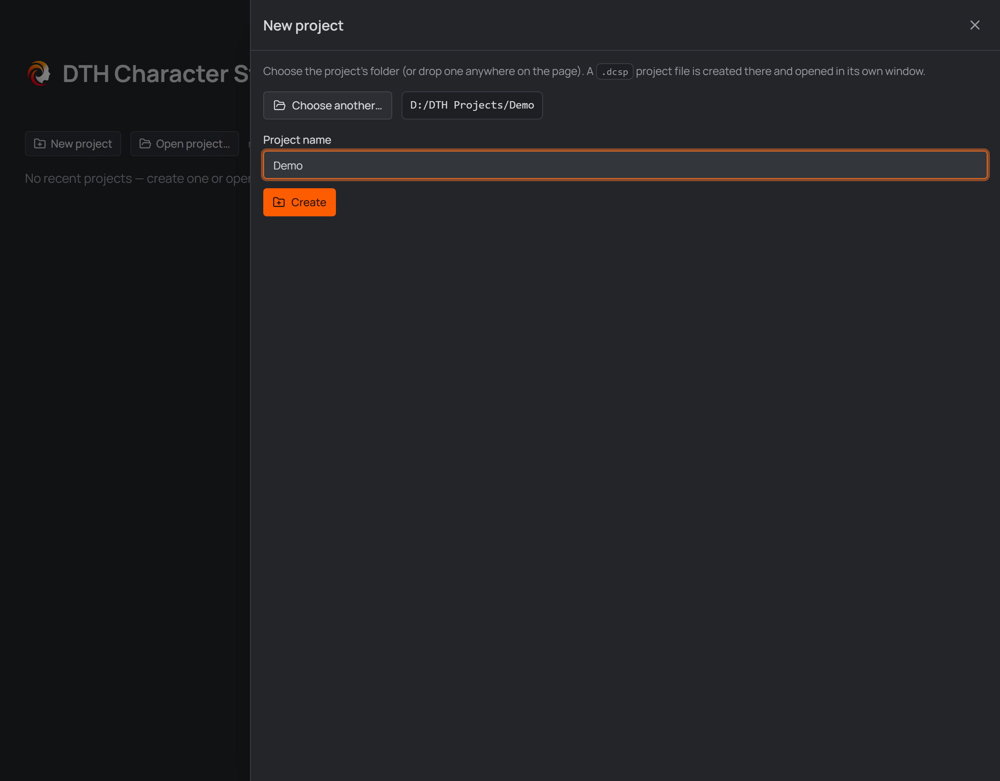
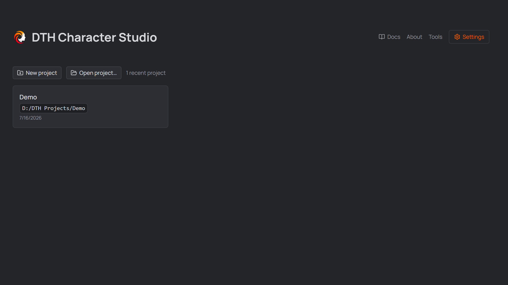
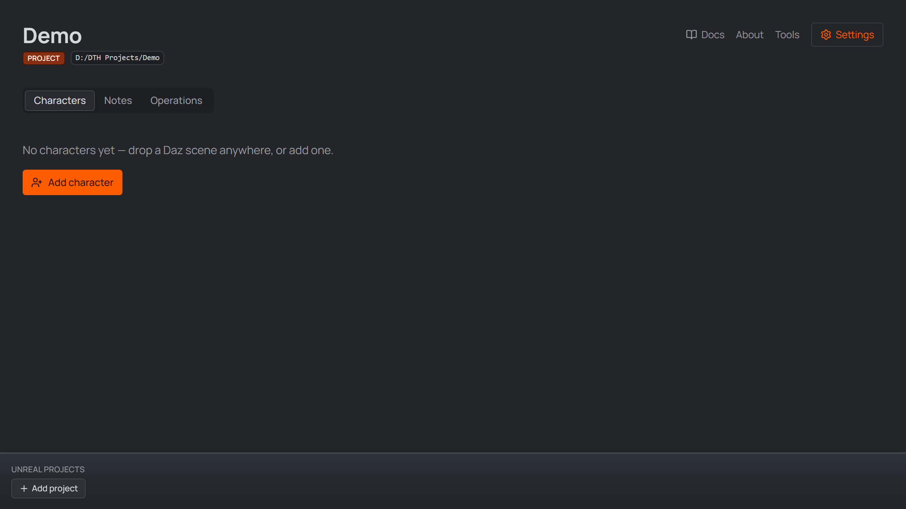
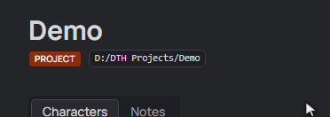
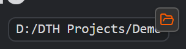
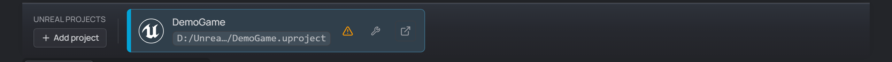

# 3 · Your first project

A project groups the characters of one production. On disk it is a **folder you
choose**, marked by a single **`.dcsp`** file — keep it wherever you keep that
production's files and back it up with them.

## Create it

  
   
  <em>The New project panel on the Home screen.</em>

1. On the **Home** screen press **New project**.
2. **Choose folder…** — pick the folder the project should live in (or drop a
   folder anywhere onto the Home screen).
3. Give it a **Project name** and press **Create**.

The project opens **in its own window**. From now on you can also open it by
double-clicking the `.dcsp` in Explorer, or from the Home screen's recent list.

  
   
  <em>The Home screen — recently opened projects reopen with one click.</em>

  
   
  <em>The project opens in its own window.</em>

## Good to know

- Every character becomes a **subfolder of the project** — definition, scenes and
  generated files live together, so the project folder is self-contained.
- Beside **Characters** the project page has **Notes** (freeform markdown) and
  **Operations** (the project-level danger zone). Enabling
  [Assets](./attachments.md) adds an **Attachments** tab.
- Per-project options live in **Settings → Project**; the defaults are fine for a
  first run. One is destructive: changing **Characters subfolder** later *moves*
  the existing character folders.
- **Path chips** — the monospace path badges all over the app — **copy the full
  path on click**, and **Alt+click opens the location in Explorer**. A chip with a
  pencil edits the value in place. The same Alt+click works on every linked card.

  

    
     
    <em>Hover shows the copy badge; a click copies the full path.</em>
  

  

    
     
    <em>Holding <strong>Alt</strong> flips the badge to a folder — Alt+click opens the path's location in Explorer.</em>
  

## Linking Unreal projects

The bar docked to the bottom of the project window holds the **Unreal projects**
this studio project feeds. Link `.uproject` files with the button or by dropping
them onto the bar — links only: the files stay where they are, and unlinking
never deletes anything.

- **The open button** launches the project in Unreal Engine; **Alt+click** shows
  it in Explorer. The rest of the card is inert — no accidental launches.
- **The install button** opens the **install dialog**: everything is pre-checked,
  so uncheck what you don't want and press **Install**.
  - the linked DTH release's *Unreal Engine Content* (into `Content/DazToHue`);
  - the **DTH Character Studio Runner**, marked **built in** because it ships
    inside the app — the small Python plugin that makes
    [Send to Unreal](./06-into-houdini.md#send-to-unreal) work. Restart the editor
    once after installing it; a card shows an amber ⚠ when its project holds an
    older copy than the app ships;
  - every plugin build from your
    [Unreal Engine Plugins folders](./02-setup.md#unreal-engine-plugins) matching
    this project's engine version.

  A checked item already in the project is overwritten with the offered build
  (project-local additions inside the folders survive). A project whose engine
  association is a source-build GUID lists every build unchecked instead.
- **Creating the Unreal project itself is Unreal's job** — its New Project screen
  is where the templates live. Make it in Unreal, then link it here.

  
   
  <em>A linked Unreal project card in the footer bar.</em>

[← One-time setup](./02-setup.md) · [Next: Your first character →](./04-first-character.md)
