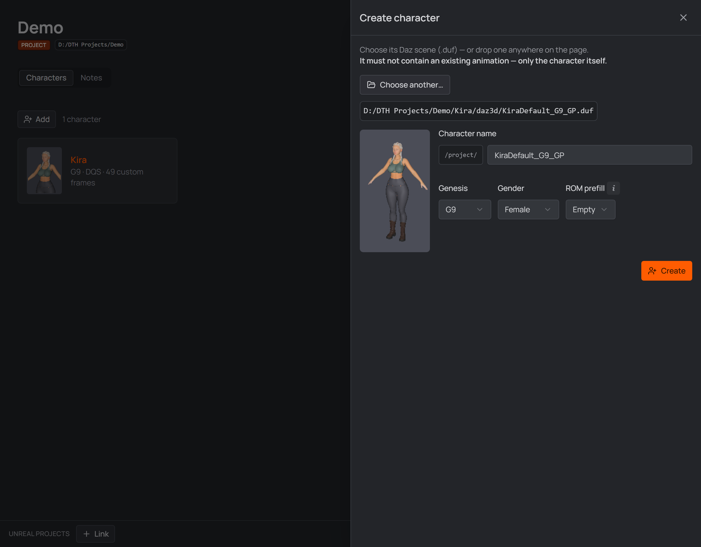
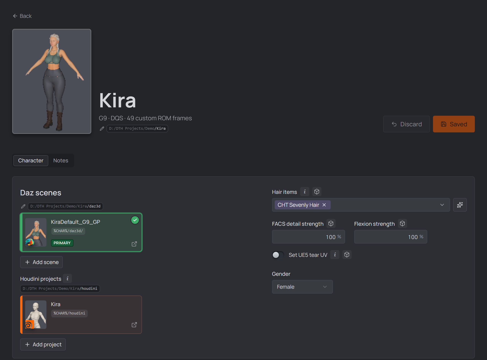
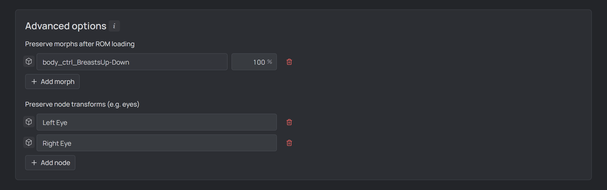
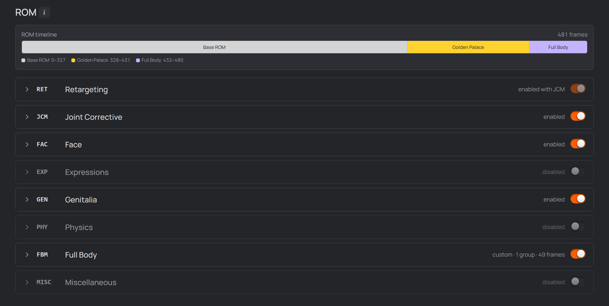
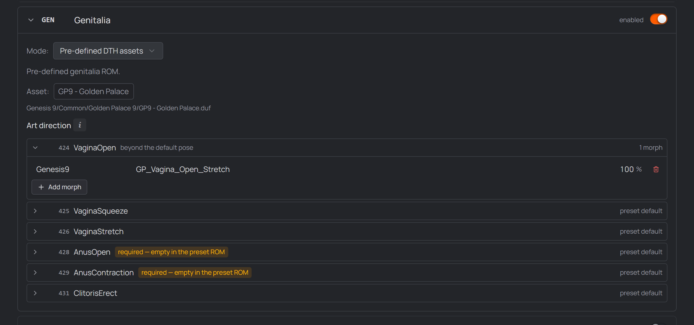
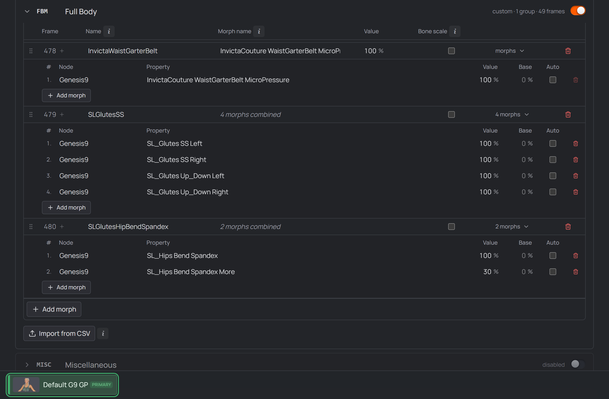
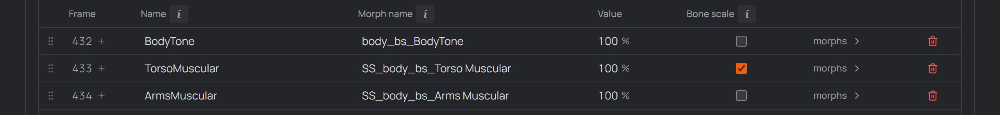
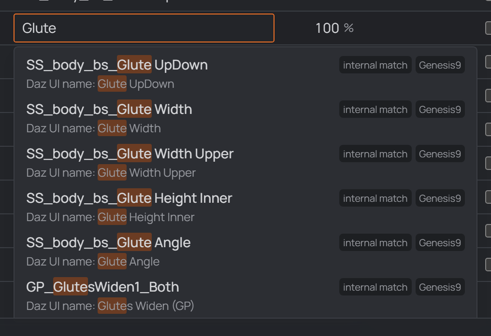
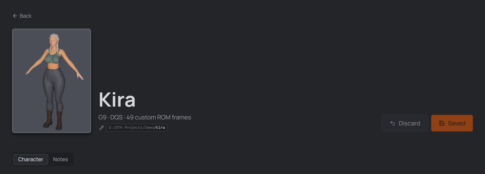

# 4 · Your first character

## Create it

  
   
  <em>The Add character panel in the project window.</em>

1. In the project window press **Add character** (or drop a `.duf` anywhere).   
3. **Choose Daz scene…** — the character's scene file.
   **It must not contain an animation** — just the character itself.
4. Name it (the name becomes its folder in the project), confirm **Genesis** (G9)
   and **Gender**.
5. **ROM prefill** — start **Empty** for a first character, or prefill from any
   of your own characters (across projects) to copy a working ROM definition.

6. Press **Create**. The scene is copied into the character's folder — your
   original stays where it is.

## Character settings

  
   
  <em>The top of the character page: Genesis/Gender, the Genesis 9 box, the primary Daz scene, hair items, and the linked Houdini project.</em>

The **Genesis** and **Gender** selects can be changed after creation — gender is
what decides the [GEN section's](https://polynaut.github.io/dth-character-studio/guide/04-first-character.html#golden-palace---dicktator--the-genitalia-gen-section) product (**Golden Palace**
for a female character, **Dicktator** for a male). All four generations are
selectable; the deeply validated path is **G9** (and G8.1 on the old pipeline) —
for the others, DTH ships a subset of pose assets and the studio offers whatever
the active release actually provides.

G9 characters also get a **Genesis 9 specific** box next to the Genesis/Gender
fields:

- **Set UE5 tear UV** — a toggle. When on, the generated ROM script switches the
  **Genesis 9 Tear** figure's shader **UV Set** to **UE5** during the build — so
  DTH's **Lacrimal Fluid** material lines up without you doing the manual
  *Surfaces ▸ Genesis 9 Tear shader ▸ UV Set ▸ UE5* step every time. It only
  matters if you use that material, and an example UE5 tear UV only ships for
  Genesis 9 — so it's off by default and absent on other generations.
- **FACS detail strength / Flexion strength** — the G9 strength dials
  (**FACS Detail Strength** and **Flexion Automatic Strength**), applied at
  frame 0 as the ROM builds. Daz-style percentages (0–100 %), like every morph
  value in the studio. Leave them at `100 %` unless your character needs the
  stock correctives dialed up or down.

<strong>Linked files — Daz scenes &amp; Houdini projects</strong>

<table><tr><td>

- **Daz scenes** — the character's scene, plus any number of extra scenes
  (outfit/look variants): **drop a `.duf`** on the card to add one; a dialog asks
  whether to **copy it into the character's folder** (optionally under a
  subfolder) or leave it where it is. The original scene can't be unlinked;
  extras can be removed. **Scenes subfolder** moves the whole scenes folder. Each
  scene has **Open in Daz** — if Daz Studio is already running with a scene
  loaded, the studio walks you through closing it and the button flips to
  **Open now** once Daz has quit.
- **Houdini projects** — drop `.hip`/`.hiplc` files to link the character's
  Houdini project(s). Click one to open it in Houdini, **Alt+click** to reveal
  its folder.

</td></tr></table>

&nbsp;

> [!TIP]
> **Hair items** (per-scene hair kept out of the export) and everything else
> around **multiple Daz scenes on one character** — outfit variants, the selected
> scene, and per-scene overrides (ROM frames, identity dials, preserve items) — read
> [Advanced: Multiple Daz scenes](https://polynaut.github.io/dth-character-studio/guide/advanced.html#multiple-daz-scenes--outfits-amp-hair-variants).

## Script install location & export directory

The **Daz scripts generated** box shows where the generated `ROM_…` (and, with
split export, `Export_…`) scripts install on Save:
`<My DAZ 3D Library>/Scripts/DTH-Character-Studio/<project>/<character>/` — needs
"My DAZ 3D Library" set in [Settings](./02-setup.md); the folder is created the
first time a script is generated.

The **Export directory** section drives [direct export](./05-rom-in-daz.md#direct-export-optional-recommended):
**Choose folder…** opens the picker (starting at the character's Houdini folder
as guidance), and **Clear** turns direct export off again. With no export
directory set the studio generates the ROM only — **Bone scale** flags then just
ride along as no-ops until you set one.

<strong>Advanced options — preserve morphs &amp; node transforms</strong>

<table><tr><td>

  
   
  <em>The Advanced options section on the character page.</em>

The **Advanced options** panel near the bottom of the character page — none of it
is needed for a working ROM:

- **Preserve morphs after ROM loading** — the DTH ROM zeroes morphs as it loads.
  Any morph you list here is **restored to the value you set afterwards** — use it
  for body-shaping controls (e.g. breast or muscle morphs) you want to keep across
  the whole ROM. Enter the morph's **property name** and its **hold value**.
- **Preserve node transforms** — a node's transform is **memorized before** the ROM
  loads and **restored after**, so posed nodes (e.g. the eyes) keep their
  orientation instead of being reset. Enter the **node's label** as it appears in Daz.

On a **non-primary Daz scene** each of these entries becomes **per-item
overridable** — the cube glyph, green border and reset appear per row, so an outfit
scene can preserve different morphs or nodes than the primary (see
[Advanced: per-scene overrides](./advanced.md#per-scene-overrides--edit-to-override)).

</td></tr></table>

## The ROM definition

  
   
  <em>The ROM sections on the character page.</em>

A ROM is a fixed sequence of eight sections. Each can be **enabled or disabled**,
and runs in **Preset** mode (the DTH release's stock pose assets) or **Custom**
mode (your own poses and morphs)

Above the sections, a colored **timeline bar** maps the whole ROM: one segment per
block (preset and custom), widths proportional to their frame counts — hover a
segment for its exact frame range. It re-renders as you edit, so you always see
where every section lands before anything runs.

<strong>Golden Palace &amp; Dicktator — the genitalia (GEN) section</strong>

<table><tr><td>

  
   
  <em>The GEN section's Golden Palace art-direction frames — a morph set per frame.</em>

**GEN** is the genital geograft's range of motion. You don't choose the product —
the character's **Gender** (set when you created it) decides: a **female**
character uses **Golden Palace**, a **male** character uses **Dicktator**. Our
example is a G9 Female, so her GEN section covers Golden Palace.

Enable GEN on **Preset** and the studio drops the DTH release's stock GP/DK ROM
block into the fixed GEN slot (after EXP, before PHY), frame-aligned like every
other section. But the preset only supplies the *motion* — the **look is yours to
art-direct**. The section lists the block's **Art direction** frames; go through
them and, for each frame, set the morph (or morphs) that give it the shape you
want — node, morph name and value, exactly like any custom morph.

Frames flagged **required — empty in the preset ROM** ship with no shape at all, so
they do nothing until you set a morph there. Ones you leave alone keep the preset
default. Your choices are written to a per-character art-direction JSON that's
stamped onto those frames as the ROM loads.

Two things worth knowing:

- **The geograft has to be fitted to the figure in the character's Daz scene.**
  The preset poses the geograft itself, so if Golden Palace / Dicktator isn't
  loaded and fitted when you build the ROM, those frames fail.
- **Preset only appears where the DTH release ships that asset.** If your release
  carries no Golden Palace / Dicktator content for the character's Genesis
  generation, the studio flags GEN's Preset as unavailable instead of letting you
  generate a block that can't run.

You built your own pose asset for the genital graft? Switch GEN to **Custom** and
use your own asset!

</td></tr></table>

&nbsp;

> [!NOTE]
> The studio computes every frame number from this structure — you never type a
> frame, and the Daz and Houdini outputs can't drift apart.

## Custom morphs

For this example we add some **Full Body Morphs (FBM)**, switch it to Custom, and list the morphs your
character should use

<strong>Import from existing Daz scene</strong>

<table><tr><td>

Import with **Import from CSV**: run the bundled **`Scan_Frames`**
script in Daz Studio (`Scripts › DTH-Character-Studio`) and
its scan of the open scene — every keyed morph frame — and it writes a .csv file

The csv shows up in the import
picker automatically, one CSV per scene name. A **Browse** button still takes any CSV
you curated yourself.

</td></tr></table>

Each pose row has two name fields with very different jobs:

- **Name** — *your* name for the generated morph, the one value that travels to
  **Houdini** and later **Unreal Engine**. Letters, numbers and underscores
  **only** — Houdini rejects anything else, and the field flags invalid
  characters. The group's Left/Right suffix is appended automatically.
- **Morph name** — must **exactly match the morph's internal name in Daz
  Studio** (not its display label). A mismatch means that frame fails in the
  ROM run.

A pose row can also drive its one output from **several Daz morphs at once** —
expand its **morphs** toggle.

  
   
  <em>Expanded pose rows — a plain single-morph row on top, and two rows combining several morphs into one output below.</em>

Every entry in that expanded list carries its own:

- **Node** — the scene node the morph lives on (`Genesis9`, `GoldenPalace_G9`, a
  bone, …); autocomplete fills it in when you pick a suggestion.
- **Property** — the morph's internal Daz name (same rule as the single Morph name).
- **Value** — what this morph is dialed to at the pose's frame.
- **Base** *(optional)* — the value the morph **returns to** on the frames around
  the pose (default `0`). Set it for a morph that's already part of the character's
  base shape, so the ROM keys the *delta* from that base instead of snapping the
  morph up from zero.
- **Auto** — instead of a fixed **Base**, tick this to read the base from the
  morph's **current scene value** when the apply-script runs — handy when that
  resting value differs from character to character.

<strong>Combining several morphs into one output — why you'd do it</strong>

<table><tr><td>

A pose usually maps one Daz morph to one generated output. Combining bakes a shape
that only exists as a combination of dials — or a controller plus its corrective —
into a single clean morph for Houdini and Unreal. All the listed morphs are keyed
together on that one frame, so they blend into the single output named in **Name**.
**Add morph** piles on more; the trash icon drops one (a pose always keeps at least
one).

</td></tr></table>

<strong>Bone scale — morphs that scale bones (reference skeletons)</strong>

<table><tr><td>

Some morphs don't just push vertices — they **scale bones** (Torso Length,
Proportion Height, and the like). Morphs can only move vertices, and Daz's FBX
export doesn't carry bone scales either — so on its own, the generated morph would
reshape the body while the skeleton stays put. Those frames need a
**reference-skeleton FBX**: an export carrying the morph *and* its bone scale,
which the Houdini PoseAsset points at for that frame (its *Reference FBX File*
input) to correct the skeleton to the pose.

Building that FBX by hand used to be the only way. Now just tick **Bone scale** on
the pose row and — **when you export through the studio** (an export directory is
set) — it handles the rest end to end:

- the frame is handed to the **DTH Exporter Plugin**, which writes its
  reference-skeleton FBX automatically — into a `Reference Skeletons` subfolder of
  your export directory;
- that FBX's path is filled into the PoseAsset CSV for you, resolved to the exact
  absolute location the exporter wrote — so Houdini finds it with nothing to type.

  
   
  <em>Tick Bone scale on a bone-scaling morph — its reference-skeleton FBX is exported and referenced for you.</em>

&nbsp;

> [!NOTE]
> **Bone scale only acts when an [Export directory](./05-rom-in-daz.md) is set** —
> that's when the studio runs the exporter and writes the FBX. With no export
> directory the studio generates the **ROM only** (no export call is involved), so a
> ticked Bone scale is simply a no-op — you export the reference skeletons yourself.
> Set an export directory later and it becomes live, no re-ticking needed.

Only **GEN** and **FBM** poses can be reference frames — the two categories
DazToHue supports reference skeletons in. DTH's own
[Guide To Creating Custom ROMs](https://docs.google.com/document/d/1e8B9uDSmiS-v5si0YLEnnAhcnhnfGl9m0RsgCE5EDWA/edit?tab=t.0)
describes the feature in depth — including the manual memorize/restore workflow
the studio replaces.

</td></tr></table>

<strong>Section &amp; group tools — suffixes, mirroring, reordering, inserting</strong>

<table><tr><td>

Each section header has its **Enable** switch and **Mode** (Preset / Custom)
select. In Preset mode you can **pick the exact DTH release asset** (when several
match); a red **no preset asset** chip appears when the active release ships
nothing for the character's generation. The **JCM** section's Custom mode takes a
**path to your own pose preset** (`.duf`), loaded as the base ROM exactly like a
DTH asset.

Grouped sections carry per-group settings in their header:

- **driver bone(s)** — the bones driving the group's poses (JCM/GEN/PHY).
- **Generation / Calculate from / Suffix** — how Houdini computes the group's
  morphs (Default / Individual / Additive / Cumulative / Advanced Additive), what
  deltas are measured against (Rest Pose / Animation Frame), and the side suffix
  (Left / Centre / Right → `_l` / `_r` appended automatically).
- **Mirror right** — on a *Left* group, appends a mirrored right-side copy of the
  whole group in one click.
- The **frame chip** shows the group's computed range live (`frames 104–107`).

Inside a group: **drag rows** to reorder (frames simply renumber — they're never
stored), and the small **+** next to a frame number inserts an empty pose
before or after it.

</td></tr></table>

### Finding a morph's internal Daz name

The internal name usually differs from the slider's label (label *Body Tone* →
internal `body_bs_BodyTone`). The comfortable way is to let the studio
**autocomplete** them for you — after a one-time scan per Genesis generation,
every Morph name field offers matching suggestions as you type. Two manual
routes still work when you just need a single name.

  &nbsp;&nbsp;&nbsp;&nbsp;&nbsp;&nbsp;&nbsp;&nbsp;
   
  <em>Left: a morph's internal name differs from its slider label. Right: the manual route via Parameter Settings.</em>

<strong>Recommended: scan your morphs once, then autocomplete</strong> — <code>Scan_Morphs_&lt;Genesis&gt;.dsa</code>

<table><tr><td>

The runtime installation (see [Tools](./tools.md)) puts four visible scan
scripts into your Daz library at `Scripts/DTH-Character-Studio/`:

- `Scan_Morphs_G9.dsa`
- `Scan_Morphs_G8.1.dsa`
- `Scan_Morphs_G8.dsa`
- `Scan_Morphs_G3.dsa`

Run the one matching your generation, once per generation:

1. In Daz Studio, load a **freshly created, unrenamed** figure of that
   generation (e.g. plain *Genesis 9*) — plus anything whose morphs you want
   indexed: geografts like Golden Palace / Dicktator, add-ons, fitted
   clothing. The scan covers the selected figure **and every node fitted to
   it**.
2. Select the figure root and run the scan script from the Content Library
   (`Scripts/DTH-Character-Studio/Scan_Morphs_<Genesis>`).

  

    
     
    <em>Select the figure root and run the scan script.</em>
  

  
3. A summary tells you how many morphs were found across how many nodes.

  

    
     
    <em>The scan reports how many morphs were found across how many nodes.</em>
  

That's the whole scan — it indexes **everything dialable** the figure carries:
classic morphs *and* controller dials, across all products installed for that
generation. The studio picks the index up automatically — switch back to the
studio window and it's live. Run the scan once per Genesis generation you work
with, each on a figure of that generation loaded in the scene.

From then on, every **Morph name** field autocompletes after two typed
characters:

- search by the **internal name** *or* the **Daz UI label** — each suggestion
  shows both, tags which one matched, and names the node the morph lives on;
- picking a suggestion fills in the exact internal name **and** selects the
  right node on that ROM entry — no more mismatched node/morph pairs.

  

    
     
    <em>Each Morph name field autocompletes from the scanned index.</em>
  

Installed new morph products since the last scan? Just run the scan script
again — the index is replaced wholesale, and the studio refreshes it the next
time its window gains focus.

</td></tr></table>

## Save = generate

Press **Save**. Every save regenerates the character's files in one go:

- **`ROM_<Name>_G9.dsa`** — the Daz apply-script, installed straight into your
  Daz library under `Scripts/DTH-Character-Studio/<Project>/<Character>/`
- **`<Name>_pose_asset.csv`** — the Houdini PoseAsset import CSV, stored in the
  character's folder

Two more scripts appear alongside the ROM one **only when their feature is on**:

- **`Export_<Name>_G9.dsa`** *(optional)* — the standalone direct-export script.
  It's split out only when an **Export directory** is set **and** *Run the export
  with the ROM script* is turned off; otherwise the export runs inline at the tail
  of the ROM script (no separate file).
- **`Export_Hair_<Name>_G9.dsa`** *(optional)* — generated when the character lists
  **[hair items](./advanced.md#hair-items--per-scene-kept-out-of-the-export)**: it
  exports the `_grooms.abc` for Houdini's **DazToHueGroom Import** node (the groom
  worn, everything else hidden).

A character with **[per-scene ROM overrides](./advanced.md#rom-overrides)**
additionally gets a `<Name>_<Scene>_pose_asset.csv` per ROM-overridden scene — the
single `ROM_<Name>_G9.dsa` still handles every scene, applying the open scene's
overrides at run time (there is no per-scene `.dsa`).

&nbsp;

> [!TIP]
> Change anything later — morphs, sections, export options — and simply Save again;
> both sides stay in sync by construction.

## The rest of the character page

Everything above covered the ROM. The page around it, box by box:

<strong>The header — avatar, rename, path chip, Save/Discard</strong>

<table><tr><td>

  
   
  <em>The character page's header: avatar, name, path chip, Save/Discard.</em>

- **Avatar** — click the portrait to open the **Character image** dialog: pick one
  of the linked Daz scenes' thumbnails, drop an image file, or paste an image URL.
  Applied **immediately** (no Save needed); stored in the project's hidden
  `.dcsmeta/images` folder, so it travels with the project.
- **Name** — click it to rename the character. The character folder, notes and
  generated scripts follow the new name (the old `ROM_…` script is cleaned up).
- **Subtitle** — the generation, the **skinning** the ROM targets (DQS or Linear,
  derived from the chosen preset assets), and the count of custom ROM frames.
- **Path chip** — where the definition lives on disk. Click **copies** the path,
  **Alt+click reveals it in Explorer** — this works on every path chip in the app.
- **Save / Discard** — the page edits a **draft**: nothing touches disk until
  **Save** (which also regenerates, see above). **Discard** reverts to the last
  save; leaving with unsaved edits asks first. (Holding **Ctrl** turns a settled
  Save button into **Re-save** — force-rewrites the files when nothing changed.)

</td></tr></table>

<strong>Notes — and the Products tab</strong>

<table><tr><td>

The **Notes** tab holds freeform **markdown notes** for this character:
background, art direction, references. The rendered view is the default; hover
and hit the pencil to edit, **drop images or files straight into the editor**,
and it autosaves. Stored as `<Name>.notes.md` next to the definition (media in
`.dcsmeta/media`), so notes are part of your project backup. The project page
has the same tab for project-wide notes.

A **Products** tab appears when the project enables Daz Products — see
[Daz product scanning](./product-scanning.md).

</td></tr></table>

<strong>The run report</strong>

<table><tr><td>

After a ROM run in Daz had problems (a missing morph, a failed preset), a
**report banner** appears the moment you switch back to the studio: every failed
frame with its reason. Clicking an entry **jumps to and highlights the pose row**
(failed rows are also tinted red in the tables). **Dismiss** clears it; a clean
run clears it automatically.

</td></tr></table>

<strong>Deleting a character</strong>

<table><tr><td>

**Operations → Delete** removes the character's folder and generated files, with
a confirmation that lets you **keep the Daz files folder** (your scenes) and
**keep the Houdini files folder** (your exports) — for when the assets should
outlive the definition. This can't be undone.

</td></tr></table>

&nbsp;

[← Your first project](./03-first-project.md) · [Next: Build the ROM in Daz →](./05-rom-in-daz.md)
