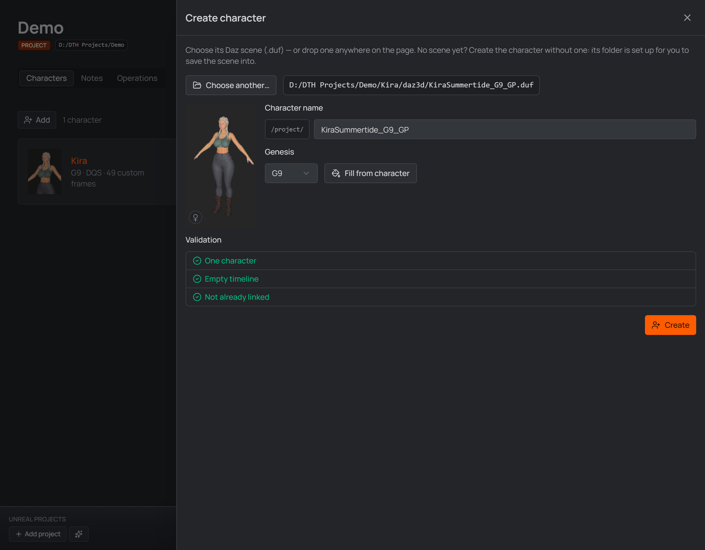
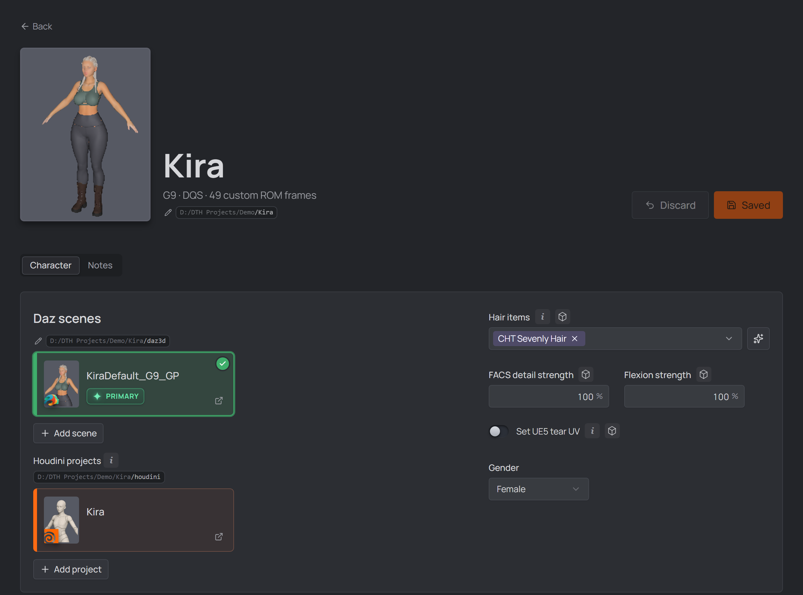
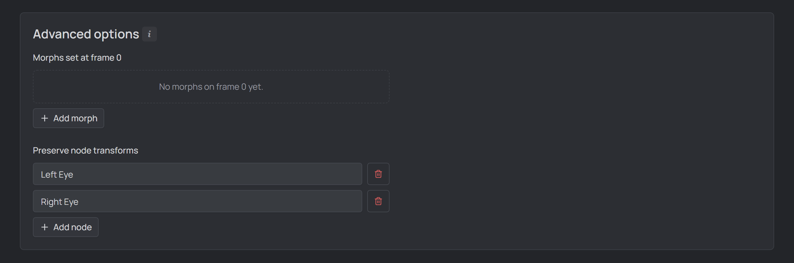
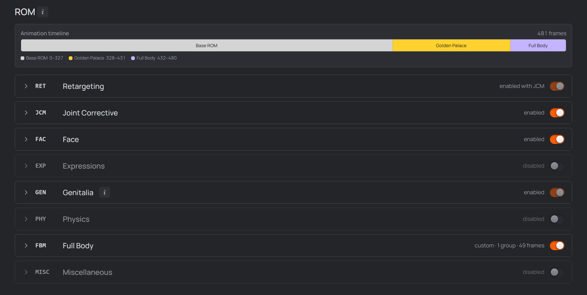
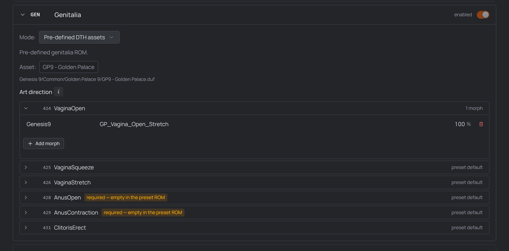
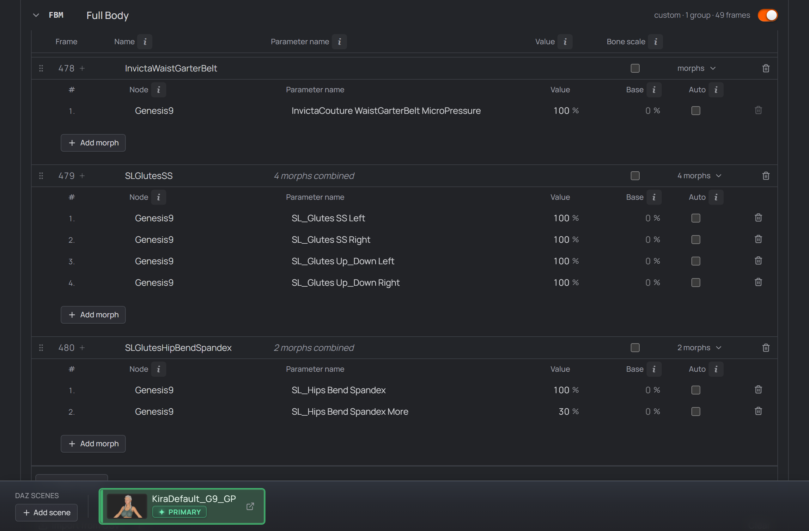
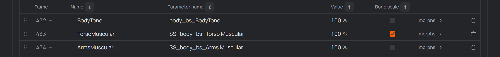
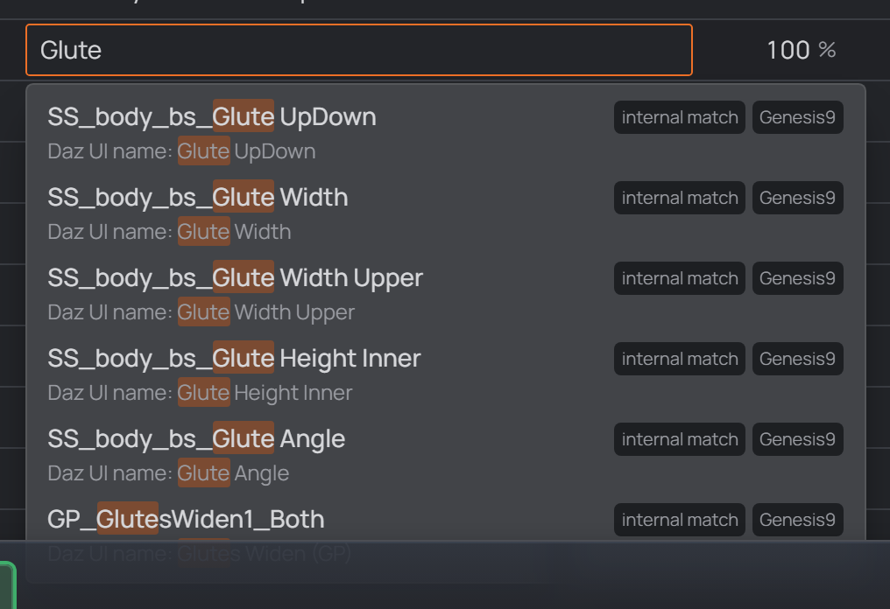
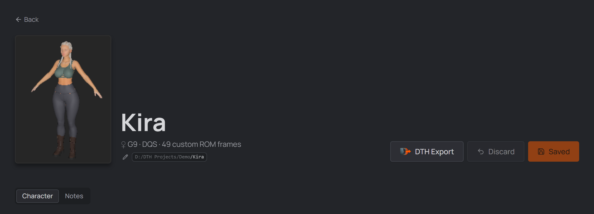

# 4 · Your first character

## Create it

  
   
  <em>The Add character panel in the project window.</em>

1. In the project window press **Add character** (or drop a `.duf` anywhere).
2. **Choose Daz scene…** — pick the character's scene file. The studio reads
   it, fills in **Genesis** and **Gender**, and validates that the scene holds
   exactly **one character** with an **empty animation timeline** (the ROM
   script fills the timeline itself). *Create anyway* overrides a failed check.
3. Name it — the name becomes its folder in the project.
4. **Fill from character** *(optional)* — copies a working ROM definition from
   any existing character across your projects: pick the source and check
   which sections to copy.
5. Press **Copy & Create** — the scene is copied into the character's folder
   and your original stays where it is (the toggle beside it turns the copy
   into a move). **Link & Create** leaves the scene where it is instead; a
   scene already inside the project shows a plain **Create**.

> [!TIP]
> **No scene yet?** Skip step 2 and press **Create without scene** — the
> character's folder (including the primary scene's subfolder, e.g.
> `daz3d/primary`) is created for you, so you can save your new scene there
> straight from Daz Studio. The
> character page stays **locked** until you link that scene as the primary (the
> Daz scenes panel shows the exact folder and the **Link Daz scene** button);
> the first link also derives Gender, Genesis and the Genitalia section from
> the scene, exactly like a normal create.

## Character settings

  
   
  <em>The top of the character page: the primary Daz scene, hair items, the Genesis 9 dials, the derived Gender, and the linked Houdini project.</em>

**Genesis** and **Gender** are set at creation; Gender never changes. On the
gender-neutral G9 it comes from the **GP/DK geograft** — Golden Palace →
female, Dicktator → male — the same detection that drives the
[GEN section](https://polynaut.github.io/dth-character-studio/guide/04-first-character.html#golden-palace--dicktator--the-genitalia-gen-section).
All four generations are selectable, but the deeply validated path is **G9**
(and G8.1 on the old pipeline); for the others, the studio offers whatever
pose assets the active DTH release ships.

G9 characters also get the **Genesis 9 specific** dials in the sidebar:

- **Set UE5 tear UV** — the ROM script switches the **Genesis 9 Tear**
  figure's **UV Set** to **UE5** during the build, so DTH's **Lacrimal Fluid**
  material lines up without the manual Surfaces step. Only matters if you use
  that material; off by default, and G9-only.
- **FACS detail strength / Flexion strength** — the G9 dials **FACS Detail
  Strength** and **Flexion Automatic Strength**, applied at frame 0 as the ROM
  builds. Leave them at `100 %` unless the stock correctives need dialing up
  or down.

<strong>Linked files — Daz scenes &amp; Houdini projects</strong>

<table><tr><td>

- **Daz scenes** — the character's scene, plus any number of extra scenes
  (outfit/look variants): **drop a `.duf`** on the card to add one. Added
  scenes pass the same checks as at creation — plus the **same GP/DK geograft
  as the primary**, so every scene produces the primary's skeleton — and are
  copied into the character's folder or left in place. The original scene
  can't be unlinked; extras can. Each scene has **Open in Daz** — when Daz
  already has a scene loaded, the studio walks you through closing it first.
- **Houdini projects** — drop `.hip`/`.hiplc` files to link the character's
  Houdini project(s). Click one to open it in Houdini, **Alt+click** to reveal
  its folder.

</td></tr></table>

&nbsp;

> [!TIP]
> **Hair items** (per-scene hair kept out of the export) and everything else
> around **multiple Daz scenes on one character** — outfit variants, the selected
> scene, and per-scene overrides (the whole ROM, identity dials, preserve items) — read
> [Advanced: Multiple Daz scenes](https://polynaut.github.io/dth-character-studio/guide/advanced.html#multiple-daz-scenes--outfits-amp-hair-variants).

## Script install location & export directory

The **Daz scripts generated** box shows where the generated `ROM_…` (and, with
split export, `Export_…`) scripts install on Save:
`<My DAZ 3D Library>/Scripts/DTH-Character-Studio/<project>/<character>/`
("My DAZ 3D Library" comes from [Settings](./02-setup.md)).

The **Export directory** section drives [direct export](./05-rom-in-daz.md#direct-export-optional-recommended):
**Choose folder…** sets it, **Clear** turns direct export off again. With no
export directory the studio generates the ROM only — **Bone scale** flags are
then no-ops until you set one.

<strong>Advanced options — preserve morphs &amp; node transforms</strong>

<table><tr><td>

  
   
  <em>The Advanced options section on the character page.</em>

The **Advanced options** panel near the bottom of the character page — none of
it is needed for a working ROM:

- **Preserve morphs after ROM loading** — the ROM zeroes morphs as it loads;
  any morph you list here is restored to the value you set afterwards. Use it
  for body-shaping controls (breast or muscle morphs, say) that should hold
  across the whole ROM. Enter the morph's **property name** and its **hold
  value**.
- **Preserve node transforms** — the listed node's transform is memorized
  before the ROM loads and restored after, so posed nodes (the eyes, say) keep
  their orientation instead of being reset. Enter the **node's label** as it
  appears in Daz.

On a **non-primary Daz scene** both lists are overridable, so an outfit scene
can preserve different morphs or nodes than the primary — see
[Advanced: per-scene overrides](./advanced.md#per-scene-overrides--edit-to-override).

</td></tr></table>

## The ROM definition

  
   
  <em>The ROM sections on the character page.</em>

A ROM is a fixed sequence of eight sections. Each can be **enabled or
disabled**, and runs in **Preset** mode (the DTH release's stock pose assets)
or **Custom** mode (your own poses and morphs).

Above the sections, a colored **timeline bar** maps the whole ROM live as you
edit — one segment per block, hover for its exact frame range.

<strong>Golden Palace &amp; Dicktator — the genitalia (GEN) section</strong>

<table><tr><td>

  
   
  <em>The GEN section's Golden Palace art-direction frames — a morph set per frame.</em>

**GEN** is the genital geograft's range of motion. You don't enable it by
hand: it turns itself on exactly when the primary scene contains a Golden
Palace / Dicktator geograft (detected when the scene is linked at creation) —
the same graft that derives the character's **Gender**. Our example G9 Female
carries Golden Palace, so her GEN section covers it.

In **Preset** mode the studio drops the DTH release's stock GP/DK ROM block
into the fixed GEN slot (after EXP, before PHY). The preset supplies the
*motion* — the **look is yours**: the section lists the block's **Art
direction** frames, and for each one you set the morph (or morphs) that give
it the shape you want — node, morph name and value, like any custom morph.

Frames flagged **required — empty in the preset ROM** do nothing until you set
a morph there; frames you leave alone keep the preset default.

Two things worth knowing:

- **The geograft must be fitted to the figure in the Daz scene** — the preset
  poses the geograft itself, so those frames fail without it.
- **Preset only appears where the DTH release ships that asset** — otherwise
  the studio flags GEN's Preset as unavailable.

You built your own pose asset for the genital graft? Switch GEN to **Custom**
and use your own asset!

</td></tr></table>

&nbsp;

> [!NOTE]
> The studio computes every frame number from this structure — you never type a
> frame, and the Daz and Houdini outputs can't drift apart.

> [!TIP]
> Want to learn all about the ROM process itself — what the blocks do and why?
> Read mrpdean's original
> **[DazToHue documentation](https://docs.google.com/document/d/1bRkFg3vo-WRKuu-kpTGig7GEoIfg7fPNVViFQspmPzc/edit?tab=t.g940wfwgh8lb#heading=h.wlvdwavo6j7h)**
> — the learning resource this studio builds on.

## Custom morphs

For this example we add some **Full Body Morphs (FBM)**: switch the section to
Custom and list the morphs your character should use.

<strong>Import from existing Daz scene</strong>

<table><tr><td>

Run the bundled **`Scan_Frames`** script in Daz Studio
(`Scripts › DTH-Character-Studio`): it scans the open scene — every keyed morph
frame — and writes a CSV. That CSV shows up in the **Import from CSV** picker
automatically, one per scene name; **Browse** still takes any CSV you curated
yourself.

</td></tr></table>

Each pose row has two name fields with very different jobs:

- **Name** — *your* name for the generated morph; it travels to **Houdini**
  and later **Unreal Engine**. Letters, numbers and underscores **only** —
  Houdini rejects anything else. The group's Left/Right suffix is appended
  automatically.
- **Parameter name** — must **exactly match the parameter's internal name in
  Daz Studio** (not its display label), or that frame fails in the ROM run.

A pose row can also drive its one output from **several Daz morphs at once** —
expand its **morphs** toggle.

  
   
  <em>Expanded pose rows — a plain single-morph row on top, and two rows combining several morphs into one output below.</em>

Every entry in that expanded list carries its own:

- **Node** — the scene node the morph lives on (`Genesis9`, `GoldenPalace_G9`,
  a bone, …); autocomplete fills it in when you pick a suggestion.
- **Parameter name** — the morph's internal Daz name (same rule as the main
  row's Parameter name).
- **Value** — what this morph is dialed to at the pose's frame.
- **Base** *(optional)* — the value the morph **returns to** on the frames
  around the pose (default `0`). Set it for a morph that's part of the
  character's base shape, so the ROM keys the *delta* instead of snapping the
  morph up from zero.
- **Auto** — instead of a fixed **Base**, read the base from the morph's
  **current scene value** when the script runs — for resting values that
  differ per character.

<strong>Combining several morphs into one output — why you'd do it</strong>

<table><tr><td>

Combining bakes a shape that only exists as a combination of dials — or a
controller plus its corrective — into a single clean morph for Houdini and
Unreal: all the listed morphs are keyed together on that one frame and blend
into the output named in **Name**. **Add morph** adds more; the trash icon
removes one (a pose always keeps at least one).

</td></tr></table>

<strong>Bone scale — morphs that scale bones (reference skeletons)</strong>

<table><tr><td>

Some morphs also **scale bones** (Torso Length, Proportion Height, and the
like). Generated morphs can only move vertices, and Daz's FBX export doesn't
carry bone scales — the body would reshape while the skeleton stays put. Such
frames need a **reference-skeleton FBX**: an export carrying the morph *and*
its bone scale, which the Houdini PoseAsset points at for that frame (its
*Reference FBX File* input).

Tick **Bone scale** on the pose row and the studio handles that end to end:
the frame is handed to the **DTH Exporter Plugin**, which writes the FBX into
a `Reference Skeletons` subfolder of your export directory, and the PoseAsset
CSV gets that FBX's absolute path filled in — Houdini finds it with nothing to
type.

  
   
  <em>Tick Bone scale on a bone-scaling morph — its reference-skeleton FBX is exported and referenced for you.</em>

&nbsp;

> [!NOTE]
> **Bone scale only acts when an [Export directory](./05-rom-in-daz.md) is set** —
> that's when the studio runs the exporter. With no export directory the studio
> generates the ROM only, so a ticked Bone scale is simply a no-op — you export
> the reference skeletons yourself. Set an export directory later and it becomes
> live, no re-ticking needed.

Only **GEN** and **FBM** poses can be reference frames — the two categories
DazToHue supports reference skeletons in. DTH's own
[Guide To Creating Custom ROMs](https://docs.google.com/document/d/1e8B9uDSmiS-v5si0YLEnnAhcnhnfGl9m0RsgCE5EDWA/edit?tab=t.0)
describes the feature in depth.

</td></tr></table>

<strong>Section &amp; group tools — suffixes, mirroring, reordering, inserting</strong>

<table><tr><td>

Each section header has its **Enable** switch and **Mode** (Preset / Custom)
select. In Preset mode you can **pick the exact DTH release asset** (when
several match); a red **no preset asset** chip appears when the active release
ships nothing for the character's generation. The **JCM** section's Custom mode
takes a **path to your own pose preset** (`.duf`), loaded as the base ROM
exactly like a DTH asset.

Grouped sections carry per-group settings in their header:

- **driver bone(s)** — the bones driving the group's poses (JCM/GEN/PHY).
- **Generation / Calculate from / Suffix** — how Houdini computes the group's
  morphs (Default / Individual / Additive / Cumulative / Advanced Additive),
  what deltas are measured against (Rest Pose / Animation Frame), and the side
  suffix (Left / Centre / Right → `_l` / `_r` appended automatically).
- **Mirror right** — on a *Left* group, appends a mirrored right-side copy of
  the whole group in one click.
- The **frame chip** shows the group's computed range live (`frames 104–107`).

Inside a group: **drag rows** to reorder (frames simply renumber — they're
never stored), and the small **+** next to a frame number inserts an empty pose
before or after it.

</td></tr></table>

### Finding a morph's internal Daz name

The **Parameter name** the studio asks for is the parameter's internal name,
which usually differs from the slider's label (label *Body Tone* → internal
`body_bs_BodyTone`). The comfortable way is the studio's **autocomplete** —
one scan in Daz covers every generation, and from then on each Parameter name
field suggests matches as you type. The manual route via *Parameter Settings*
(right screenshot) still works for a single name.

  &nbsp;&nbsp;&nbsp;&nbsp;&nbsp;&nbsp;&nbsp;&nbsp;
   
  <em>Left: a morph's internal name differs from its slider label. Right: the manual route via Parameter Settings.</em>

<strong>Recommended: build the index once, then autocomplete</strong> — <code>Build_Genesis_Index.dsa</code>

<table><tr><td>

The runtime installation (see [Tools](./tools.md)) puts **one** visible index
script into your Daz library at `Scripts/DTH-Character-Studio/`:
**`Build_Genesis_Index.dsa`**. One run covers **every** generation and builds
both halves of the index the studio autocompletes from — the **morphs** (every
dialable parameter) and the **skeleton** (every bone) — so it feeds the
**Parameter name** fields *and* the bone field of
[Modify JCM frames](./advanced.md#modify-jcm-frames).
There is nothing to load or select first:

1. In Daz Studio, **save your open scene** (the build clears it), then run
   `Scripts/DTH-Character-Studio/Build_Genesis_Index` from the Content Library.
2. Confirm the prompt — it lists exactly which generations it found installed
   and what it will skip. It then creates the stock figures itself, one generation
   at a time — *Genesis 3*, *8* and *8.1* female **and** male, and *Genesis 9*
   twice: it's gender-neutral, so that pair is differentiated by geograft
   instead (**Golden Palace** on one, **Dicktator** on the other, when you have
   them installed — loaded via their *Smart* preset, so the geoshells are
   indexed too). It scans each figure plus everything fitted to it, and writes
   one index per generation. Takes a few minutes.

<!-- SHOT 1 (Daz, needs re-taking): Content Library at
     Scripts/DTH-Character-Studio, showing the Build_Genesis_Index tile with its
     icon. The old shot here showed a per-generation Scan_Morphs script with a
     figure selected — a flow that no longer exists. Paste the new
     user-attachments URL into the  below and delete this comment. -->

3. A summary reports what was indexed per generation, which geograft file it
   picked, and anything it couldn't find — so a missing product, or an
   unexpected pick after a product update, is never silent.

<!-- SHOT 2 (Daz, needs re-taking): the run summary dialog — the per-generation
     "Indexed:" list with its morph + bone counts, the geograft it picked, and any
     skips. The old shot showed the single-figure "Scanned N morphs on M nodes"
     dialog, which no longer exists. -->

The scan indexes **everything dialable** each figure carries — classic morphs
*and* controller dials, across all products installed for that generation —
plus every **bone** of the figure and its geografts, which is what the JCM bone
field autocompletes from. Installed new morph products later? Just run it
again. Either way the studio picks the index up by itself the next time its
window gains focus.

**Got a figure the stock build doesn't cover** — a third-party geograft, an
add-on, fitted clothing whose morphs you dial? Load it in Daz, then run the
script: with figures already in the scene it offers to **scan the open scene**
instead of building fresh ones, and indexes exactly what's loaded (merged into
that generation's index).

From then on, every **Parameter name** field autocompletes after two typed
characters — searchable by **internal name** *or* **Daz UI label** — and
picking a suggestion fills in the exact internal name **and** the right node:
no more mismatched node/morph pairs.

  

    
     
    <em>Each Parameter name field autocompletes from the scanned index.</em>
  

</td></tr></table>

## Save = generate

Press **Save**. Every save regenerates the character's files in one go:

- **`ROM_<Name>_G9.dsa`** — the Daz apply-script, installed straight into your
  Daz library under `Scripts/DTH-Character-Studio/<Project>/<Character>/`
- **`<Name>_pose_asset.csv`** — the Houdini PoseAsset import CSV, stored in the
  character's folder

Two more scripts appear alongside the ROM one **only when their feature is on**:

- **`Export_<Name>_G9.dsa`** — split out only when an **Export directory** is
  set **and** *Run the export with the ROM script* is turned off; otherwise the
  export runs inline at the tail of the ROM script (no separate file).
- **`Export_Hair_<Name>_G9.dsa`** — generated when the character lists
  **[hair items](./advanced.md#hair-items--per-scene-kept-out-of-the-export)**:
  it exports the `_grooms.abc` for Houdini's **DazToHueGroom Import** node (the
  groom worn, everything else hidden).

Each of them gets its own **Content Library icon**, so you can tell them apart at
a glance in Daz — the ROM script's icon even says whether the export runs with it
or not. They appear on the next Save (or **Tools → Refresh assets** for
characters you haven't touched since updating).

A character with **[per-scene ROM overrides](./advanced.md#rom-overrides)**
additionally gets per-scene PoseAsset CSVs — see
[Advanced: What Save generates](./advanced.md#what-save-generates).

&nbsp;

> [!TIP]
> Change anything later and simply Save again — both sides stay in sync.

## The rest of the character page

Everything above covered the ROM. The page around it, box by box:

<strong>The header — avatar, rename, path chip, Save/Discard</strong>

<table><tr><td>

  
   
  <em>The character page's header: avatar, name, path chip, Save/Discard.</em>

- **Avatar** — click the portrait to pick one of the linked Daz scenes'
  thumbnails, drop an image file, or paste an image URL. Applied immediately
  (no Save needed); stored in the project's hidden `.dcsmeta/images` folder, so
  it travels with the project.
- **Name** — click it to rename. The character folder, notes and generated
  scripts follow (the old `ROM_…` script is cleaned up).
- **Subtitle** — the generation, the **skinning** the ROM targets (DQS or
  Linear, derived from the chosen preset assets), and the custom-frame count.
- **Path chip** — where the definition lives on disk; click copies, Alt+click
  reveals, like every path chip in the app.
- **Save / Discard** — the page edits a **draft**: nothing touches disk until
  **Save** (which also regenerates, see above). **Discard** reverts to the
  last save; leaving with unsaved edits asks first. **Ctrl** turns a settled
  Save button into **Re-save**, force-rewriting the files when nothing changed.

</td></tr></table>

<strong>Notes — and the Products tab</strong>

<table><tr><td>

The **Notes** tab holds freeform **markdown notes** for this character:
background, art direction, references. Hover, hit the pencil to edit, **drop
images or files straight into the editor** — it autosaves. Stored as
`<Name>.notes.md` next to the definition (media in `.dcsmeta/media`), so notes
travel with your project backup. The project page has the same tab for
project-wide notes.

A **Products** tab appears when the project enables Daz Products — see
[Daz product scanning](./product-scanning.md).

</td></tr></table>

<strong>The run report</strong>

<table><tr><td>

After a ROM run in Daz had problems (a missing morph, a failed preset), a
**report banner** appears the moment you switch back to the studio: every
failed frame with its reason. Clicking an entry **jumps to and highlights the
pose row** (failed rows are also tinted red in the tables). **Dismiss** clears
it; a clean run clears it automatically.

</td></tr></table>

<strong>Filling the ROM from another character</strong>

<table><tr><td>

**Operations → Fill from character** opens the same two-step wizard as at
creation: pick a source character (same generation and gender) from any of
your projects, then check which of its filled ROM sections to copy
(Retargeting always rides with JCM; the *Modify JCM frames* rules and preserve
lists are optional extras). The checked sections **replace** this character's
current config in the editor draft; nothing lands on disk until you save. GEN
keeps this character's own scene-derived Golden Palace / Dicktator setup.

</td></tr></table>

<strong>Deleting a character</strong>

<table><tr><td>

**Operations → Delete** removes the character's folder and generated files,
with a confirmation that lets you **keep the Daz files folder** (your scenes)
and **keep the Houdini files folder** (your exports) — for when the assets
should outlive the definition. This can't be undone.

</td></tr></table>

&nbsp;

[← Your first project](./03-first-project.md) · [Next: Build the ROM in Daz →](./05-rom-in-daz.md)
