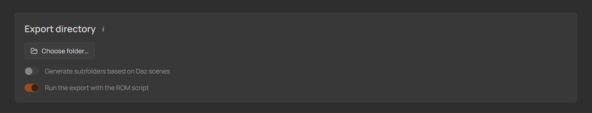

# 5 · Build the ROM in Daz Studio

## Run the script

1. Open the character's scene in Daz Studio — the scene chip on the character page
   has an **Open in Daz** button.
2. In Daz's **Content Library** pane, browse your library:
   **Scripts → DTH-Character-Studio → \<Project\> → \<Character\>**.
3. Double-click **`ROM_<Name>_G9`**.

<!-- SCREENSHOT — paste the image URL into src below, then delete this comment line and the closing one

  
   
  <em>The character's ROM script in Daz's Content Library.</em>

-->

The script builds the entire ROM on the timeline — every section you enabled,
every morph on its exact frame. Depending on the ROM's size this takes a moment;
the script reports what it did when it finishes.

&nbsp;

> [!NOTE]
> If anything couldn't be applied — a morph missing from the scene, a preset that
> failed to load — the script says so in a dialog at the end, and the studio shows
> the exact list the moment you switch back to it. The ROM's frame count is never
> affected: a missing morph leaves its frames empty instead of shifting everything
> after it.

&nbsp;

## Direct export (optional, recommended)

Instead of exporting by hand, let the script drive the **DTH Exporter Plugin**
(v1.8.1+, installed in step 2):

  
   
  <em>The export directory section on the character page.</em>

1. On the character page, set an **Export directory** and Save.
2. Run the script in Daz as above — after building the ROM it now runs the
   exporter automatically and writes everything the pipeline needs into your
   export folder: **`<Name>.abc`**, **`<Name>.dth`**, and the **PoseAsset CSV**
   (plus a **reference-skeleton FBX** for each **Bone scale** frame, under a
   `Reference Skeletons` subfolder — the CSV already points at each one).

Two switches tune this:

- **Generate subfolders based on Daz scenes** — nests each export under a folder
  named after the Daz scene open in Daz when the script runs (resolved at run
  time), so outfit/scene variants of one character export side by side. The
  exporter output **and** the PoseAsset CSV land directly in that scene
  subfolder; it falls back to the export root if no scene is saved.
- **Run the export with the ROM script** — on (the default): the one
  `ROM_<Name>_G9.dsa` builds the ROM and runs the export. Off: the export splits
  into its own **`Export_<Name>_G9.dsa`** beside the ROM script — run it after
  the ROM script in the same Daz session; handy for re-exporting (another scene,
  or after a failed export) without rebuilding the ROM.

&nbsp;

> [!NOTE]
> No export directory set? The ROM is still built in Daz — export manually with the
> DTH Exporter as described in the DazToHue docs; the PoseAsset CSV is waiting in
> the character's folder.

&nbsp;

[← Your first character](./04-first-character.md) · [Next: Into Houdini →](./06-into-houdini.md)
