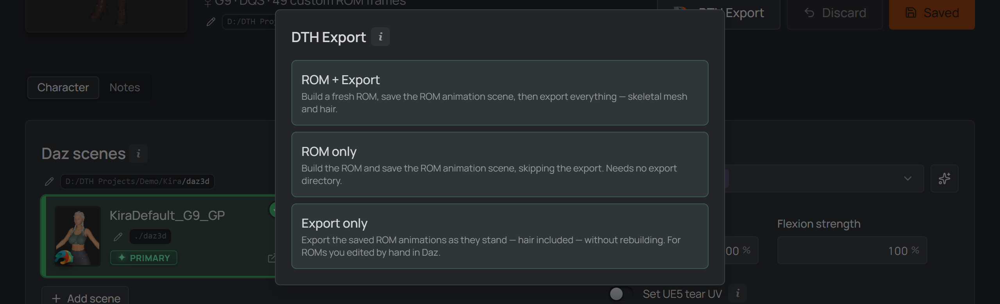

# 5 · Build the ROM in Daz Studio

## Run the script

1. Open the character's scene in Daz Studio — the scene chip on the character page
   has an **Open in Daz** button.
2. In Daz's **Content Library** pane, browse your library:
   **Scripts → DTH-Character-Studio → \<Project\> → \<Character\>**.
3. Double-click **`ROM_<Name>_G9`**.

<p align="center">
  
  <br>
  <sub><em>The character's ROM script in Daz's Content Library.</em></sub>
</p>

The script builds the entire ROM on the timeline — every section you enabled,
every morph on its exact frame. This takes a moment on a big ROM; the script
reports what it did when it finishes.

&nbsp;

> [!NOTE]
> If anything couldn't be applied — a missing morph, a failed preset — the
> script says so in a dialog at the end, and the studio lists the exact
> failures when you switch back to it. The ROM's frame count is never
> affected: a missing morph leaves its frames empty instead of shifting
> everything after it.

&nbsp;

> [!NOTE]
> The scripts check the **open scene** first: running a character's ROM,
> export or scan script while some *other* scene is open (or an unsaved one)
> does nothing — an error dialog names the open scene and the character's
> linked scenes instead. No more silently building Kira's ROM into the wrong
> scene.

&nbsp;

## Direct export (optional, recommended)

Instead of exporting by hand, let the script drive the **DTH Exporter Plugin**
(v1.8.1+, installed in step 2):

<p align="center">
  
  <br>
  <sub><em>The export directory section on the character page.</em></sub>
</p>

1. Nothing to set up: every character has an **Export directory**, fixed at
   `dth-exports` inside its Daz folder (created with the character). It sits
   beside the scenes that produce it and is shown read-only on the character
   page. To skip exporting, turn off **Run the export with the ROM script**
   (below) rather than looking for a way to clear the path.
2. Run the script in Daz as above — after building the ROM it now runs the
   exporter automatically and writes everything the pipeline needs into your
   export folder: **`<Name>.abc`**, **`<Name>.dth`** (extra scenes:
   `<Name>_<Scene>.*`), and the
   **PoseAsset CSV** (plus a **reference-skeleton FBX** for each **Bone scale**
   frame, under a `Reference Skeletons` subfolder — the CSV already points at
   each one).

After a clean ROM build — right before any export — the script also **saves
the ROM'd scene** as `<scene>_ROM.duf` into a `rom-animations/` subfolder next
to the scene file. Open it any time later to get the fully built ROM animation
back without the (slow) rebuild; each run overwrites the previous copy.

&nbsp;

> [!NOTE]
> This folder used to be hidden and called `.ROM_Animations`. It holds scenes
> you're meant to open, so it's a normal visible folder now — any existing one
> is renamed for you the next time the character is saved.

Every scene exports into its **own subfolder** of the export directory, named
after the subfolder the scene lives in inside the character folder (the
primary scene's is `primary`; extra scenes get theirs when they're added) — so
outfit/scene variants of one character always export side by side. The
exporter output **and** the PoseAsset CSV land in that subfolder, and the
export files carry the scene in their name too — `Kira_Summertide.abc` for the
`summertide` scene (capitalized), not another `Kira.abc` — so files from
different scenes stay distinguishable after they leave their subfolder
(Houdini file pickers, recent lists). The **primary scene** is the one
exception: it exports into its subfolder like every scene, but its files keep
the plain name (`Kira.abc`, never `Kira_Primary.abc`) — the primary is the
character.

### Where the Houdini project fits

The exports deliberately live **outside** the Houdini project — a Houdini
project folder is something you back up, sync or put in version control, and
`.abc`/`.dth` files are large and fully regenerable. So the studio keeps them
on the Daz side and gives Houdini a **shortcut** instead:

```
<character>/
  daz3d/
    Kira.duf
    dth-exports/          ← the real files
      primary/  Kira.abc  Kira.dth  Kira_pose_asset.csv
      summertide/
  houdini/
    Kira.hiplc
    houdini-project/      ← $JOB (File → Set Project)
      dth-exports  ──►  ../../daz3d/dth-exports
  export/                 ← the FINAL files, for Unreal
```

Those three folders are created with every new character. The last one,
**`export/`**, is the end of the pipeline — what Houdini generates for Unreal
goes there, and it's yours to organise. Don't confuse it with `dth-exports`
inside the Daz folder, which holds the Daz→Houdini intermediate the DTH
Exporter writes. All three names can be changed per project in
**Settings → Project**.

That last entry is a **junction**: a folder-shaped shortcut Windows resolves
transparently. Houdini's file picker opens at `$JOB`, so `dth-exports/` is
right there — one click instead of climbing two levels into the Daz folder —
and imports read `$JOB/dth-exports/primary/Kira.dth`
([Into Houdini](./06-into-houdini.md)).

**Generate project** creates it, along with the `houdini-project` folder
itself. That folder is shared: the first generated project creates it, every
later one reuses it, so all of a character's projects open with the same
`$JOB`.

&nbsp;

> [!NOTE]
> The junction is a convenience, not plumbing — the export pipeline itself
> never goes through it. If a tool that scans your project folder dislikes it
> (Perforce and some backup clients follow or delete reparse points), you can
> add `dth-exports` to `P4IGNORE`/`.gitignore`, or simply delete the link and
> browse to the Daz folder yourself. Nothing breaks either way, and the next
> **Generate project** puts it back.

&nbsp;

**Old folders clean themselves up**: the studio remembers which export folders
the current layout uses, and when a scene's subfolder is renamed or moved, the
previous run's folders are removed from the export directory on the next save.

&nbsp;

> [!NOTE]
> **Upgrading from an older version?** Characters that had a hand-picked export
> directory move to the new one automatically the next time they're saved — and
> their already-exported files come along, so nothing is left behind (**Tools →
> Refresh assets** migrates every character in one go). Only the folders the
> studio wrote are moved; anything else you kept in that directory stays put.

Two switches (in the **Daz scripts generated** box on the character page)
tune this:

- **Run the export with the ROM script** — on (the default), the one
  `ROM_<Name>_G9.dsa` builds the ROM and runs the export. Off, the export
  splits into its own **`Export_<Name>_G9.dsa`** beside the ROM script — run it
  after the ROM script in the same Daz session; handy for re-exporting
  (another scene, or after a failed export) without rebuilding the ROM.
- **Export hair assets too** — right after the main export, each of the open
  scene's [hair items](./advanced.md#hair-items--per-scene-kept-out-of-the-export)
  is exported on its own (`<Name>_Hair_<item>_grooms.abc` — the same per-item
  pass as the standalone `Export_Hair_…` script), into the same export folder.
  Works in both modes: with the combined ROM script and with the split
  `Export_…` script. Scenes without a hair list skip the pass.

## Batch export — DTH Export

Running the script yourself (above) is one way — the **DTH Export** button in
the character header does the whole thing for you. It asks what the run should
do first:

<p align="center">
  
  <br>
  <sub><em>Step one: ROM + Export, ROM only, or Export only.</em></sub>
</p>

- **ROM + Export** — the full run: a fresh ROM, the saved ROM animation scene,
  and the export of everything (skeletal mesh and hair).
- **ROM only** — build the ROM and save the `rom-animations` scene (above),
  skipping the export entirely.
- **Export only** — export the saved ROM animations as they stand, hair
  included, without rebuilding them. This is the one for a ROM you tweaked by
  hand in Daz: it pre-selects exactly the scenes whose ROM animation is newer
  than their last export, and skips scenes that have no ROM animation yet.

Then pick the scenes:

<p align="center">
  
  <br>
  <sub><em>Step two: pick the scenes, Start hands the batch to Daz Studio.</em></sub>
</p>

Pick the linked scenes to export (scenes that changed since their last export
come pre-checked) and press **Start**: the batch is handed to Daz Studio,
where the bundled
[**Runner plugin**](./02-setup.md#install-the-dth-character-studio-runner-plugin)
works through it unattended — every scene gets its full ROM build, export and
delivered CSV, exactly as if you had run the scripts by hand. A closed Daz is
started; a running one picks the batch up by itself. While the batch is still
waiting the button reads **Abort**; once Daz starts working it shows live
progress, and the studio reports the outcome — including any per-scene
failures — when the batch finishes.

The dialog refuses to start while the Runner plugin is missing or older than
the one bundled with the app — the notice links straight to Settings to update
it first.

&nbsp;

> [!NOTE]
> **Running a scene with per-scene overrides?** The one `ROM_<Name>_G9.dsa` embeds
> every scene's [overrides](./advanced.md#per-scene-overrides--edit-to-override) and
> applies the right ones for whichever scene is **open in Daz** — so open the right
> scene before running it. A scene with **ROM** overrides also has its own
> PoseAsset CSV to import in Houdini — see
> [What Save generates](./advanced.md#what-save-generates).

&nbsp;

> [!NOTE]
> Prefer exporting by hand? Turn off *Run the export with the ROM script* — the
> ROM is still built in Daz, and you export with the DTH Exporter as described
> in the DazToHue docs; the PoseAsset CSV is waiting in the character's folder.

&nbsp;

[← Your first character](./04-first-character.md) · [Next: Into Houdini →](./06-into-houdini.md)
