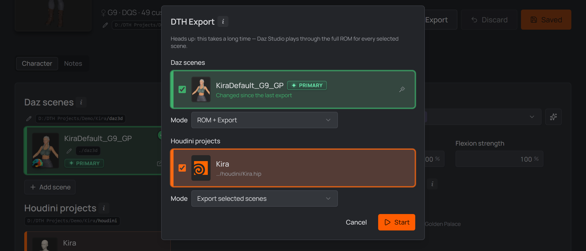
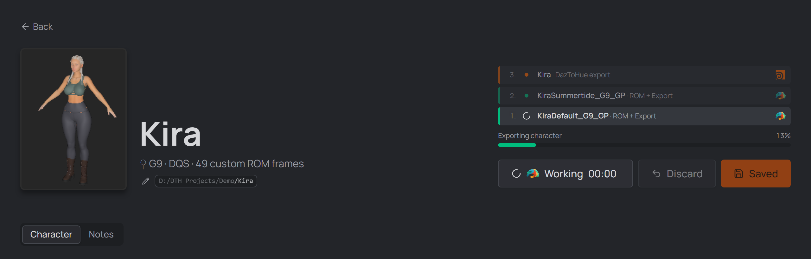

# 5 · Build the ROM in Daz Studio

## Run the script

1. Open the character's scene in Daz Studio — each scene card on the character
   page has an open menu (**Open Original**, or the saved
   [ROM animation](#direct-export-optional-recommended) once one exists).
2. In Daz's **Content Library** pane, browse your library:
   **Scripts → DTH-Character-Studio → \<Project\> → \<Character\>**.
3. Double-click **`ROM_<Name>_G9`**.

<p align="center">
  
  <br>
  <sub><em>The character's ROM script in Daz's Content Library.</em></sub>
</p>

The script builds the entire ROM on the timeline — every section you enabled,
every morph on its exact frame. This takes a moment on a big ROM; the script
reports what it did when it finishes. Before it builds, it also quietly scans
the open scene into the studio's
[morph index](./custom-morphs.md) (and, with a DIM manifests folder set,
refreshes that scene's product scan) — the Parameter-name autocomplete stays current
through normal use, and a scan problem never fails the run.

&nbsp;

> [!NOTE]
> If anything couldn't be applied — a missing morph, a failed preset — the
> script says so in a dialog at the end, and the studio lists the exact
> failures when you switch back to it. The ROM's frame count is never
> affected: a missing morph leaves its frames empty instead of shifting
> everything after it.

&nbsp;

> [!NOTE]
> The scripts check the **open scene** first: running a character's ROM,
> export or scan script while some *other* scene is open (or an unsaved one)
> does nothing — an error dialog names the open scene and the character's
> linked scenes instead. No more silently building Kira's ROM into the wrong
> scene.

&nbsp;

## Direct export (optional, recommended)

Instead of exporting by hand, let the script drive the **DTH Exporter Plugin**
(v1.8.1+, installed in step 2):

<p align="center">
  
  <br>
  <sub><em>The export directory section on the character page.</em></sub>
</p>

1. Nothing to set up: every character has an **Export directory**, fixed at
   `daz-export` inside its Houdini folder (created with the character). It sits
   beside the `.hip` projects that read it and is shown read-only on the character
   page. To skip exporting, turn off **Run the export with the ROM script**
   (below) rather than looking for a way to clear the path.
2. Run the script in Daz as above — after building the ROM it now runs the
   exporter automatically and writes everything the pipeline needs into your
   export folder: **`<Name>.abc`**, **`<Name>.dth`** (extra scenes:
   `<Name>_<Scene>.*`), and the
   **PoseAsset CSV** (plus a **reference-skeleton FBX** for each **Bone scale**
   frame, under a `Reference Skeletons` subfolder — the CSV already points at
   each one). The script **deletes the scene's previous export set first** —
   an export always replaces the whole set, so files from an earlier layout
   (or a renamed hair item) never linger beside a fresh one, and Daz Studio
   4's exporter, which skips the ROM walk when its output files already
   exist, always gets the empty folder it needs. Anything else you keep in
   the folder is left alone.

After a clean ROM build — right before any export — the script also **saves
the ROM'd scene** as `<scene>_ROM.duf` into a `rom-animations/` subfolder next
to the scene file. Open it any time later to get the fully built ROM animation
back without the (slow) rebuild; each run overwrites the previous copy.

Every scene exports into its **own subfolder** of the export directory, named
after the subfolder the scene lives in inside the character folder (the primary
scene's is `primary`), so outfit variants of one character export side by side.
The exporter output **and** the PoseAsset CSV land there, and the files carry
the scene in their name too — `Kira_Summertide.abc`, not another `Kira.abc` —
so they stay distinguishable once they leave the subfolder (Houdini file
pickers, recent lists). The **primary scene** is the exception: its files keep
the plain name (`Kira.abc`, never `Kira_Primary.abc`) — the primary is the
character.

### Where the Houdini project fits

The exports deliberately live **outside** the Houdini project — a Houdini
project folder is something you back up, sync or put in version control, and
`.abc`/`.dth` files are large and fully regenerable. So the studio keeps them
on the Daz side, one `..` away from your `.hip`:

```
<character>/                ← $JOB (Set Project) — it holds BOTH sides
  daz3d/
    Kira.duf              ← your scenes, and nothing generated
  houdini/                ← $HIP — every scene of this character lives here
    Kira.hiplc            ← imports read daz-export/…
    Kira_Look.hiplc
    daz-export/           ← what the DTH Exporter wrote, for these imports
      primary/  Kira.abc  Kira.dth  Kira_pose_asset.csv
      summertide/
    render/ geo/ backup/  ← Houdini's own output, shared by both scenes
  export/                 ← the FINAL files, for Unreal
```

**`$JOB` is the character folder** — Houdini only collapses a path you pick into
a variable when it sits under `$HIP` or `$JOB`, so `$JOB` has to be the folder
*above* `houdini/`, or picking an export writes an absolute path and the project
stops being movable. **`houdini/` is the shared project folder**: every scene of
a character lives in it and shares one `$HIP`, so Houdini's own output (renders,
caches, backups) collects there instead of scattering per scene. **`export/`**
is the end of the pipeline — what Houdini generates for Unreal, yours to
organise, and not to be confused with the `daz-export` intermediate the DTH
Exporter writes inside the Houdini folder. All three are created with every new
character and can be renamed per project in **Settings → Project**.

There is no plumbing between the two sides: from a `.hip` in the houdini folder
the exports are a subfolder away, and ticking Houdini's **Make path relative to
current directory** in the file picker gives you the portable `$HIP/daz-export/…`
form — the same spelling the studio generates, so a path you pick by hand and
one it wrote read identically inside the same node. **Generate project** bakes
`$JOB` in for you, so a generated scene needs no Set Project at all; `$HIP`
never needs setting up either way, since Houdini derives it from wherever the
`.hip` sits.

> [!NOTE]
> **Upgrading from an older version?** Every layout change below carries itself
> out on the next save, and **Tools → Refresh assets** does every character in
> one go.
>
> - **The export directory has moved twice.** A character's exports follow to
>   the current location and the emptied old folder goes; only folders the
>   studio wrote are moved, anything else you kept there stays put. A Houdini
>   project generated before a move still names the old one, so its imports
>   report as broken on the character page — **Utils → Make paths portable**
>   rebuilds them from the current export root, and only ever writes a path
>   whose file it can actually see.
> - **The `houdini-project` subfolder is gone.** Before v0.68 it was meant to be
>   the Set Project target, a job it could never do (Set Project sets `$JOB`,
>   not `$HIP`), so it stayed empty while the output landed beside the scenes.
>   It is removed **only when empty**; one holding files is left alone and named
>   in Refresh assets, for you to clear yourself.
> - **`dth-exports` shortcut links** (NTFS junctions) beside Houdini projects
>   are removed, reported as *removed N leftover dth-exports junction(s)*. Real
>   export folders are never touched.
> - **The saved-ROM folder** was hidden and called `.ROM_Animations`; it holds
>   scenes you're meant to open, so it is the plain visible `rom-animations` now
>   and an existing one is renamed for you.

### Reference-skeleton paths — `$HIP` by default

Every **Bone scale** frame gets a reference-skeleton FBX, and the PoseAsset CSV
has to point Houdini at it. Those paths are written relative to **`$HIP`** — the
folder the `.hip` itself sits in — which now reaches the exports without leaving
the project folder:

```
$HIP/daz-export/primary/Kira_frame_432.fbx
```

so the project keeps resolving after you move, rename or copy the character
tree — including onto another machine. `$HIP` has a property no other anchor
has: Houdini derives it from where the file *is*, so it can't go stale — a
project whose `$JOB` points at another character still resolves its own imports.
**Settings → Project → Houdini path style** controls this: `hip` (the default)
writes the relative paths, `absolute` forces absolute ones.

Two layouts fall back to **`$JOB`**, the character folder, which encodes no
depth and so is right for every project at once: linked projects sitting in
**different folders** (there is no single `$HIP` to name), and exports sitting
**beside** the houdini folder rather than under it — the arrangement before
v0.68. Both still resolve, so neither is flagged; **Utils → Make paths
portable** shortens the older form to today's when you ask.

What still falls back to **absolute** paths: no linked project yet, a `.hip`
hand-linked somewhere in your own tree (where `$JOB` is whatever you set it to),
or an export root outside the character folder. Generate a project — or link one
in the character's houdini folder — and save again to switch it over.

**Old folders clean themselves up**: the studio remembers which export folders
the current layout uses, and when a scene's subfolder is renamed or moved, the
previous run's folders are removed from the export directory on the next save.

Two switches (in the **Daz scripts generated** box on the character page)
tune this:

- **Run the export with the ROM script** — on (the default), the one
  `ROM_<Name>_G9.dsa` builds the ROM and runs the export. Off, the export
  splits into its own **`Export_<Name>_G9.dsa`** beside the ROM script — run it
  after the ROM script in the same Daz session; handy for re-exporting
  (another scene, or after a failed export) without rebuilding the ROM.
- **Export hair assets too** — right after the main export, each of the open
  scene's [hair items](./advanced.md#hair-items--per-scene-kept-out-of-the-export)
  is exported on its own (`<Name>_Hair_<item>_grooms.abc` — the same per-item
  pass as the standalone `Export_Hair_…` script), into the same export folder.
  Works in both modes: with the combined ROM script and with the split
  `Export_…` script. Scenes without a hair list skip the pass.

## Batch export — DTH Export

Running the script yourself (above) is one way — the **DTH Export** button in
the character header does the whole thing for you, Houdini included:

<p align="center">
  
  <br>
  <sub><em>Pick the Daz scenes and their run, then the Houdini projects that carry on with the results.</em></sub>
</p>

**Daz scenes** lists every linked scene; the ones with outstanding work come
pre-checked (the wand picks a single scene, a double-click selects all). The
**Mode** below the list decides what their run does:

- **ROM + Export** — the full run: a fresh ROM, the saved ROM animation scene,
  and the export of everything (skeletal mesh and hair).
- **ROM only** — build the ROM and save the `rom-animations` scene (above),
  skipping the export entirely.
- **Export only** — export the saved ROM animations as they stand, hair
  included, without rebuilding them. This is the one for a ROM you tweaked by
  hand in Daz: it pre-selects exactly the scenes whose ROM animation is newer
  than their last export, and skips scenes that have no ROM animation yet.
- **Skip Daz — use last exports** — nothing runs in Daz at all: the Houdini
  projects below work off each selected scene's **last Daz export** as it
  stands on disk. For when the Daz side hasn't changed and only Houdini needs
  a fresh pass. Scenes that never delivered an export are kept out of the run
  (there is nothing to rely on).

**Houdini projects** lists the character's linked projects the same way — the
ones that carry on with the results once the Daz side is done. They come
pre-selected whenever scenes are, so a plain **Start** does the whole round
trip; untick them and the run ends with Daz. Their own **Mode**:

- **Open only** — just open the project, run nothing (needs exactly one
  project selected — picking a second flips to the export run).
- **Export selected scenes** — the default: run the projects' DazToHue
  exports for the checked Daz scenes.
- **Export all** — run them for every linked scene, whatever is checked.

**The project list follows the scene selection.** Untick a Daz scene and the
projects that only import *that* scene leave the run with it; tick it back on
and they return. The match is the one Houdini itself makes at export time — a
project belongs in the run when one of its networks imports a selected scene's
`.dth` file — so what the dialog shows and what the run exports can't disagree.
Names are deliberately not consulted: networks and projects get renamed and
copied around, the import path doesn't. A project only ever *leaves* the run
when its imports actually name a scene you unticked; one the background scan
hasn't reached yet, or whose imports match none of this character's scenes
either way, keeps whatever you have — the studio can't know there, and quietly
dropping a project would skip the Houdini half of a run you asked for.

Several selected projects run **one after another**: each loads and exports,
then the next starts — the outcome waits for the single report at the end.

**ROM only** is the exception: it builds no fresh export, so there is nothing
for a Houdini export to pick up — the projects don't pre-select there, and a
project you tick by hand can only be **opened** (the export modes are
disabled, and one project at a time).

**Unreal projects** is the third leg, and appears once the studio project has
[linked `.uproject` files](./03-first-project.md#linking-unreal-projects). Tick
one and the finished export is **queued for import** when the whole run ends —
every export set the character has, in one job. Nothing waits on Unreal: the
job is a file, and the project's
[DTH Studio Bridge](./06-into-houdini.md#send-to-unreal) picks it up whenever
that editor is next open.

Like the other two lists, it **pre-selects what the run is for**: a project that
already holds this character (its `Content/DazToHue/…` folder) starts ticked, a
project that doesn't stays for you to decide — putting a character into an
Unreal project for the first time is a choice, not a continuation. The section
needs an exporting Houdini leg: with **Open only** or **ROM only** there is no
fresh export, and sending would only re-import the previous one.

Press **Start**: the batch is handed to Daz Studio, where the bundled
[**Runner plugin**](./02-setup.md#daz-studio-plugins)
works through it unattended — every scene gets its full ROM build, export and
delivered CSV, exactly as if you had run the scripts by hand. A closed Daz is
started **minimized**, since nobody needs to watch it work; a running Daz picks
the batch up by itself and is left exactly as you had it.

The dialog refuses to start while the Runner plugin is missing or older than
the one bundled with the app — the notice links straight to Settings to update
it first. (A skip-Daz run doesn't need the Runner at all.)

### Watching the run

The character header becomes the run's own display for as long as it lasts:

<p align="center">
  
  <br>
  <sub><em>The live pipeline: what is left to do, what is being said, and how far along it is.</em></sub>
</p>

- **Task cards**, numbered in run order — every selected Daz scene, then every
  Houdini project. The column stacks from the **bottom**: the card being worked
  on is the lit one at the very bottom, beside the buttons, and everything still
  to come waits above it (so the numbers read downwards, 3 · 2 · 1). A finished
  card sails off and the queue drops into its place, leaving the column always
  reading as what is left.
- **A log window** tailing whichever leg is talking. The Daz scripts report each
  step as they start it *and* as it lands (*generating ROM* → *ROM generated*),
  so the window names what is running and not only what finished; the Houdini
  leg streams the DazToHue HDA's own output.
- **A progress bar** for the unit being worked on — plus a second one above it
  whenever the leg spans several units (several scenes, or several DazToHue
  networks in one project). Both are a track and a percent, nothing else: the
  cards say what is running and the log window's newest line says how it's
  going.

The button beside it simply reads **Working** with the elapsed time; the numbers
live in the display. Nothing is announced mid-run: **one report** at the very
end covers both legs, with any per-scene failures and the total time, and stays
on screen until you close it (or start a new run).

**Getting out of a live run takes Ctrl.** A plain click on the working button
does nothing — a stray one used to drop the watch, which reads as *"the export
vanished"*:

- **Ctrl on the Daz leg** turns the button into **Abort** — the way out of a
  batch that is stuck (Daz sitting on a dialog, the Runner never finishing). It
  deletes the job file and resets the button, so the next export isn't refused
  with *"a batch is waiting for Daz Studio"*. Anything Daz already started keeps
  running there; what you get back is the studio. (The same file can also be
  cleared from [Settings → App Data](./02-setup.md#the-app-data-tab).)
- **Ctrl on the Houdini leg** offers **Stop watching**: the export itself keeps
  running to its end, but the studio lets go — and the projects still queued
  behind it will not start.

Before Daz has picked the batch up at all the button reads **Abort** without any
modifier: nothing has started yet.

**Reloading the app doesn't lose the run.** Every handoff writes its plan down
beside its own files, so the character's editor picks the run back up when it
opens: the elapsed clock, the task cards, the Houdini projects still to come and
the report so far. Any *other* window shows the same run read-only.

### Carry on into Houdini

With Houdini projects selected in an exporting mode, the round trip's last
manual step is gone — each project **runs its own DazToHue exports** for the
scenes in scope, right after the Daz batch delivers (or immediately, with
**Skip Daz**).

What happens:

1. Daz finishes the batch and the Houdini leg starts straight away — the report
   waits until the *whole* round trip is done.
2. Houdini runs the project **headless**: `hython` loads it in the background,
   works the batch and exits again. No window opens, so there is nothing to wait
   for while a big project loads and nothing of yours to close — the log window
   in the header is where you watch it. Want a project left open to work in?
   That's the **Open only** mode, which still opens Houdini normally.
3. Only the networks importing **the scenes you ticked** export. A project
   holding networks for other scenes — or other characters — is left alone.
4. After the last project, **one report** names every leg — *"Daz: 2/2 scenes
   exported in 3m 10s"*, then a line per Houdini project (*"Kira_Look: 2
   exported, 1 skipped"*) — under a single *DTH Export finished in …* headline
   with the total time.

Two things it deliberately won't do:

- **Overwrite an export directory you configured.** A node with one set exports
  where you told it to; only a blank one is filled in from the run.
- **Save the project.** Nothing about your `.hip` changes on disk — any
  parameter it touches is put back afterwards.

If the DazToHue pre-flight check reports problems, the studio answers its
*"Continue anyway?"* prompt for you and **keeps the message**, so those
problems reach the report instead of vanishing behind an unattended dialog.

Everything Houdini printed on its way through — the HDA's own output and
Houdini's console chatter with it — lands in **`.dth_houdini_console.log`** in
the character folder. It is deliberately *not* cleaned up with the run's other
files: it's the file to open when a run did something puzzling (a run that
matched no export nodes records exactly what it looked for and what it found),
and it is one file per character, overwritten by that character's next run.

&nbsp;

> [!NOTE]
> **Running a scene with per-scene overrides?** The one `ROM_<Name>_G9.dsa` embeds
> every scene's [overrides](./advanced.md#per-scene-overrides--edit-to-override) and
> applies the right ones for whichever scene is **open in Daz** — so open the right
> scene before running it. A scene with **ROM** overrides also has its own
> PoseAsset CSV to import in Houdini — see
> [What Save generates](./advanced.md#what-save-generates).

&nbsp;

> [!NOTE]
> Prefer exporting by hand? Turn off *Run the export with the ROM script* — the
> ROM is still built in Daz, and you export with the DTH Exporter as described
> in the DazToHue docs; the PoseAsset CSV is waiting in
> [the studio's own folder for that character](./06-into-houdini.md#what-the-studio-gives-you).

&nbsp;

---

## Geografts under a Golden Palace / Dicktator shell

Fit a **nipple** or **navel** geograft to a figure that already wears **Golden
Palace** or **Dicktator**, and the genital shell covers it: you get shell
material where the graft should be. It is not a fitting problem. A geoshell
carries one visibility switch per **surface** of the figure it shells, and a
newly fitted graft adds *its* surfaces to that list **switched on** — so the
shell now draws over the graft.

Fixing it by hand means finding each of those rows (`stx_…_Body` and friends) in
the shell's *Parameters ▸ Shell ▸ Visibility ▸ Surfaces* list and switching it
off — on **every** GP/DK shell (Golden Palace has two), in **every** scene.

The bundled **`Fix_Graft_Shell_Surfaces`** script does it in one run. Open the
scene, then run it from **Scripts › DTH-Character-Studio** in the Content
Library. Nothing to select. It reports what it switched off, and it is safe to
re-run — only rows that are still on get written.

What it will **not** touch:

- **Other geoshells.** Skin overlays, tattoo and nail shells keep their graft
  surfaces on — a body tattoo *should* cover the nipple graft.
- **The shell's own graft.** Golden Palace's own surfaces stay visible on the
  Golden Palace shells; only the *other* grafts' rows go off.
- **The figure's own surfaces** (`Body`, `Head`, `Legs`…), which the shell
  already controls however its product intends.

A scene without a GP/DK shell is a no-op. If the script cannot tell which graft
a shell belongs to — a renamed graft node, say — it reports that shell as
**skipped** instead of guessing, and you fix that one by hand.

&nbsp;

---

## Rescuing an old scene that is only a ROM animation

A scene the studio can use has an **empty timeline** — the generated ROM script
fills the timeline itself, so a scene that already carries animation is refused
by the add-scene check. Which is a problem when the only surviving copy of an
old character *is* the scene with its full ROM baked in.

The bundled **`Kill_Animation`** script is the way back. The order matters:

1. **Open the old scene** in Daz Studio.
2. **Run `Scan_Frames` first.** It writes the animation out frame by frame as a
   CSV the studio can [import as a ROM definition](./custom-morphs.md) — do this
   *before* the next step, because afterwards there is nothing left to scan.
3. **Run `Kill_Animation`** from **Scripts › DTH-Character-Studio**. Nothing to
   select. It shows you what it found — how many keys, how many frames — and
   asks before deleting anything.
4. **File ▸ Save As** into your character's folder in the studio project, and
   add it as a scene. The timeline check passes now.

What it changes is only the timeline. The character keeps its shape, its
clothes, its hair and the pose it holds at **frame 0** — no node is deleted, no
morph zeroed, no material touched. Every key goes, and the animation range goes
back to **0–30 frames**, the timeline a fresh Daz scene opens with.

> [!WARNING]
> **There is no undo.** The script does not save the scene — that stays your
> decision — but the keys are gone from the open scene the moment you confirm.
> If the ROM in it still matters to you, run `Scan_Frames` first.

If a property refuses to give up its keys, the script says so and **names it**,
rather than reporting a clean run over a scene that still has animation in it.

&nbsp;

[← Your first character](./04-first-character.md) · [Next: Into Houdini →](./06-into-houdini.md)
