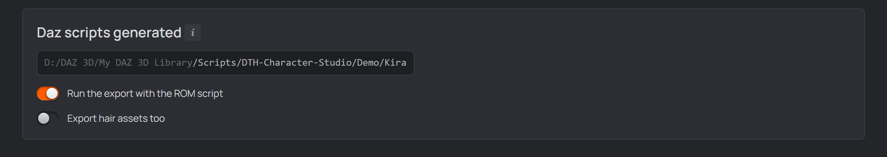

# 5 · Build the ROM in Daz Studio

Nothing here is done by hand: the **DTH Export** button in the character header
runs the whole round trip unattended — that is the default way to build a ROM.
The generated scripts it drives can also be run yourself, one scene at a time —
that workflow is the fold-out at the end of this page:
[Working with the scripts alone](#working-with-the-scripts-alone).

## Run it — DTH Export

Press **DTH Export** in the character header, keep the pre-ticked **Daz scenes**
and the *ROM + Export* mode, and press **Start**. The panel itself — its modes,
the Houdini and Unreal legs, watching and interrupting a run — has its own page:
**[The DTH Export batch](./dth-export.md)**. What matters here is what that run
builds: the entire ROM on the timeline — every section you enabled, every morph
on its exact frame — with the export straight after. On the way each scene is
also scanned into the studio's [morph index](./custom-morphs.md), so the
Parameter-name autocomplete stays current through normal use.

> [!NOTE]
> If a morph couldn't be applied, the run's report says so and the studio lists
> the exact failures on the character page. The ROM's frame count is never
> affected: a missing morph leaves its frames empty instead of shifting
> everything after it.

<a id="direct-export-optional-recommended"></a>

## What a run exports

The export is driven by the **DTH Exporter Plugin** (v1.8.1+, installed in
[step 2](./02-setup.md#daz-studio-plugins)).

<p align="center">
  
  <br>
  <sub><em>The Export directory, at the bottom of the Daz scripts generated box.</em></sub>
</p>

There is nothing to set up: every character has an **Export directory**, fixed at
`daz-export` inside its Houdini folder. Each scene's run writes **`<Name>.abc`**,
**`<Name>.dth`** and the **PoseAsset CSV** — plus a **reference-skeleton FBX** for
each **Bone scale** frame, under a `Reference Skeletons` subfolder the CSV already
points at.

- Each run **deletes that scene's previous export set first**, so files from an
  earlier layout never linger beside a fresh one. Anything else you keep in the
  folder is left alone.
- A clean ROM build also **saves the ROM'd scene** as `<scene>_ROM.duf` into a
  `rom-animations/` subfolder next to the scene file. Open it any time to get the
  built ROM animation back without the slow rebuild.
- Every scene exports into its **own subfolder**, named after the subfolder the
  scene lives in, and the files carry the scene in their name —
  `Kira_Summertide.abc`. The **primary** is the exception: its files keep the plain
  name (`Kira.abc`).

### Where the Houdini project fits

The exports deliberately live **outside** the Houdini project — `.abc`/`.dth`
files are large and fully regenerable, and a Houdini project folder is something
you back up or version. So they sit one `..` away from your `.hip`:

```
<character>/                ← $JOB (Set Project) — it holds BOTH sides
  daz3d/
    Kira.duf              ← your scenes, and nothing generated
  houdini/                ← $HIP — every scene of this character lives here
    Kira.hiplc            ← imports read daz-export/…
    Kira_Look.hiplc
    daz-export/           ← what the DTH Exporter wrote, for these imports
      primary/  Kira.abc  Kira.dth  Kira_pose_asset.csv
      summertide/
    render/ geo/ backup/  ← Houdini's own output, shared by both scenes
  export/                 ← the FINAL files, for Unreal
```

- **`$JOB` is the character folder.** Houdini only collapses a picked path into a
  variable when it sits under `$HIP` or `$JOB`, so `$JOB` has to be the folder
  *above* `houdini/` — otherwise picking an export writes an absolute path and the
  project stops being movable.
- **`houdini/` is the shared project folder.** Every scene of a character lives in
  it and shares one `$HIP`, so Houdini's own output collects there instead of
  scattering per scene.
- **`export/`** is the end of the pipeline — what Houdini generates for Unreal.
  Not to be confused with the `daz-export` intermediate.

All three are created with every new character and can be renamed per project in
**Settings → Project**. Ticking Houdini's **Make path relative to current
directory** in the file picker gives you the portable `$HIP/daz-export/…` form —
the same spelling the studio generates.

> [!NOTE]
> **Upgrading from an older version?** Every layout change carries itself out on
> the next save, and **Tools → Refresh assets** does every character in one go:
> exports follow to the current location, the empty `houdini-project` subfolder and
> leftover `dth-exports` junctions are removed, and the hidden `.ROM_Animations`
> folder becomes the visible `rom-animations`. A Houdini project generated before a
> move still names the old location — **Utils → Make paths portable** rebuilds
> those imports.

### Reference-skeleton paths — `$HIP` by default

Every **Bone scale** frame gets a reference-skeleton FBX, and the PoseAsset CSV
points Houdini at it relative to **`$HIP`**, the folder the `.hip` sits in —
`$HIP/daz-export/primary/Kira_frame_432.fbx` — so the project keeps resolving after
you move, rename or copy the character tree. **Settings → Project → Houdini path
style** controls this: `hip` (the default) writes relative paths, `absolute` forces
absolute ones.

Two layouts fall back to **`$JOB`**, the character folder: linked projects sitting
in **different folders**, and exports sitting **beside** the houdini folder rather
than under it. Both still resolve. It falls back to **absolute** paths when there
is no linked project yet, when a `.hip` is hand-linked in your own tree, or when
the export root is outside the character folder.

<details>
<summary><strong>Working with the scripts alone</strong></summary>
<table><tr><td>

Everything the batch runs is an ordinary Daz script, installed on Save — you can
run it yourself, handy for a single scene or when you want to watch every step.

1. Open the character's scene in Daz Studio — each scene card on the character
   page has an open menu.
2. In Daz's **Content Library** pane, browse to
   **Scripts → DTH-Character-Studio → \<Project\> → \<Character\>**.
3. Double-click **`ROM_<Name>_G9`**.

<p align="center">
  
  <br>
  <sub><em>The character's ROM script in Daz's Content Library.</em></sub>
</p>

The script builds the ROM and runs the export exactly as the batch would, and
reports what it did when it finishes — anything that couldn't be applied is named
in a dialog at the end, and the studio lists the exact failures when you switch
back.

> [!NOTE]
> The scripts check the **open scene** first. Running a character's ROM, export
> or scan script while some *other* scene is open does nothing — an error dialog
> names the open scene and the character's linked scenes instead.
>
> The same check picks the per-scene work: the one `ROM_<Name>_G9.dsa` embeds
> every scene's [overrides](./advanced.md#per-scene-overrides--edit-to-override)
> and applies the right ones for whichever scene is **open in Daz** — so open the
> right scene before running it. A scene with **ROM** overrides also has its own
> PoseAsset CSV — see
> [What Save generates](./advanced.md#what-save-generates).

Two switches in the **Daz scripts generated** box tune the scripts (a DTH Export
run ignores them — the batch always builds and exports everything):

- **Run the export with the ROM script** — on by default, so one
  `ROM_<Name>_G9.dsa` builds the ROM and runs the export. Off, the export splits
  into its own **`Export_<Name>_G9.dsa`** — run it after the ROM script in the
  same Daz session, handy for re-exporting without rebuilding the ROM.
- **Export hair assets too** — right after the main export, each of the open
  scene's [hair items](./advanced.md#hair-items--per-scene-kept-out-of-the-export)
  is exported on its own (`<Name>_Hair_<item>_grooms.abc`). Works in both modes;
  scenes without a hair list skip the pass.

> [!NOTE]
> Prefer exporting by hand? Turn off *Run the export with the ROM script* and
> export with the DTH Exporter as the DazToHue docs describe; the PoseAsset CSV is
> waiting in
> [the studio's own folder](./06-into-houdini.md#what-the-studio-gives-you).

</td></tr></table>
</details>

Two bundled scripts handle scenes the pipeline can't take as they are — a
geograft hidden under a Golden Palace shell, and an old scene that is nothing but
a baked ROM animation: **[Bundled fix-it scripts](./bundled-scripts.md)**.

&nbsp;

[← Your first character](./04-first-character.md) · [Next: The DTH Export batch →](./dth-export.md)
