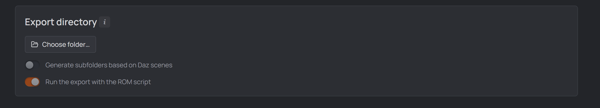

# 5 · Build the ROM in Daz Studio

## Run the script

1. Open the character's scene in Daz Studio — the scene chip on the character page
   has an **Open in Daz** button.
2. In Daz's **Content Library** pane, browse your library:
   **Scripts → DTH-Character-Studio → \<Project\> → \<Character\>**.
3. Double-click **`ROM_<Name>_G9`**.

<!-- SCREENSHOT — paste the image URL into src below, then delete this comment line and the closing one
<p align="center">
  
  <br>
  <sub><em>The character's ROM script in Daz's Content Library.</em></sub>
</p>
-->

The script builds the entire ROM on the timeline — every section you enabled,
every morph on its exact frame. This takes a moment on a big ROM; the script
reports what it did when it finishes.

&nbsp;

> [!NOTE]
> If anything couldn't be applied — a missing morph, a failed preset — the
> script says so in a dialog at the end, and the studio lists the exact
> failures when you switch back to it. The ROM's frame count is never
> affected: a missing morph leaves its frames empty instead of shifting
> everything after it.

&nbsp;

> [!NOTE]
> The scripts check the **open scene** first: running a character's ROM,
> export or scan script while some *other* scene is open (or an unsaved one)
> does nothing — an error dialog names the open scene and the character's
> linked scenes instead. No more silently building Kira's ROM into the wrong
> scene.

&nbsp;

## Direct export (optional, recommended)

Instead of exporting by hand, let the script drive the **DTH Exporter Plugin**
(v1.8.1+, installed in step 2):

<p align="center">
  
  <br>
  <sub><em>The export directory section on the character page.</em></sub>
</p>

1. On the character page, check the **Export directory**. A new character
   already has one: its own **Houdini subfolder** (the empty folder the
   studio seeds for the character's Houdini project). Change it with
   **Change…** if you export somewhere else, or **Clear** it to turn the
   auto-export off.
2. Run the script in Daz as above — after building the ROM it now runs the
   exporter automatically and writes everything the pipeline needs into your
   export folder: **`<Name>.abc`**, **`<Name>.dth`** (extra scenes:
   `<Name>_<Scene>.*`), and the
   **PoseAsset CSV** (plus a **reference-skeleton FBX** for each **Bone scale**
   frame, under a `Reference Skeletons` subfolder — the CSV already points at
   each one).

Every scene exports into its **own subfolder** of the export directory, named
after the subfolder the scene lives in inside the character folder (the
primary scene's is `primary`; extra scenes get theirs when they're added) — so
outfit/scene variants of one character always export side by side. The
exporter output **and** the PoseAsset CSV land in that subfolder, and the
export files carry the scene in their name too — `Kira_Summertide.abc` for the
`summertide` scene (capitalized), not another `Kira.abc` — so files from
different scenes stay distinguishable after they leave their subfolder
(Houdini file pickers, recent lists). The **primary scene** is the one
exception: it exports into its subfolder like every scene, but its files keep
the plain name (`Kira.abc`, never `Kira_Primary.abc`) — the primary is the
character.

### The Houdini project folder

The **Houdini project folder** field (new characters start with
`<Project>_<Character>`) puts a Houdini-project layer above those scene
subfolders: everything exports into

```
<export dir>/<project folder>/dth-export/<scene subfolder>/
```

Point a Houdini project at `<export dir>/<project folder>` with **File → Set
Project** and every import becomes project-relative —
`$JOB/dth-export/primary/Kira.dth` ([Into Houdini](./06-into-houdini.md)).

- **Empty the field** and no project folder is created — each scene's subfolder
  exports directly into the export directory (how it always worked; existing
  characters keep this until they set a folder).
- With a **non-primary Daz scene selected** the field overrides **per scene**
  (the green override mark, like the identity dials): a scene can export into
  its own project folder — or, overridden to empty, directly into the export
  directory.
- **Old folders clean themselves up**: the studio remembers which export
  folders the current layout uses, and when the layout changes (a renamed or
  cleared project folder, a moved scene subfolder) the previous run's folders
  are removed from the export directory on the next save. Clearing the whole
  export directory never deletes anything.

Two switches tune this:

- **Run the export with the ROM script** — on (the default), the one
  `ROM_<Name>_G9.dsa` builds the ROM and runs the export. Off, the export
  splits into its own **`Export_<Name>_G9.dsa`** beside the ROM script — run it
  after the ROM script in the same Daz session; handy for re-exporting
  (another scene, or after a failed export) without rebuilding the ROM.
- **Export hair assets too** — right after the main export, each of the open
  scene's [hair items](./advanced.md#hair-items--per-scene-kept-out-of-the-export)
  is exported on its own (`<Name>_Hair_<item>_grooms.abc` — the same per-item
  pass as the standalone `Export_Hair_…` script), into the same export folder.
  Works in both modes: with the combined ROM script and with the split
  `Export_…` script. Scenes without a hair list skip the pass.

&nbsp;

> [!NOTE]
> **Running a scene with per-scene overrides?** The one `ROM_<Name>_G9.dsa` embeds
> every scene's [overrides](./advanced.md#per-scene-overrides--edit-to-override) and
> applies the right ones for whichever scene is **open in Daz** — so open the right
> scene before running it. A scene with **ROM** overrides also has its own
> PoseAsset CSV to import in Houdini — see
> [What Save generates](./advanced.md#what-save-generates).

&nbsp;

> [!NOTE]
> No export directory set? The ROM is still built in Daz — export manually with the
> DTH Exporter as described in the DazToHue docs; the PoseAsset CSV is waiting in
> the character's folder.

&nbsp;

[← Your first character](./04-first-character.md) · [Next: Into Houdini →](./06-into-houdini.md)
