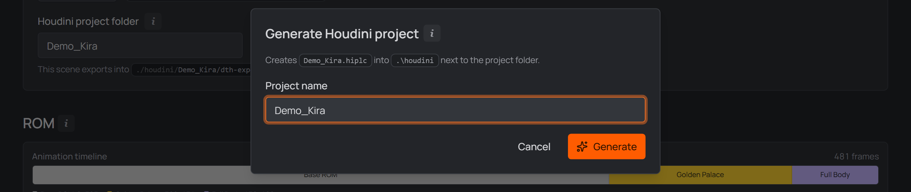

# 6 · Into Houdini

The Houdini side of the pipeline is the **DazToHue HDA** — its own documentation
covers the network in depth; this page is just the hand-off.

## What the studio gives you

- The **Houdini assets** (otls, presets, toolbar) were merged into your Houdini
  documents folder during [setup](./02-setup.md).
- Your character's **PoseAsset CSV** — delivered into each scene's export
  folder under the same scene-suffixed base name as everything beside it
  (`<Name>_<Scene>_pose_asset.csv`; the primary scene's is plain
  `<Name>_pose_asset.csv`). Without direct export, take it from the studio's
  own copy: `<Project>/.dcsmeta/characters/<Character>/<Name>_pose_asset.csv`.
  That folder is hidden and belongs to the app — read from it, don't edit it;
  the next Save overwrites what's there.
- The exporter's **`<Name>.abc`** / **`<Name>.dth`** next to it.
- For any **[Bone scale](./04-first-character.md)** frames, a
  **reference-skeleton FBX** each — the CSV already points at them, nothing to
  wire up.

## Hook it up

In your DazToHue network, point the **PoseAsset** import at the character's
`_pose_asset.csv` and the geometry import at the exported `.abc`/`.dth`.

Wire the network once — from then on the studio can run it for you: pick the
project in [**DTH Export**](./05-rom-in-daz.md#batch-export--dth-export) and it
runs the DazToHue exports for the scenes in scope, headless in the background —
with **Skip Daz — use last exports** for a Houdini-only pass.

> [!TIP]
> The exports sit **under** the `.hip` that reads them, so the portable form
> costs nothing: in the file picker, navigate to `daz-export/` and tick
> **Make path relative to current directory** — the import reads
> `$HIP/daz-export/primary/<Name>.dth`, which is exactly what the studio
> generates, and the `.hip` stays movable.
>
> Still worth pointing Houdini's **File → Set Project** at the
> **[character folder](./05-rom-in-daz.md#where-the-houdini-project-fits)** —
> the one holding `houdini/` — because `$JOB` is what reaches the character's
> `export/` folder, which sits beside the houdini folder rather than under it.
> [Generate project](#generate-the-houdini-project-automatically) bakes that in
> for you.

## Generate the Houdini project automatically

The character page's **Houdini projects → Generate project** creates the whole
project for you: a new scene named after the character (editable in the dialog,
which refuses a name that already exists), saved in the character's houdini
folder, with **Set Project already baked in** — `$JOB` on the **character
folder**, so both the scene and the exports sit under it — and the **DazToHue
network ready**. The network comes out
**wired**: the import file paths (`.dth`, FBX, Alembic, ROM FBX), the
**PoseAsset CSV path**, the **export directory** and the **Skinning method**
(Linear / Dual Quaternion, from the ROM definition) are prefilled — as
`$HIP/daz-export/…`, relative to the project's own folder, by default; absolute
when the project's
[Houdini path style](./05-rom-in-daz.md#reference-skeleton-paths--hip-by-default)
says so — and the **character name** is set with them. A parameter
your installed DazToHue version doesn't have yet is simply skipped (the CSV
path needs the release with the CSV-driven PoseAsset node).

The new scene's **timeline is set to 30 fps**, the rate the ROM is built at —
one pose per frame. DazToHue's import node sets this itself *when it loads the
files*, and a generated project never loads one (the studio builds the network
and fills its parameters directly), so the studio sets it up front. Houdini's
own default is 24, which would put every imported ROM frame between two of the
scene's own — and the PoseAsset CSV names frame numbers. If the generated scene
comes back on some other rate, the studio says so instead of assuming.

**Which scene?** A character with several Daz scenes gets a **Daz scene to
import** picker in the dialog — from the **second** project on. Each scene
exports into its own folder, so the pick decides which export set the imports
point at — generate one project per scene to cover them all. The **first**
project isn't asked (nor is a single-scene character): it is the character's
main project, wired to the primary scene.

Either way the dialog **says which scene it is generating for** — *"wired to
`KiraSummertide_G9_GP`"*, marking the primary as such — and the line follows the
picker as you change it. The confirmation names the scene too, so the answer
survives the dialog closing: a character with one project per outfit makes
*"which one did I just make?"* a real question.

The generated project **opens with its character already loaded**, on the rest
pose. Setting the import paths from a script doesn't run the import node's own
"a character was chosen" routine — the one that offers to fill the sibling paths
and then actually reads the files, which is what sets the Alembic's frame range
and puts the scene on frame 0 — so the studio runs it itself and answers its
prompt the way you would, then puts its own `$HIP/…` paths back so the project
stays movable. It only runs when the files are really on disk: generate before
the Daz export has produced them and the project comes out wired but unloaded,
exactly as it used to.

The **export directory** is a different folder from the imports, on purpose:
they read the Daz→Houdini intermediates under `daz-export`, while Houdini
writes its own Unreal-bound output to the character's **`export/`** folder
(`$JOB/export/`, or whatever the project's *Final export subfolder* is
named). One `export/` per character, shared by every scene's project.
Generate a second or third project and they all land in the same houdini folder,
so they share both `$JOB` and `$HIP` — and with `$HIP` shared, Houdini's own
output (renders, caches, backups) collects in that one folder rather than
scattering per scene.

<p align="center">
  
  <br>
  <sub><em>Generate project: one name, prefilled — the studio builds the scene, Set Project and the DazToHue network.</em></sub>
</p>

```
Ita/                            ← $JOB (Set Project), baked into every scene
├─ daz3d/                       ← your Daz scenes
└─ houdini/                     ← $HIP, and the shared project folder
   ├─ PlaygroundAssets_Ita.hiplc   ← the generated scene (imports daz-export/…)
   ├─ daz-export/                  ← what the DTH Exporter wrote, per scene
   └─ render/ geo/ backup/         ← Houdini's own output, shared by every scene here
```

Removing a **generated** project asks about its files: with **Keep houdini
files** on it is only unlinked; turned off, its scene file is deleted too. The
houdini folder itself always stays — the character's other scenes live in it,
and so does its `daz-export` folder. Hand-linked projects are always
unlink-only.

One one-time Settings entry powers it: the **Houdini installation folder**
(Houdini's own install directory — its `bin\hython.exe` builds the scene
headlessly), paired with the **matching Houdini documents folder**
(`Houdini 22.0.x` ↔ `…\Documents\houdini22.0`) so the DazToHue assets load.
Normally you never type either: activating a Houdini card in
[**Settings → General**](./02-setup.md#houdini-installation--same-idea) fills
both together, which is exactly why the cards exist — and the *Generate
Houdini Projects* section in Settings disappears entirely then, since there is
nothing left in it to set. Fill the paths by hand on a machine with no card
and Settings warns live when the pair doesn't match. The DazToHue
network is created from your **installed DazToHue HDA** at generate time, so
it's always the current plugin version — no template scene that could rot
across Houdini or DazToHue updates. If the HDA isn't installed the project
still generates (empty scene, Set Project baked) and the studio tells you to
add the network from the DazToHue shelf.

## Project checks — what the card warns about

The studio checks a character's own Houdini projects in the background: opening
the character page scans them (at most two at a time) and caches the result, so
nothing waits on Houdini and a project you haven't touched since costs nothing to
re-check. Projects linked from **outside** the character folder are left alone —
those are yours, and the studio has no `$JOB` expectation for them.

A project that needs attention gets a **Needs attention** marker on its card,
with the reason in the tooltip:

| What it says | What it means |
| --- | --- |
| `$JOB` points at … | the project's Set Project is another character's folder — every path it stores collapses against the wrong root |
| the timeline runs at … | the scene is not on the ROM's 30 fps (Houdini's own default is 24), so imported ROM frames don't land on the scene's frames |
| import paths do not resolve | a `.dth`/FBX/Alembic reference points at a file that isn't there |
| Not filled in yet | a DazToHue parameter the studio knows the value for is still blank |

All of them are repaired from the
[**Utils** drawer's *General* tab](./houdini-utils.md#the-general-tab)
(**Repair project settings**, **Make paths portable**, **Fill network**) — which
is exactly what makes **copying** a project workable: a copy arrives carrying the
source's `$JOB` and file references, the card tells you so, and three buttons fix
it. That drawer also copies a **material or skeleton setup** from one project
into another; it has [its own page](./houdini-utils.md).

> [!NOTE]
> The checks cover `$JOB`, the timeline, the DazToHue import paths and blank
> parameters. They do **not** verify material texture paths — a clean card is
> not a promise that every path in the scene resolves. A project the studio has
> never managed to read a value from is reported as *could not be read*, never
> as wrong: an unknown is not a fault, and nothing repairs one.

## `$DAZ3D_LIB` — your Daz library, as a variable

With both **My DAZ 3D Library** and the **Houdini documents folder** set in
Settings, the studio maintains a `DAZ3D_LIB` variable in each configured
Houdini version's `houdini.env`, pointing at your Daz library. Reference any
library file as `$DAZ3D_LIB/…` (textures, geometry, presets) instead of
hardcoding machine paths — together with the `$HIP`-anchored imports, the whole
project stays moveable. It updates automatically when the library path changes in
Settings, and **Tools → Refresh assets** (re)wires it too — restart Houdini to
pick up changes.

> [!NOTE]
> In the export folder, every scene's delivered CSV is scene-suffixed — always
> point the PoseAsset import at the CSV sitting in the scene subfolder you
> exported. (In the character's folder, a scene whose
> [per-scene ROM overrides](./advanced.md#rom-overrides) change the **frame
> layout** additionally has its own source CSV — see
> [What Save generates](./advanced.md#what-save-generates).)

<!-- SCREENSHOT — paste the image URL into src below, then delete this comment line and the closing one
<p align="center">
  
  <br>
  <sub><em>Point the DazToHue HDA's PoseAsset import at the character's CSV.</em></sub>
</p>
-->

&nbsp;

> [!NOTE]
> That's the whole trick: the CSV comes from the **same definition** as the Daz
> script you just ran, so every frame Houdini expects is exactly where Daz put
> it. Change the character later, Save, re-run, re-export — both sides move
> together.

&nbsp;

## Send to Unreal

Once Houdini has exported, the character page's **Send to Unreal** panel (under
the Houdini projects) hands that export to a linked Unreal project. It appears
only when the studio project has a linked `.uproject` — see
[Linking Unreal projects](./03-first-project.md#linking-unreal-projects).

What it sends is the `.dth` Houdini wrote into the character's **`export/`**
folder — the end of the pipeline, not the `daz-export` intermediate the Houdini
imports read. What imports it is **mrpdean's DazToHue importer plugin**, whose
own pipeline does the work: meshes, textures, materials, animation curves and
the post-process animation blueprint.

**The studio does not start Unreal.** An editor takes minutes to come up and
holds its project open, so the job is *queued* instead: the studio installs a
small bridge plugin into the project (`Plugins\DTHStudioBridge`, pure Python)
which watches for the job and runs the import within about a second. An editor
you open later claims the job on startup — the same way a closed Daz picks up a
batch that was queued while it wasn't running.

> [!NOTE]
> The panel says *"Waiting for the editor to pick it up…"* until something
> claims the job. That is the normal state while Unreal starts. If the project
> is already open and it never moves, the bridge was installed after that editor
> session began — restart the editor once and it will be there.

The bridge is rewritten on every send, so a project can never hold a version
older than the studio talking to it, and it lives in its own plugin: the
DazToHue plugin is never edited.

For the Unreal side itself, continue with the [DazToHue](https://docs.google.com/document/d/1LYXl90FCXPX5KVpru4_T_hCY_XLr9vinR_9zYENPHUw/edit?tab=t.0)
documentation.

---

**That's it — first character, first ROM, both sides in sync.** From the second
character on, the loop is just: *Add character → Fill from character → adjust
morphs → Save → run the script.*

[← Build the ROM in Daz](./05-rom-in-daz.md) · [Guide overview](./README.md)
