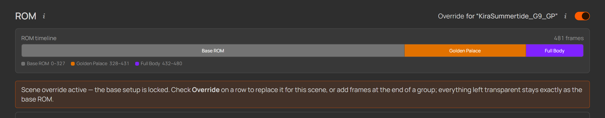

# Advanced

&nbsp;

> [!NOTE]
> Two optional power features live here: **multiple Daz scenes** on one character —
> outfits and hair variants, per-scene hair lists, and per-scene ROM overrides —
> and the **Modify JCM frames** grid for morphs riding along the shipped joint
> correctives. (The character page's collapsed **Advanced options** panel — storage
> location, preserve morphs / node transforms — is covered in
> [Your first character](./04-first-character.md#advanced-options--storage-location-preserve-morphs---node-transforms).)

&nbsp;

## Multiple Daz scenes — outfits & hair variants

One character often exists as **several Daz scenes**: the default look plus a
second outfit, a different hair style, a themed variant. Instead of duplicating
the character, link every scene to the one definition — the ROM setup, morphs and
generated files stay shared, and the per-scene bits (hair, overrides) attach to
the scene they belong to.

**Add scene** (or dropping a `.duf` on the cards) links another scene; a dialog
asks whether to **copy it into the character's scenes folder** or leave it in
place. The **primary** scene — the one the character was created from — can't be
unlinked; extras can. Every card has **Open in Daz**.

  
   
  <em>Two linked scenes: the primary and a selected outfit scene — the hair list below belongs to the selected card.</em>

### The selected scene

Clicking a card **selects** that scene, and the per-scene features follow the
selection: the **hair items** list below the cards always edits the *selected*
scene's list, and the ROM's **Override** toggle arms for the selected extra
scene. With more than one scene linked, the header **tags the selected scene
right next to the character name** — it stays visible in the collapsed sticky
header too, so you always know which scene you're working on. Clicking the tag
scrolls back up to the scene cards to switch.

  
   
  <em>The selected scene rides the header as a tag — click it to jump back to the scene cards.</em>

### Hair items — per scene, kept out of the export

With **Hair items live in the Daz scenes** on (the default), each scene
carries its full look — hair included — and the hair items you pick per scene
are kept out of the DTH export: they're hidden right before the DTH Exporter
runs and shown again afterwards, so hair never rides into the ROM's FBX/Alembic.
The DTH Exporter Plugin **2.0.1+** unparents the hidden items itself, keeping
them out of **both** the FBX and the Alembic (older plugins leak the hidden hair
into the FBX — the character page warns when yours is too old). Turned **off**,
nothing is excluded — the classic workflow where hair lives in separate Daz
scene files.

The picker under the scene cards edits the **selected** card's list — the lists
are **per scene**, since outfit scenes carry different hair. The one generated
script bakes every scene's list and applies the right one for whichever scene is
open in Daz; a scene with no items listed exports as-is.

- **List the top fitted item** (e.g. the hair cap) — its children ride along
  automatically.
- The dropdown offers the items found in the scene file (hair-ish names first,
  type to filter). A label the scan doesn't offer can be typed exactly as it
  appears in Daz's **Scene** pane and added.
- A listed label that isn't found in the scene turns amber — the export stops
  loudly on a label missing from the open scene rather than silently shipping a
  hair-polluted export.

Characters with hair items also get an `Export_Hair_…` script — it exports the
`_grooms.abc` for Houdini's **DazToHueGroom Import** node (the groom itself,
worn, with everything else hidden).

### Per-scene ROM overrides

A second outfit sometimes needs **different morphs on a few frames** — a body
shape that reads better in that clothing, other values, plus **a few extra
frames** for morphs only that outfit's assets have (a skirt flow, a hood
adjust). A **scene override** does exactly that without touching the base ROM:
most frames stay as defined, a few rows are replaced for that scene, and new
frames append at the end.

Select an **extra** scene in the cards (the primary *is* the base ROM), then
flip the **Override** toggle at the top right of the ROM section:

  
   
  <em>Override enabled for the selected outfit scene — the base setup locks while the override is edited.</em>

The grids switch into override mode: every base row turns **slightly
transparent and read-only**, and a leading **Override** checkbox appears.

- **Check a row** to replace it for this scene — it comes back at full strength,
  seeded with the base row's content, and everything on it is editable: name,
  morphs, values, bone scale, combined morphs. **Uncheck** to fall back to the
  base row again.
- **Add morph** appends an override frame **at the end of the group** — added
  frames are always fully visible and are the only rows an override can delete.
  Inserting between existing frames, reordering, and all structural edits
  (sections, modes, presets, groups) stay locked: the base frame layout is
  fixed, so every untouched frame keeps its exact number.

  
   
  <em>Override mode: the checked row is replaced for this scene; the transparent rows stay exactly as the base ROM.</em>

On **Save**, every scene with an active override gets its **own artifact pair**
next to the defaults, from the merged result:

- **`ROM_<Name>_<Genesis>_<Scene>.dsa`** — the scene's apply-script, installed in
  the same scripts folder. Run it **with that scene open in Daz**; the default
  `ROM_…` script remains the one for the primary scene.
- **`<Name>_<Scene>_pose_asset.csv`** — the scene's PoseAsset CSV, next to the
  default one in the character folder. With split export on, a scene
  `Export_…` variant delivers it.

&nbsp;

> [!NOTE]
> Overrides are validated on Save exactly like the base ROM — an added frame
> still needs a name and a morph, and a blocked save jumps straight to the
> offending row. Frame numbers shown in override mode are the merged ones: what
> the scene's own script and CSV actually generate.

Toggling an override **off** keeps its stored rows (re-enable it and they're
back) but stops generating — the scene's artifacts are cleaned up on the next
save. Unlinking the scene behaves the same way, so re-linking it later restores
the work.

&nbsp;

## Modify JCM frames

The **JCM** section runs the shipped joint-corrective-morph poses — bones rotate
through their range and the stock correctives fire. To ride *your own* morphs along
with those bends, the JCM section has a **Modify JCM frames** grid: an optional
power feature, collapsed by default.

  
   
  <em>The Modify JCM frames grid expanded in the JCM section.</em>

You build it from **rules**, each watching **one bone's rotation axis** (XRotate /
YRotate / ZRotate) across the JCM ROM. A rule's **drives** are the morphs it sets
proportionally to the keyed angle — the **angle range maps linearly onto a value
range**. Which way a drive corrects is read from its **angle range's sign**, so one
rule can hold drives for both bend directions at once. Example: layer a custom
calf-flex morph on top of the shipped knee-bend poses.

Each drive is one row:

- **Morph name** — the morph to drive (autocompletes, same as everywhere else).
- **Angle from / to** — the bone angles (degrees) over which the morph ramps; the
  **sign of Angle to** sets the bend direction (e.g. `−115` = the negative bend — a
  zero or zero-crossing range is flagged).
- **Value from / to** — the morph's value at those angles, as a Daz-style
  percentage (`100 %` = fully dialed).

**Add rule** starts a new bone/axis; **Add morph drive** adds a row to a rule. The
**mirror** button copies a rule to the other side, flipping every Left/Right and
`_L`/`_R` token in the bone and morph names while carrying the angles and values
over unchanged — so you set a limb up once and mirror it.

[← Your first character](./04-first-character.md)
