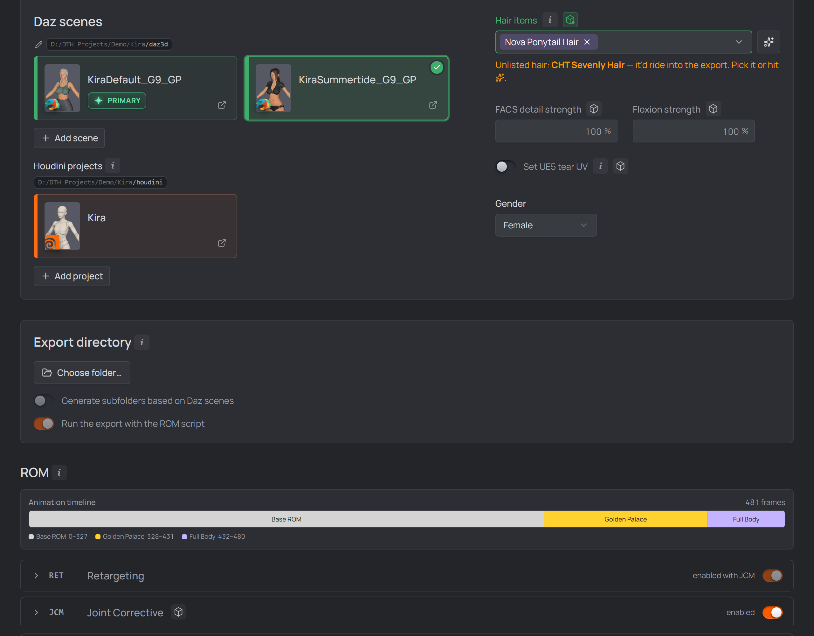
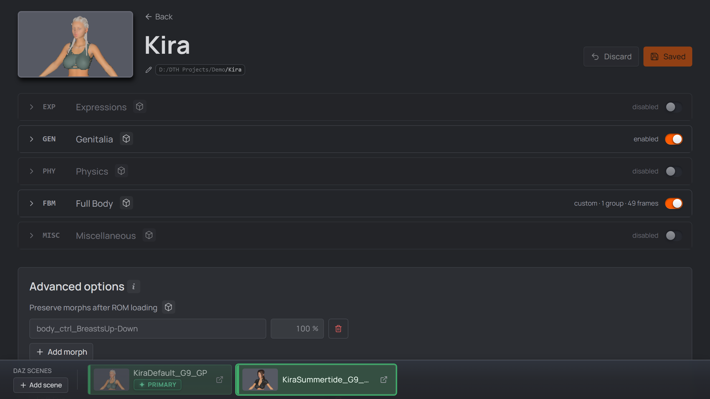
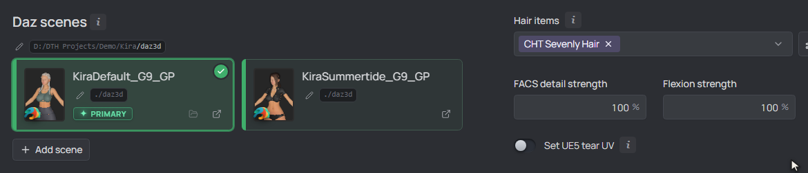
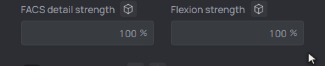
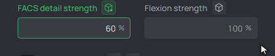
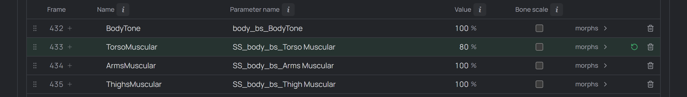
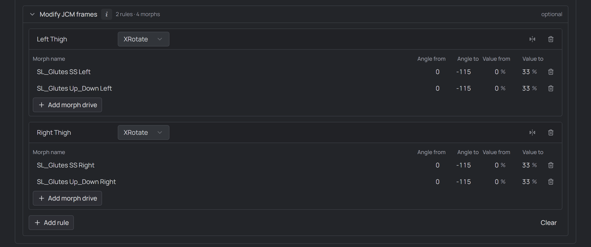

# Advanced

Two optional power features: **multiple Daz scenes** on one character (outfits,
per-scene hair, per-scene overrides), and the **Modify JCM frames** grid.
(Preserve node transforms are covered in
[Your first character](./04-first-character.md#advanced-options--preserve-node-transforms).)

## Multiple Daz scenes — outfits & hair variants

One character often exists as **several Daz scenes** — outfits, hair styles, themed
variants. Instead of duplicating the character, link every scene to the one
definition: the ROM stays shared, the per-scene bits attach to their scene.

  
   
  <em>Two linked scenes: the primary and a selected outfit scene — the hair items beside the cards belong to the selected one.</em>

**Add scene** (or dropping a `.duf` on the cards) links another scene, validated
first — same Genesis generation, one character, empty timeline, and the **same
GP/DK geograft as the primary** (*Add anyway* overrides) — then copied into its
**own subfolder**, or left in place. The **primary** can't be unlinked; extras can,
and removing one with **Delete file on disk** ticked also deletes that scene's
subfolder (saved ROM animations included) and its `daz-export` folder.

**Replacing the primary** is offered while it is the character's **only** scene:
its card's folder button browses for a new scene, runs the same validation, then
swaps it in — the Genitalia section re-derives from the new geograft, detected
[hair items](#hair-items--per-scene-kept-out-of-the-export) are pre-selected, and
the avatar follows. With extra scenes linked it is not offered, since each was
validated against the *current* primary: unlink them first, replace, then add each
back.

### The selected scene

Clicking a card **selects** that scene, and the per-scene features follow: the
**hair items** list beside the cards edits the *selected* scene's list, and editing
an overridable field overrides it for that scene. Scroll the cards off-screen and a
**docked scene bar** slides up along the bottom — click a pill to switch, exactly
like its card.

  
   
  <em>Scroll the scene cards off-screen and the docked bar keeps the selected scene on hand — click a pill to switch.</em>

### Hair items — per scene, kept out of the export

Whatever a scene lists as hair items stays out of the DTH export: hidden right
before the DTH Exporter runs, shown again after. The Exporter Plugin **2.0.1+**
also unparents them, keeping them out of **both** the FBX and the Alembic (the
character page warns when your plugin is older). A scene that lists nothing
excludes nothing. The picker edits the **selected** card's list; the one generated
script bakes every scene's list and applies the right one for the open scene.

- **List the top fitted item** (e.g. the hair cap) — its children ride along.
- The dropdown offers the items found in the scene file; a label it doesn't offer
  can be typed exactly as it appears in Daz's **Scene** pane.
- A listed label that isn't found in the open scene turns amber, and the export
  stops rather than shipping a hair-polluted export.

Characters with hair items also get an `Export_Hair_…` script — **one
`<Name>_Hair_<item>_grooms.abc` per listed item** for Houdini's **DazToHueGroom
Import** node.

### Per-scene overrides — edit to override

Beyond hair, almost everything on the character page can differ **per scene**: the
**identity dials**, the **Advanced options** preserve list, and the **whole ROM**
— every section's mode, preset asset, GEN art direction, custom-JCM path, frames
and groups, plus the **Modify JCM frames** grid. There is no override switch: on a
non-primary scene you **edit the field, and a value that differs from the primary
becomes that scene's override.**

**Select the scene first.** While a non-primary scene is selected, each overridable
field — and each ROM **section title** — carries a small **cube glyph**.

  
   
  <em>Click the outfit scene's card: it takes the selection, its own hair list comes up — and the cubes appear.</em>

**Then edit.** A value that differs turns that field and its label green and puts a
dot on its cube — only that field; its neighbours go on tracking the primary.

  
   
  <em>No override switch — the edit <em>is</em> the override. Flexion beside it never moved, so it still follows the primary.</em>

**The green cube is also the way back.** Hover it and it becomes a **reset** to the
primary's value.

  
   
  <em>Hovering the green cube swaps it for ↺ — one click and the field is back on the primary's value.</em>

The one thing no scene can override is the **GEN section's on/off state**, which
follows the primary scene's geograft. Its *content* overrides like any other
section's.

#### ROM overrides

Select the extra scene (the primary *is* the base ROM); every control stays live.
What you touch decides how much becomes the override:

- **Tweak a base row** — its value, name, morphs, bone scale — and just **that
  row** becomes the override: it turns **green** and gains a **reset** back to the
  base ROM frame. Untouched rows keep tracking later base edits.
- **Restructure or reconfigure a section** — reorder, insert or delete a frame, add
  a group, switch the **mode**, swap the **preset asset**, edit a GEN
  **Art-direction** frame, set a custom **JCM path**, or **Import from Daz scene**
  — and the **whole section** becomes this scene's override.

Either way the section's **title cube goes green**; the section-title **reset**
restores the entire section at once, the per-row ↺ only that frame.

  
   
  <em>A non-primary scene's ROM grid: the green row is overridden for this scene (↺ resets it); the rows around it stay exactly as the base ROM.</em>

#### What Save generates

Save still produces **one** ROM apply-script — there are no per-scene scripts:

- **`ROM_<Name>_<Genesis>.dsa`** embeds every scene's overrides and applies the
  right ones for whichever scene is **open in Daz**.
- A scene whose overrides change the **frame layout** — different frames or counts,
  a swapped preset, a flipped mode — also gets its own
  **`<Name>_<Scene>_pose_asset.csv`** beside the default one (in the studio's
  [`.dcsmeta` folder](./06-into-houdini.md#what-the-studio-gives-you)), since
  Houdini has no runtime to pick frames. Overrides that only change applied values
  ride the base CSV.

> [!NOTE]
> Overrides are validated on Save exactly like the base ROM, and frame numbers
> shown on a non-primary scene are the merged ones: what that scene's CSV actually
> generates.

An override isn't a mode you switch off — it exists exactly as long as something
differs from the primary. Reset every green field and section title and the scene
falls back to the base; its extra CSV is cleaned up on the next save.

## Modify JCM frames

The **JCM** section runs the shipped joint-corrective poses — bones rotate through
their range and the stock correctives fire. The **Modify JCM frames** grid rides
*your own* morphs along with those bends (collapsed by default).

  
   
  <em>The Modify JCM frames grid expanded in the JCM section.</em>

The grid is built from **rules**, each watching **one bone's rotation axis**
(XRotate / YRotate / ZRotate) across the JCM ROM. A rule's **drives** are the morphs
it sets in proportion to the keyed angle — the angle range maps linearly onto a
value range. Example: layer a custom calf-flex morph on top of the shipped knee-bend
poses. The **bone** field autocompletes from the same index as every morph field;
build it once with [**Tools → Scan & index**](./tools.md#tab-1--scan-amp-index).

Each drive is one row:

- **Morph name** — the morph to drive (autocompletes).
- **Angle from / to** — the bone angles (degrees) over which the morph ramps; the
  sign of **Angle to** sets the bend direction (`−115` = the negative bend), so one
  rule can hold drives for both directions. A zero-crossing range is flagged.
- **Value from / to** — the morph's value at those angles, as a Daz-style
  percentage (`100 %` = fully dialed).

**Add rule** starts a new bone/axis; **Add morph drive** adds a row. The **mirror**
button copies a rule to the other side, flipping every Left/Right and `_L`/`_R`
token while carrying angles and values over — set a limb up once, mirror it.

Like the rest of the ROM, the grid is overridable per scene — see
[Per-scene overrides](#per-scene-overrides--edit-to-override).

[← Your first character](./04-first-character.md) · [Guide overview](./README.md)
