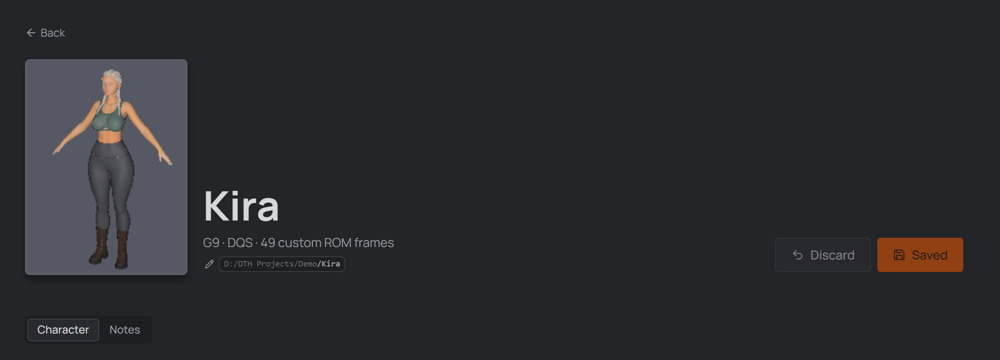

# Advanced

&nbsp;

> [!NOTE]
> Two optional power features live here: **multiple Daz scenes** on one character —
> outfits and hair variants, per-scene hair lists, and **per-scene overrides** (edit
> an identity dial, a preserve morph or anything in the ROM on an outfit scene to
> override just that scene) — and the **Modify JCM frames** grid for morphs riding
> along the shipped joint correctives. (The character page's **Advanced options** section —
> preserve morphs / node transforms — is introduced in
> [Your first character](./04-first-character.md#advanced-options--preserve-morphs--node-transforms).)

&nbsp;

## Multiple Daz scenes — outfits & hair variants

One character often exists as **several Daz scenes**: the default look plus a
second outfit, a different hair style, a themed variant. Instead of duplicating
the character, link every scene to the one definition — the ROM setup, morphs and
generated files stay shared, and the per-scene bits (hair, overrides) attach to
the scene they belong to.

**Add scene** (or dropping a `.duf` on the cards) links another scene; a dialog
asks whether to **copy it into the character's scenes folder** or leave it in
place. The **primary** scene — the one the character was created from — can't be
unlinked; extras can. Every card has **Open in Daz**.

  
   
  <em>Two linked scenes: the primary and a selected outfit scene — the hair list below belongs to the selected card.</em>

### The selected scene

Clicking a card **selects** that scene, and the per-scene features follow the
selection: the **hair items** list below the cards always edits the *selected*
scene's list, and editing an overridable field — a ROM frame, an identity dial or
a preserve item — overrides it for the selected scene. With more than one scene
linked, the header **tags the selected scene
right next to the character name** — it stays visible in the collapsed sticky
header too, so you always know which scene you're working on. Clicking the tag
scrolls back up to the scene cards to switch.

  
   
  <em>The selected scene rides the header as a tag — click it to jump back to the scene cards.</em>

### Hair items — per scene, kept out of the export

With **Hair items live in the Daz scenes** on (the default), each scene
carries its full look — hair included — and the hair items you pick per scene
are kept out of the DTH export: they're hidden right before the DTH Exporter
runs and shown again afterwards, so hair never rides into the ROM's FBX/Alembic.
The DTH Exporter Plugin **2.0.1+** unparents the hidden items itself, keeping
them out of **both** the FBX and the Alembic (older plugins leak the hidden hair
into the FBX — the character page warns when yours is too old). Turned **off**,
nothing is excluded — the classic workflow where hair lives in separate Daz
scene files.

The picker under the scene cards edits the **selected** card's list — the lists
are **per scene**, since outfit scenes carry different hair. The one generated
script bakes every scene's list and applies the right one for whichever scene is
open in Daz; a scene with no items listed exports as-is.

- **List the top fitted item** (e.g. the hair cap) — its children ride along
  automatically.
- The dropdown offers the items found in the scene file (hair-ish names first,
  type to filter). A label the scan doesn't offer can be typed exactly as it
  appears in Daz's **Scene** pane and added.
- A listed label that isn't found in the scene turns amber — the export stops
  loudly on a label missing from the open scene rather than silently shipping a
  hair-polluted export.

Characters with hair items also get an `Export_Hair_…` script — it exports the
`_grooms.abc` for Houdini's **DazToHueGroom Import** node (the groom itself,
worn, with everything else hidden).

### Per-scene overrides — edit to override

Beyond hair, almost everything on the character page can differ **per scene**: the
**identity dials** (FACS detail strength, Flexion strength, Set UE5 tear UV), the
**Advanced options** preserve morphs & node transforms, and the **whole ROM** —
every section's mode, preset asset, GEN art direction, custom-JCM path, frames and
groups, plus the **Modify JCM frames** grid. There's no override switch — on a
non-primary scene you just **edit the field, and a value that differs from the
primary becomes that scene's override.**

Each overridable field — and each ROM **section title** — carries a small **cube
glyph**. A plain cube means "can be overridden on this scene"; once you override it
the cube grows a **green dot** and the field (or the whole section) turns green (a
toggle flipped *off* as an override keeps a light-green knob). Hover or
keyboard-focus the cube for a **reset** button that drops it back to the primary
scene's value. On the primary scene there is nothing to override, so the cubes stay
dotless.

#### ROM overrides

A second outfit sometimes needs **different morphs on a few frames** — a body
shape that reads better in that clothing, other values, plus **extra frames** for
morphs only that outfit's assets have (a skirt flow, a hood adjust) — or a whole
section set up differently: a different preset, custom instead of preset, its own
art direction.

Select the extra scene (the primary *is* the base ROM). Its ROM is **always in
override mode** — every control stays live, with **two grains** of override
depending on what you touch:

- **Tweak a base row** — its value, name, morphs, bone scale, combined morphs — and
  just **that row** becomes the scene's override: it turns **green** and gains a
  **reset** button (the green ↺) that drops it back to the base ROM frame. Rows you
  don't touch stay exactly as the base ROM and keep tracking later base edits.
- **Restructure or reconfigure a section** — reorder (drag), insert a frame between
  others, delete a base frame, add a group, switch the section's **mode** (Preset ⇄
  Custom), swap its **preset asset**, edit a GEN **Art-direction** frame, set a
  custom **JCM path**, or **Import from CSV** — and the **whole section** becomes this
  scene's override. It then edits **exactly like the primary** — full drag, insert,
  delete and group management — just stored on this scene.

However a section diverges — one green row or a full takeover — its **title cube
goes green**, and the section-title **reset** (the green ↺ on the title) restores the
**entire section** to the primary at once. The per-row ↺ is the granular version:
it resets only that frame.

  
   
  <em>A non-primary scene's ROM grid: the green row is overridden for this scene (↺ resets it); the rows around it stay exactly as the base ROM.</em>

#### What Save generates

On Save it still comes out as **one** ROM apply-script — there are no per-scene
scripts:

- **`ROM_<Name>_<Genesis>.dsa`** embeds every scene's overrides and, at run time,
  applies the delta for whichever scene is **open in Daz** — the identity dials and
  the ROM frame changes alike. One script serves the primary and every outfit scene.
- A scene whose overrides change the **frame layout** — different frames or counts,
  a swapped preset, a flipped mode — also gets its own
  **`<Name>_<Scene>_pose_asset.csv`** next to the default one, since Houdini has no
  runtime to pick frames. Overrides that only change values the one script applies at
  run time (identity dials, preserve morphs, GEN art direction, JCM mods) ride the
  base CSV — no extra file.

&nbsp;

> [!NOTE]
> Overrides are validated on Save exactly like the base ROM — an added frame still
> needs a name and a morph, and a blocked save jumps straight to the offending row.
> Frame numbers shown on a non-primary scene are the merged ones: what that scene's
> CSV actually generates.

An override isn't a mode you switch off — it exists exactly as long as something
differs from the primary. **Reset every green field and section title** and the
scene falls back to the base; its extra CSV is cleaned up on the next save.
Unlinking the scene does the same, so re-linking it later restores the work.

&nbsp;

## Modify JCM frames

The **JCM** section runs the shipped joint-corrective-morph poses — bones rotate
through their range and the stock correctives fire. To ride *your own* morphs along
with those bends, the JCM section has a **Modify JCM frames** grid: an optional
power feature, collapsed by default.

  
   
  <em>The Modify JCM frames grid expanded in the JCM section.</em>

You build it from **rules**, each watching **one bone's rotation axis** (XRotate /
YRotate / ZRotate) across the JCM ROM. A rule's **drives** are the morphs it sets
proportionally to the keyed angle — the **angle range maps linearly onto a value
range**. Which way a drive corrects is read from its **angle range's sign**, so one
rule can hold drives for both bend directions at once. Example: layer a custom
calf-flex morph on top of the shipped knee-bend poses.

Each drive is one row:

- **Morph name** — the morph to drive (autocompletes, same as everywhere else).
- **Angle from / to** — the bone angles (degrees) over which the morph ramps; the
  **sign of Angle to** sets the bend direction (e.g. `−115` = the negative bend — a
  zero or zero-crossing range is flagged).
- **Value from / to** — the morph's value at those angles, as a Daz-style
  percentage (`100 %` = fully dialed).

**Add rule** starts a new bone/axis; **Add morph drive** adds a row to a rule. The
**mirror** button copies a rule to the other side, flipping every Left/Right and
`_L`/`_R` token in the bone and morph names while carrying the angles and values
over unchanged — so you set a limb up once and mirror it.

Like the rest of the ROM, the grid is **overridable per scene** — edit it on a
non-primary scene and that scene keeps its own JCM mods (the JCM section title goes
green; its reset restores the primary). See
[Per-scene overrides](#per-scene-overrides--edit-to-override).

[← Your first character](./04-first-character.md)
