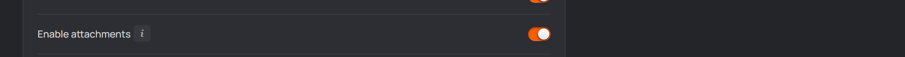
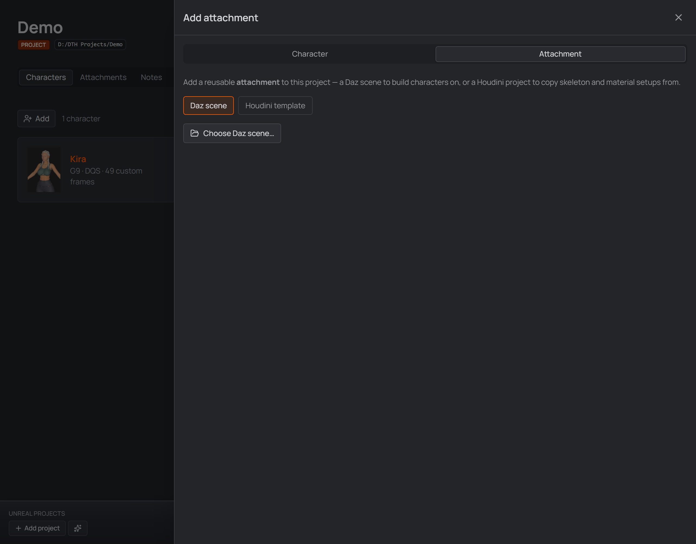

# Attachments

An **attachment** is a reusable file that **isn't a character** but that you keep
organized inside a project alongside its characters. Two kinds:

- a **Daz scene** (`.duf`) — a base figure, a prop, an outfit, a look you start from
- a **Houdini template** (`.hip`) — a ready-made skeleton or material + texture-baker
  setup that the [Utils drawer](06-into-houdini.md#utils--copy-a-texture-baker-setup-between-projects)
  copies from

It's an **opt-in, per-project** feature.

&nbsp;

> [!NOTE]
> Think of it as a labelled shelf plus a one-click "open this in Daz" button,
> not a character generator — adding an attachment does **not** create or
> pre-fill a character.

&nbsp;

---

## Enable it

Attachments are off by default. Open **Settings → Project** (the Project tab only
shows inside a project window) and turn on **Enable attachments**, then Save. The
setting is stored in that project's `.dcsp` file, so you enable it per project that
wants it.

  
   
  <em>Enable attachments in Settings → Project.</em>

With it **off**, the project's tab bar is just Characters / Notes / Operations.
With it **on**, an **Attachments** tab appears beside Characters, and the "Add"
panel gains a **Character / Attachment** choice.

---

## Houdini templates

Pick **Houdini template** in the Add panel and choose (or drop) a `.hip`. Give it
a name and a description — "G9 skeleton, UE5 twist bones" — and it becomes a
one-click source in the Utils drawer: the **Source** section lists this project's
templates by name, so copying a setup never starts with hunting for a file.

A Houdini template is **always linked, never copied**. Moving a Houdini project
safely needs every reference to be relative *and* its `$JOB` project folder to
travel with it, and neither can be verified from here — so the copy options
don't appear for a `.hip`.

## Add an attachment

On the **Attachments** tab, press **Add** and fill in:

1. **Choose Daz scene…** — pick the `.duf`. The rest of the form appears once a
   scene is chosen, with a thumbnail preview.
2. **Name** — auto-filled from the file name (e.g. `Kira.duf` → "Kira"); editable.
3. **Description** *(optional)* — what this base is for.
4. **Copy into the `.assets` folder** *(on by default)* — see below.
   - **Subfolder** *(optional)* — organize copies under `.assets/<subfolder>/`.
   - **Delete the original after copying** — makes it a move instead of a copy.
   - Turn the copy switch **off** to **link in place** — the scene stays where it
     is and the attachment just records its path.

  
   
  <em>The Add attachment panel with its scene thumbnail preview.</em>

**Copy vs link — the one thing to understand:**

| | Copy (default) | Link |
|---|---|---|
| Where the `.duf` lives | duplicated into the project's `.assets/` | stays where it is |
| Portable with the project | ✅ yes | ❌ points at an external file |
| Removing the attachment | deletes the copied `.duf` (optionally kept) | never touches your original |

Each attachment card shows its thumbnail (from the scene's `.tip.png`/`.png`
sidecar, or the name's initials), its name/description, a storage badge (`linked`, or
`.assets/<subfolder>`), and two actions: **Open scene in Daz** and **Remove
attachment**.

---

## Use an attachment

The only in-app action is **Open scene in Daz** — it opens the `.duf` in Daz
Studio (Daz must be the registered handler). From there you work in Daz as
usual: dial your character on top of the base, save a new `.duf`, and back in
the studio **Add character** pointing at that saved scene.

---

## On disk

Everything lives in a hidden **`.assets/`** folder inside the project:

- `.assets/assets.json` — the registry (names, descriptions, scene paths, copy/link
  flags).
- copied scenes (and their thumbnails) under `.assets/` (or `.assets/<subfolder>/`).

There is **no global/shared attachment library** — attachments belong to one project
only. Changing the project's characters subfolder never touches `.assets`.

## Good to know

- `.duf` scenes only.
- The adjacent **Enable Daz Products** switch is a separate feature — see
  [Daz product scanning](./product-scanning.md).

[← Guide overview](./README.md)
