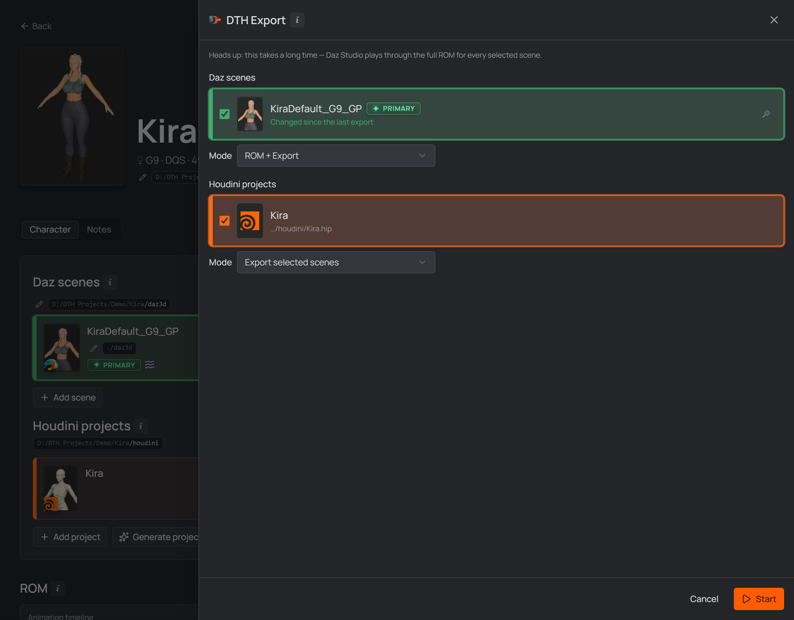

# 6 · The DTH Export batch

The **DTH Export** button in the character header runs the whole round trip
unattended: every Daz scene you pick gets its ROM built and exported, the Houdini
projects that read those exports run straight afterwards, and the result can be
queued for re-import into a linked Unreal project. One run, one report.

## The short version

1. Press **DTH Export** in the character header.
2. Check the **Daz scenes** to run (the ones with outstanding work are already
   ticked) and leave the **Mode** on *ROM + Export*.
3. The **Houdini projects** that read those scenes are already ticked too — and
   so is any **Unreal project** the run would refresh.
4. Press **Start**. The panel closes and the run reports in the character header.

That is the whole thing. The rest of this page is what the individual choices do.

  
   
  <em>Pick the Daz scenes and their run, then the Houdini projects that carry on with the results.</em>

## Daz scenes

Every linked scene is listed; the ones with outstanding work come pre-checked
(the wand picks a single scene, a double-click selects all). The **Mode** decides
what their run does:

| Mode | What runs |
| --- | --- |
| **ROM + Export** | the full run — a fresh ROM, the saved ROM animation scene, and the export of everything (skeletal mesh and hair) |
| **ROM only** | build the ROM and save the [`rom-animations` scene](./05-rom-in-daz.md#what-a-run-exports); no export |
| **Export only** | export the saved ROM animations as they stand, without rebuilding. Pre-selects the scenes whose ROM animation is newer than their last export; skips scenes that have none |
| **Skip Daz — use last exports** | nothing runs in Daz — the Houdini projects work off each scene's last export on disk. Scenes that never delivered an export are kept out, and one whose export **didn't land** (a crashed run leaves a 0-byte `.dth`) is refused by name |

## Houdini projects

The character's linked projects, pre-selected whenever scenes are — so a plain
**Start** does the whole round trip. Untick them and the run ends with Daz. Their
own **Mode** is either **Export selected scenes** (the default) or **Skip Houdini
— use last exports**, which hands the exports already on disk to the Unreal
projects below (offered only when the studio project has a linked `.uproject`).

**The project list follows the scene selection.** Untick a Daz scene and the
projects that only import *that* scene leave the run with it — matched on the
import path, the same one Houdini uses at export time, not on names. A project the
background scan hasn't reached yet keeps whatever you set.

Several selected projects run **one after another**. **ROM only** is the
exception: it builds no fresh export, so the projects don't pre-select and the
export mode is disabled.

> To just **open** a Houdini project, use the open button on its card — this panel
> runs the pipeline.

## Unreal projects

The third leg, shown once the studio project has
[linked `.uproject` files](./03-first-project.md#linking-unreal-projects). Tick one
and the finished export is **queued for import** when the whole run ends: the job
is a file, and the project's
[DTH Character Studio Runner](./06-into-houdini.md#send-to-unreal) picks it up
whenever that editor is next open — the studio opens the project for it if nothing
does.

**The run is not over until the editor answers.** Writing that job file takes a
moment; the import behind it takes minutes. So the report waits for it, and the
import's outcome — with the time the import itself took — is the report's last
line. Nothing waits when there is nothing to wait for: a send that was refused, or
a run with no Unreal project ticked, reports the moment its export legs are done.

**The project is the only thing you tick.** Which export sets go is worked out from
what the checked Houdini projects write (or, under *Skip Houdini*, from what is on
disk), and the run's task list names every set with the project it lands in.

The send is **re-import only**, so a project that already holds one of this run's
sets starts ticked. A project holding nothing this run makes goes inert and says
so: a character's **first import** is made in Unreal itself, and that is where you
decide where it lives. A Houdini project the background scan hasn't reached yet
says nothing about what it writes, so nothing is pre-ticked — send it anyway and
**everything** in the export folder that project holds is re-imported; **Rescan**
it (Utils drawer) and the run sends only what it makes.

## Start

Press **Start**: the panel closes and the batch is handed to Daz Studio, where the
bundled [**Runner plugin**](./02-setup.md#daz-studio-plugins) works through it
unattended. A closed Daz is **opened where you can see it** — this is a run you are
watching. A running Daz picks the batch up by itself and is left as you had it.

The panel refuses to start while the Runner plugin is missing or older than the one
bundled with the app; the notice links straight to Settings. A skip-Daz run doesn't
need the Runner at all.

## Watching the run

The character header becomes the run's display for as long as it lasts.

  
   
  <em>The live pipeline: one list of what the run does, and how far through it is.</em>

- **One task list**, numbered in run order and stacked **bottom-up** like a log,
  with **one row per job**: every selected **Daz scene**, every **DazToHue
  network** (not merely every `.hip` — a project holding two networks is two
  rows), and every **export set going into an Unreal project**. A finished row is
  ticked, then **retires** so the work still ahead stays in view — a **failed** row
  never does. Numbering counts the whole run, so a row's number never changes.
- **One progress bar** underneath, with the **newest thing the run said** printed
  on it. Only the newest line is shown; each leg's full output stays on disk (the
  Runner's progress log, Houdini's console log, Unreal's own).

The button beside it reads **Working** with the elapsed time. Nothing is announced
mid-run: **one report** at the end covers every leg, with any per-scene failures and
the total time. The end is the **last leg's** answer — with an Unreal project
ticked, that is the editor's, minutes after the export itself finished. **A run that produced nothing is never reported as a success** —
the report also reads the character's own **ROM run log**, so a scene that failed
mid-ROM is named as a failure, and when nothing survived the Houdini and Unreal
legs are **held back**. It checks the **export folder** too: a Daz script the
exporter kills mid-export still returns cleanly, so a missing or 0-byte `.dth` is
what gives it away. Such a scene is reported as *“the Daz export did not land”*
and dropped from the Houdini leg, rather than cooked into a green tick. A **morph that could not be applied** deliberately does
*not* count: its frame stays in the ROM (empty) and the export still runs.

### Interrupting

Hover the **Working** button while a run is live and its spinner becomes a stop
mark — *Click to interrupt* — through both legs:

- The **ROM build stops** where it happens to be, and the **export that would have
  followed is skipped**, along with every scene still queued. A queued scene still
  opens in Daz (the Runner owns the batch), it just does no work.
- The **Houdini leg stops between export nodes** and closes its background
  Houdini; projects still queued never start.
- The report says **DTH Export interrupted**, never *"n scenes exported"* — after
  an interrupt the studio can no longer tell a scene that exported from one that
  was skipped. The ROM run log names the scene that was cut off.

What is already written stays. The interrupt cannot cut short a call already
running inside Daz or Houdini, so the button can sit at **Stopping** for a while.
Before Daz has picked the batch up at all it reads **Abort** instead.

> **If a run is stuck rather than running** — Daz sitting on a dialog, or a batch
> this window is only *showing* — nothing is left to read the interrupt.
> [Settings → App Data](./02-setup.md#the-app-data-tab) clears the stuck batch
> handoff, so the next export isn't refused with *"a batch is waiting for Daz
> Studio"*.

**Reloading the app doesn't lose the run** — the character's editor picks it back
up when it opens; any *other* window shows the same run read-only.

## Carry on into Houdini

With Houdini projects selected in an exporting mode, each project **runs its own
DazToHue exports** for the scenes in scope, right after the Daz batch delivers
(or immediately, with **Skip Daz**).

1. Daz finishes the batch and the Houdini leg starts straight away — the report
   waits until the *whole* round trip is done.
2. Houdini runs the project **headless**: `hython` loads it in the background,
   works the batch and exits. No window opens; the header's task list is where you
   watch it.
3. Only the networks importing **the scenes you ticked** export. A project holding
   networks for other scenes — or other characters — is left alone.
4. After the last project, **one report** names every leg — *"Daz: 2/2 scenes
   exported in 3m 10s"*, then a line per Houdini project.

Two things it deliberately won't do: **overwrite an export directory you
configured** (only a blank one is filled in from the run), and **save the project**
(any parameter it touches is put back afterwards). If the DazToHue pre-flight check
reports problems, the studio answers its *"Continue anyway?"* prompt and **keeps
the message**, so those problems reach the report.

Everything Houdini printed lands in **`.dth_houdini_console.log`** in the character
folder — one file per character, overwritten by that character's next run, and
deliberately not cleaned up with the run's other files. A headless run that dies
without a word is reported as **Houdini exited during** *its last step*, with
`hython`'s exit code: a negative one (`0xC0000005`) is a crash inside Houdini, not
a studio failure.

&nbsp;

[← Build the ROM in Daz Studio](./05-rom-in-daz.md) · [Next: Into Houdini →](./06-into-houdini.md)
