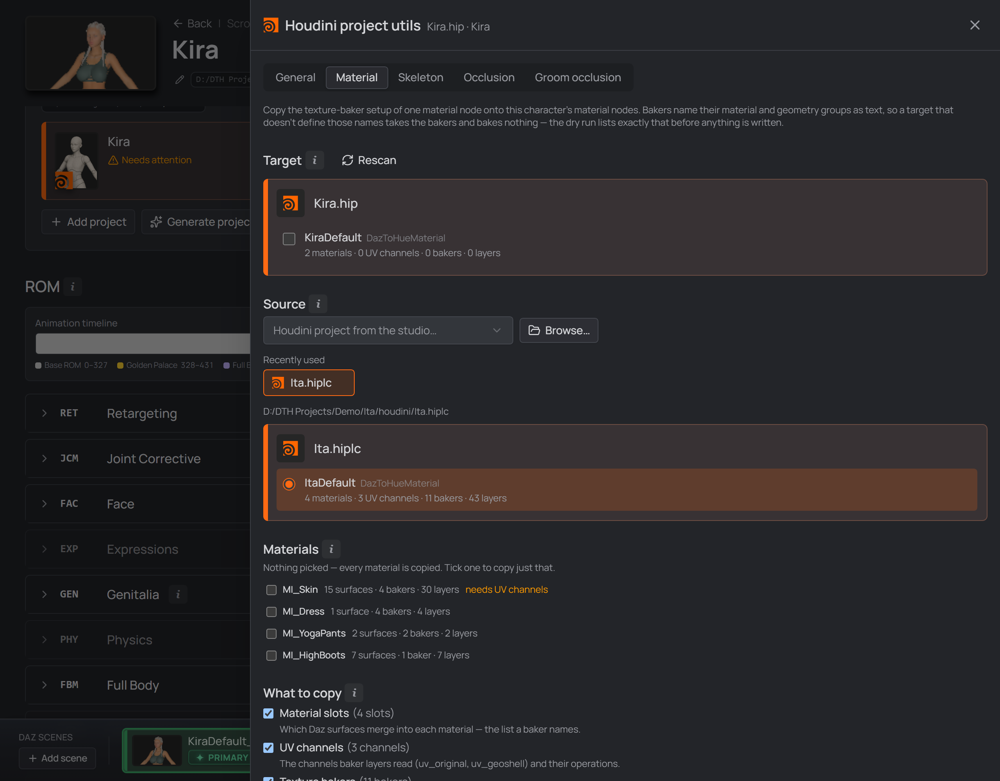
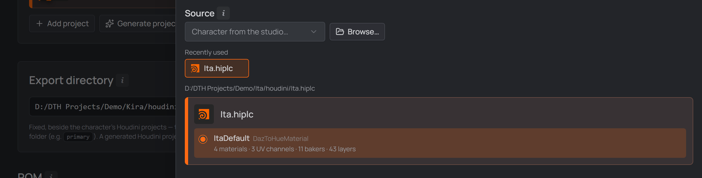
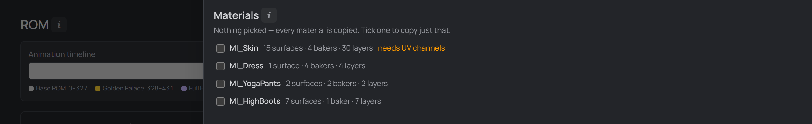
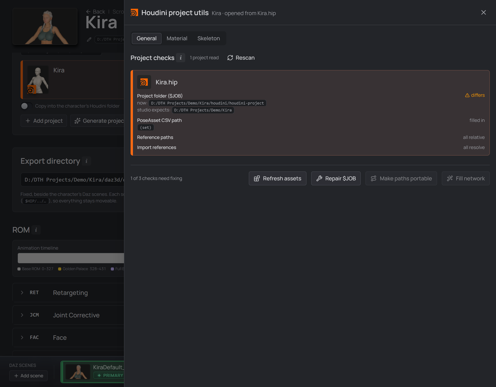

# The Utils drawer

Every Houdini project card on the character page carries a **Utils** button (the
🔧 that appears on hover). It opens a drawer with a tab per job:

- **General** — the health check of the projects themselves, and the repairs for
  what it finds. The tab it opens on, and the only one useful without a second
  project picked.
- **Material**, **Skeleton**, **Occlusion** and **Groom occlusion** — copy a
  node's **complete setup** from one project into another. One tab per DazToHue
  node kind, because a setup belongs to its node: the material tab carries
  material slots, UV channels and texture bakers, the other three carry their
  node's own option folders.

For what the studio hands Houdini in the first place — the CSV, the exports and
the generated project — see [Into Houdini](./06-into-houdini.md).

## Copy a texture-baker setup between projects

Setting up a **DazToHueMaterial** node is the most tedious part of the whole
workflow: one skin material easily runs to four bakers of thirty layers, each
layer naming a texture, a geometry group, a blend mode and seven adjustments —
on top of the material slots that merge fifteen Daz surfaces into one `Skin`.
If you reuse the same skin across characters, you were rebuilding all of it by
hand.

  
   
  <em>The Utils drawer: the character's own projects as targets, a browsed project as the source, and what travels.</em>

- **Target** — this character's linked Houdini projects, with every DazToHue
  material node found in each. Tick as many as you want; the card you opened
  Utils from starts selected.

  **Network boxes are picked up if you use them.** Once a project holds more
  than one DTH network, the usual way to keep them apart is to wrap each in a
  network box and give it a title — and then the nodes inside are all called
  `DazToHueMaterial`, `DazToHueMaterial1`, `DazToHueMaterial2`, which says
  nothing about which network you're picking. The scan reads the box title and
  lists those as `KiraDefault`, `KiraYoga`, `KiraNaked`, keeping the node name
  beside it. Boxes are entirely optional: with one network — or an untitled
  box — the list simply shows the node name, exactly as before.
- **Source** — the node to copy *from*: pick another character from the studio,
  or **Browse…** for any Houdini project on disk (dragging a `.hip` out of
  Explorer onto that button does the same). A project that keeps
  **[Houdini templates](./attachments.md#houdini-templates)** lists them here by
  name as one-click sources. The **last five** sources you picked are offered as
  **Recently used** chips under the picker, so the template you keep coming back
  to is one click rather than another trip through the file dialog — re-picking
  one floats it back to the top, and a file that has since moved or been deleted
  drops out of the row rather than offering a chip that can't open. Exactly one
  node can be the source.

  

    
     
    <em>The source you just picked comes back as a chip under the picker — the second use is one click.</em>
  

- **Transfer** asks for confirmation, then offers **Dry run** (changes nothing,
  reports exactly what a real run would do) and **Run**.

**Replace UV channels and bakers** is off by default: the copied ones are
*added* to whatever the target already has. Turned on, the target's existing UV
channels and bakers are removed first. It does not cover **material slots** —
those always [merge by surface](#material-slots-merge-by-surface).

## Pick a material, not a node

The thing you actually reuse is a **material**. The drawer lists the source
node's material slots with what each one costs by hand:

  
   
  <em>Each slot with what it costs by hand — and which one needs the UV channels.</em>

Tick one and only that material travels — its slot definition *and* the bakers
that name it. Tick nothing and everything is copied.

This matters because the two halves behave differently. A **skin** slot merges
the same ~15 Daz surfaces on every character of a generation, so it transfers
between any two Genesis 9 characters as-is. **Clothing** slots only match when
the target wears the same asset.

## What gets copied

**What to copy** picks which parts travel, all on by default:

| | what it is |
| --- | --- |
| **Material slots** | which Daz surfaces merge into each material — the merge list *is* the tedious part |
| **UV channels** | the node's UV channels and their operations (all of them — channels are positional, not named) |
| **Texture bakers** | the bakers of the picked materials, and every layer |

> **Bakers reference everything by name.** A baker copied into a node that has no
> material called `MI_Skin` imports fine and then bakes nothing. Untick
> **Material slots** and the report names exactly which materials are then
> missing, so you know what to set up by hand first — unticking **UV channels**
> is refused outright when it would strand a baker (below).

**Do you need the UV channels?** The drawer tells you: a material shows
**needs UV channels** when its bakers read a UV that only a channel produces.
Measured on a real setup — a skin reads `uv_geoshell` (built by the
Copy-From-Geoshell channels), while clothing reads only `uv_original`, which
every DTH import already has. So a skin copy wants the channels and a clothing
copy doesn't, and you don't have to remember which.

It isn't only advice. Untick **UV channels** while such a material is selected
and **Transfer is disabled**, with the reason stated beside the checkbox that
caused it: those bakers would land pointing at a UV name nothing at the target
creates. Tick the channels, or deselect that material — either clears it. The
block applies only while **Texture bakers** travel; without them there is no UV
dependency to satisfy.

This also blocks a target that *already* has matching channels. UV channels
carry no name — they are positional — so the studio cannot verify that a
target's channels produce `uv_geoshell`, and it refuses rather than let a copy
through on an assumption it can't check.

**A parameter linked to another node arrives as its value.** The DazToHue HDA's
own **Linking** rewrites a node's parameters into references at its source
(`ch("…/DazToHueMaterial/…")`) so it live-mirrors another node inside the same
network. A reference like that cannot cross into another file: DTH node names
are identical in every project, so the copy would silently rebind to the
*target* project's own node and read wrong values without erroring. Such a
parameter is copied as the value it had in the source — which is what you meant
to reuse. Expressions naming no node travel as written.

## Material slots merge by surface

A material slot is a **claim on Daz surfaces**, and a surface can belong to only
one slot. So installing a slot removes exactly the slots that claim the same
surfaces — no more, no less.

Copying a `Skin` that merges `Body Head Legs …` onto a freshly imported
character (which holds each of those as its *own* slot) leaves you with `Skin`
plus the clothing and eye slots it never touched. Neither of the obvious
alternatives is right: replacing the list wholesale would throw away the
clothing, and appending would leave the target's `Body` beside the incoming
`Skin` that already claims it — the same surface claimed twice.

A target slot claiming a *mix* of taken and untaken surfaces is not dropped; it
keeps the ones nothing else claims.

The confirm dialog lists what this replaces at each target **before** you run,
and the report names it again afterwards.

## Same figure only — checked, not assumed

A material setup only transfers within one Genesis version. The studio checks
that without knowing anything about generations: the surfaces your **selected
materials** claim are matched against the ones the target actually has.

- **Some** unclaimed is normal — the source wears a dress this character
  doesn't. You get a note, and the transfer runs.
- **None** matching means the two nodes describe different figures, and
  **Transfer is disabled**, with the target named. The copied slots would name
  surfaces that aren't there and every baker would bake nothing. Deselect that
  target, or pick a source built from the same figure.

Because the match list comes from the source itself, this is right for every
generation — including ones the studio has never been told about, and
third-party figures.

A target with **no** material slots yet — a freshly generated DazToHue network —
is never flagged and never blocked. There is nothing there to contradict, and
setting an empty node up from a template is the normal reason to run a transfer
in the first place.

## Portable texture paths

Texture layers store **absolute** paths into your Daz library
(`D:\DAZ 3D\My DAZ 3D Library\Runtime\Textures\…`), so a copied setup breaks the
day that library moves — or the day the project opens on a machine where it sits
on another drive.

**Portable texture paths** (on by default) rewrites those to
`$DAZ3D_LIB/Runtime/Textures/…`, the variable the studio already wires into
every configured `houdini.env`. Houdini expands it at load, so the setup keeps
working wherever the library lives. Turn it off to copy the paths exactly as the
source stored them.

Only paths **under** your Daz library are rewritten. A texture living somewhere
else can't be made portable, so it stays absolute and the report lists it — the
copy is only as movable as those paths.

Every project the transfer writes is saved once. **Close the target projects in
Houdini first** — Houdini writes the entire scene when you save, so an open copy
would overwrite the transfer.

> **Every run that writes takes a backup first**, and you never have to think
> about it: one rolling `backup/<name>_dthbak.hiplc` beside Houdini's own,
> silently replaced each run. It only ever surfaces when something **fails** —
> the failed entry in the report grows an **Undo this run** button that puts
> that project back exactly as it was. A run that worked has nothing to undo,
> so it says nothing.
>
> **They last as long as the drawer.** A backup is an undo buffer for this
> sitting, not an archive — each is a full copy of the project, so leaving them
> to pile up beside every project you ever touched is how a disk fills. When you
> close the drawer it lists what it made and asks: **Remove** clears them,
> **Keep them** doesn't. If a run failed and you haven't undone it, the prompt
> says so — that copy is the only way back. Only the studio's own `_dthbak`
> files are ever removed; Houdini's backups in the same folder are never
> touched, and a file Houdini is holding open stays put.

## The Skeleton tab

The same transfer for the **DazToHueSkeleton** node, which carries just as much
hand-work — a real setup here holds 22 bone renames, 10 reparents, 3 deletes,
the breast/glute physics-bone offsets and the skin-weight operations. Daz bone
names are fixed per generation, so that whole block moves between characters of
that generation.

Sections are the node's own three tabs — **General**, **Skeleton** and **Skin
Weights** — and each one is copied **wholesale**: a configuration block isn't a
list you append to (22 renames onto 22 existing ones would be 44 rules, not a
merged setup), so this tab has no *Replace at target* toggle. The counts beside
each section are how much is actually set there, not how many parameters exist.

It carries the same **Recently used** row as the Material tab, and the same list
behind it: sources are remembered per machine, not per tab and not per project,
because the template you copy from usually lives outside any project. The row
remembers *every* source you pick, including the one-off look, so each chip has
a **✕** to drop it again — that removes the shortcut only, never the `.hip`.

## The Occlusion tabs

Same transfer again, for the two occlusion nodes — and they are two, so they get
a tab each rather than one tab that changes shape under you:

- **Occlusion** — the **DazToHueOcclusion** node. Its sections are **Occlusion
  Culling** (the substance: the manual occlusion attributes and the
  Auto-Occlusion operation list) and **Visualise** (what the node draws in the
  viewport while you work).
- **Groom occlusion** — the **DazToHueGroomOcclusion** node, with its own
  **Options**, **Skin**, **Occlusion Mask**, **Texture Stamp** and **Visualise**.

Like the Skeleton tab, each section is a folder copied **wholesale** — its
settings and any lists inside it replace the target's — so there is no *Replace
at target* toggle, and the count beside a section is how much is actually set
there. Tick only the sections you want; unlike a material setup, these do not
depend on each other.

> **The node's own `Linking` folder is deliberately not offered.** It holds
> parameter *references*, and DTH node names are identical in every project — a
> copied reference would quietly rebind to the target project's own node and
> read the wrong values without erroring. It is the same rule the material
> transfer follows, where a linked parameter travels as
> [its value](#what-gets-copied).

## The General tab

The tab the drawer opens on, and the only one useful without a second project
picked: what each linked project carries **now**, and what the studio can put
right. Every check is one row — its name on the left, the verdict on the right,
the value beneath — and the fixes sit in the footer, in the order they have to
be run. (**Refresh assets** leads them but answers to no check; see below.)

  
   
  <em>A project made before v0.64: <code>$JOB</code> still points below the exports, everything else passes.</em>

**Project folder (`$JOB`)** is the one you can repair. `$JOB` is saved *inside*
each `.hip`, so a project keeps whatever it was created with — and projects made
before v0.64 point it at the shared `houdini/houdini-project` folder rather than
at the character folder.

Since the exports moved inside `houdini/` (v0.68), most import paths no longer
depend on `$JOB` at all: they sit under **`$HIP`**, the `.hip`'s own folder,
which Houdini derives from where the file is and so can never get wrong. What
still runs through `$JOB` is what `$HIP` cannot reach without climbing out —
chiefly the character's **`export/`** folder, Houdini's own Unreal-bound output,
which sits *beside* the houdini folder rather than under it and is written
`$JOB/export/`. A project carrying another character's `$JOB` aims its finals at
that character's tree.

Measured with the call Houdini's own file picker uses — on the pre-v0.68 layout,
when the exports still sat outside the houdini folder and `$JOB` was the only
variable that reached them:

| `$JOB` | picking an export gave you |
| --- | --- |
| `<character>/houdini/houdini-project` | `D:\…\Ita\houdini\daz-export\primary\Ita.fbx` |
| `<character>` — what **Repair project settings** writes | `$JOB/houdini/daz-export/primary/Ita.fbx` |

> **It fixes what you pick from now on.** Repointing `$JOB` does not rewrite
> references that are *already* stored absolute — that is what **Make paths
> portable** below is for.

**Timeline (FPS)** is the second value the same button repairs, and it is scene
state in exactly the same way. The ROM is **one pose per frame at 30 fps** — that
is the rate Daz writes it at and the rate the PoseAsset CSV's frame numbers mean
— while Houdini's own default is 24. DazToHue's import node sets the scene's FPS
for you *when it loads the files*, so this row is about the projects where that
hasn't happened: one the studio generated headlessly (nothing loads a file there,
so generation sets it up front) and one you built by hand before importing
anything.

> **What it does to existing animation is Houdini's business.** The repair calls
> Houdini's own `setFps`; how that treats keys already in a scene is Houdini
> behaviour this studio has not measured. As with every other run here, the
> project is backed up first and a failed one can be put straight back from the
> report.

**Reference paths** and **Import references** are the other half. Repairing
`$JOB` decides how *future* picks are written down; these two fix what is
already written.

**Make paths portable** does two things in one pass:

- Rewrites every absolute reference that sits under `$HIP`, `$JOB` or
  `$DAZ3D_LIB` so it is stored relative to that variable instead. On a real
  project that was **131 texture paths**, all of them into the Daz library.
  Anything under none of those roots can't be made portable — it stays exactly
  as it is and the report names it. It also **shortens** a project still
  carrying the longer `$JOB/houdini/daz-export/…` form to today's
  `$HIP/daz-export/…`, and only on DazToHue nodes — a `$JOB` path on your own
  cache or render nodes is your choice of anchor and is left alone.
- Rebuilds a **DazToHue import** path that points at a file which isn't there.
  Two cases, one pass. Projects made before v0.63 address their `.dth` through
  the retired `dth-exports` junction, so it dangles while the `.fbx` and `.abc`
  beside it are fine — the replacement is derived from that same node's other
  export files, which sit together under the same name. Projects made before the
  export folder moved point at the old one, and there **every** import broke at
  once, so no sibling survives to follow: those are rebuilt from the character's
  current export directory instead. Either way the new path is only written when
  the file it would point at **actually exists**. Nothing is guessed.

> **`$JOB` has to be right first**, and the button stays disabled until it is.
> A path is made relative to whatever `$JOB` the scene currently carries, so
> repathing a project that still has the old value would store every export
> path against the wrong folder. Measured on one real project: with the stale
> `$JOB` it reports *0* paths it can fix; after the `$JOB` repair, the same file
> reports *2*.

Both offer a **Dry run**, and both take the same silent backup described above —
so a failed run can be undone from its own report. Running twice changes nothing
the second time.

**Fill network** gives an *existing* project the same wiring
[Generate project](./06-into-houdini.md#generate-the-houdini-project-automatically)
gives a new one: the import file paths, the export directory and — once your
DazToHue has it — the PoseAsset CSV path. Projects you already have can never be
regenerated, so this is how they catch up.

Two things make it safe to run on a project you set up by hand:

- **Only blank parameters are written.** Anything you filled in yourself is
  listed as *already set, left alone* and never touched.
- **A parameter your DazToHue version doesn't have is named, not silently
  skipped.** DazToHue **2.5** has no PoseAsset CSV *path* — the node ships an
  import *button* instead — so the row says so rather than failing quietly.
  **2.5.1** added it (*Auto CSV File Path*), and there Fill network writes it
  like any other blank parameter. Nothing to re-install and nothing to
  re-generate: install the newer DazToHue and the same action simply starts
  filling it.

Once the paths are in, Fill network runs the import node's own *"a character was
chosen"* routine — so the project comes back with the character **loaded, on the
rest pose**, instead of holding correct paths whose load never happened (the
same step [Generate project](./06-into-houdini.md#generate-the-houdini-project-automatically)
takes). It is skipped when the export files aren't on disk yet: there is nothing
to load.

**Repair project settings** is enabled only when at least one project actually
differs, and it touches only those — a project already on the right folder *and*
the right timeline is listed and left alone, so running it twice rewrites nothing
the second time. The two values are judged separately: a project whose `$JOB` is
fine and whose timeline is 24 gets its timeline written and nothing else, and the
report says which of them moved. It offers the same **Dry run** as the transfer,
and the same backup before saving. A value the scan couldn't read is never
repaired: it is *unknown*, not wrong.

**Refresh assets** is the odd one out, and deliberately so. A `.hip` stores the
DazToHue asset definitions it was built with, so switching your installed
DazToHue release leaves every project you already have on the old ones —
DazToHue's own answer to that is the **Refresh Assets** tool on its shelf. This
button runs *that tool*, on every project the scan could open, without you
opening each one in Houdini.

Three things it does **not** do, because it can't:

- **It isn't a check.** Nothing in a project says which DazToHue release its
  assets came from, so nothing can tell you a project needs this. It is always
  on offer and never counted among the three checks above — you run it when you
  know you changed DazToHue.
- **It can't preview.** The studio runs DazToHue's tool rather than doing the
  refresh itself, so it has no idea in advance what will change. The **Dry run**
  still opens each project and runs the tool — it simply never saves the file.
  That is a weaker promise than the other dry runs' *nothing was written*, and
  the dialog says so.
- **It won't tell you it worked.** The report names the shelf tool that ran and
  whether the scene came back *modified* — nothing more, because nothing more
  was observed. A project that reports no change is left alone rather than
  re-saved.

If the tool isn't found, the report names the DazToHue shelf tools that *were*
there. hython reads the shelves from the Houdini **documents folder** in
Settings, so that list is usually the fastest way to see that DazToHue isn't
installed for the Houdini version the studio is pointed at.

## Scanning

Like [Generate project](./06-into-houdini.md#generate-the-houdini-project-automatically),
this runs Houdini's `hython`, so it needs the **Houdini installation folder**
and its matching documents folder in Settings. The drawer scans when it opens
and after a run, and a project is only re-read when something it depends on
changed — so coming back to projects nobody touched costs nothing. Reading a
`.hip` the first time takes a few seconds; a transfer rewrites its targets, so
exactly those are read again and their neighbours aren't. One scan serves all
three tabs — the `$JOB` and `$HIP` values are read in the same pass as the
nodes — so switching between General, Material and Skeleton is instant.

**Installing a new DazToHue invalidates it.** What the scan remembers depends on
the DazToHue libraries hython loads, not only on the `.hip` — so installing,
updating or removing an `.hda` in the paired preferences folder re-reads every
project that depended on it. Without that, a verdict phrased in the *old*
release's vocabulary outlives the install that replaced it: a freshly installed
DazToHue would keep being reported as the one it replaced.

**Rescan re-reads everything.** The button bypasses the cache and reads every
project with hython again, then reports how many it read — so a verdict you
believe is wrong has a way out. (It used to be served by that same cache, which
on a project that looked fresh made it indistinguishable from a dead button.)

&nbsp;

[← Into Houdini](./06-into-houdini.md) · [Guide overview](./README.md)
