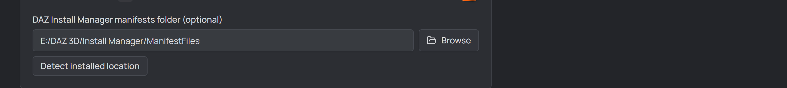
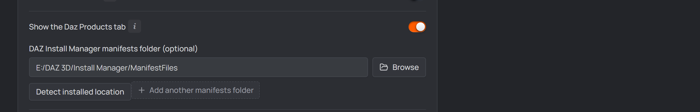
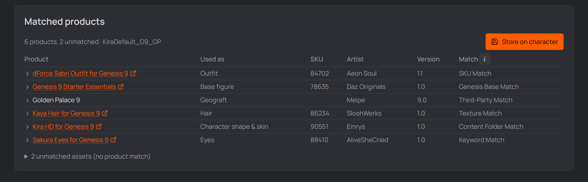

# Daz product scanning

Product scanning answers "**which Daz products does this character actually use?**"
— the studio analyses each scene as it exports it, matches the used assets to your
installed products, and files the result (product name, SKU, artist, version)
against the character. Useful for provenance, licensing notes, or rebuilding a
character later.

&nbsp;

> [!NOTE]
> It runs on its own and it never affects ROM generation. Nothing to start, and
> nothing to confirm afterwards.

&nbsp;

---

## Set the DIM manifests folder — that's the switch

**Usually already done.** Activating a Daz installation in
[Settings → General](./02-setup.md#daz-installation--pick-it-once) fills this
from DIM's own settings, and it then shows read-only there.

Otherwise set the **DAZ Install Manager manifests folder** in **Settings** — the
`ManifestFiles` folder DIM writes (a folder of `.dsx` files; see DIM → Advanced
Settings → "Download/Install"). **Detect installed location** auto-finds it.

That folder **is** the product database, so it is also what arms the scanning:
with it set, every export run scans the scene it just built and files the result.
With it empty, nothing is scanned — there would be nothing to match against.

- It's a **machine-wide** setting (shared by all projects).
- Scanning happens whether or not you look at it (see the tab toggle below).

  
   
  <em>The DIM manifests folder field with its Detect button.</em>

## Show the Products tab (per project)

**Settings → Project → Show the Daz Products tab** decides whether this project's
characters get a **Products** tab. It does not decide whether scanning happens:
every export run scans the scene it just built either way, so turning the tab on
later shows you results that were already collected. What it *also* switches off
is the two things you would start by hand — the per-character
[`Scan_Products_<Name>` script](#when-a-scan-happens) and the product pass in
Tools → Scan project.

  
   
  <em>The tab toggle in Settings → Project.</em>

---

## When a scan happens

- **Every ROM/export run** scans the scene it just built.
- [**Tools → Scan & index → Scan project**](./tools.md#tab-1--scan-amp-index)
  covers every scene of every character in one unattended batch.
- **By hand**, for a one-off scene: open the scene in Daz Studio and run
  **`Scan_Products_<Name>`** from the Content Library (installed beside the ROM
  script under `Scripts/DTH-Character-Studio/<Project>/<Character>/`, with its own
  Content Library tile like the ROM and Export scripts). The studio picks that up
  next time you open the character —
  or press **Check for new results** on the Products tab.

  That script is the one thing the **Products tab toggle** does decide besides the
  tab: with it off, the script isn't generated and
  [Tools → Scan project](./tools.md#tab-1--scan-amp-index) refuses its product
  pass. The scan that runs with every export is armed by the manifests folder
  alone, and keeps filing results regardless.

  A script's tiles are written when the character is **saved**, so a character you
  haven't touched picks its artwork up on the next Save — or all at once via
  [Tools → Refresh assets](./tools.md#tab-3--refresh-assets). Turning Daz Products
  off retires the tiles along with the script, rather than leaving artwork behind
  pointing at something that no longer exists.

&nbsp;

> [!NOTE]
> **Per-scene by design.** Each scene is filed separately and a re-scan replaces
> only that scene's entry, so scanning one outfit never disturbs the products
> you mapped for the others. The tab shows them merged, attributing each product
> to the scene(s) it appeared in.

&nbsp;

Matching tries the strongest signals first — the asset's own file, its
textures, SKU, product keywords — falling back to a content-library match for
manual installs without a DIM manifest (that's the **Match** column on the
Products tab).

Results are stored with the studio's other per-character files, in the project's
hidden `.dcsmeta/characters/<Character>/products.json`. They travel with the
project and go when you delete the character. The Daz-written CSVs are transport
only: they're parsed and deleted the moment the studio picks them up.

---

## Read the results (Products tab)

  
   
  <em>The matched products table on the character's Products tab.</em>

- **Scanned scenes** — one row per scene, with its counts and when it was last
  scanned. The panel below is these merged.
- **Matched products** — a table of **Product · Used as · SKU · Artist · Version ·
  Match** (with a per-scene filter when a character has several scanned scenes).
  Expand a row to see the exact assets behind the match. When the SKU is a Daz store
  id, the product name links to its Daz **product page**.
- **Unmatched** — a collapsible list of assets the scan couldn't tie to a product
  (still shown with artist/version from their own files). Common for hand-installed
  content.
- **Check for new results** — re-reads, picking up anything a manual Daz run left
  behind.
- **Clear** — throws the stored results away. The next export run rebuilds them.

## Gotchas

- **No DIM folder → no scanning at all.** That folder is the product database;
  without it there is nothing to match against.
- A product installed **outside DIM** matches by its content-library folder
  instead, so it has no SKU — the name and artist come from the content's own
  files.

[← Guide overview](./README.md)
