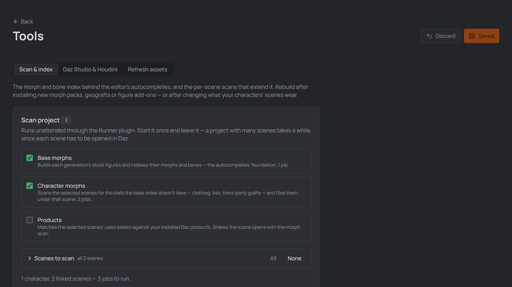
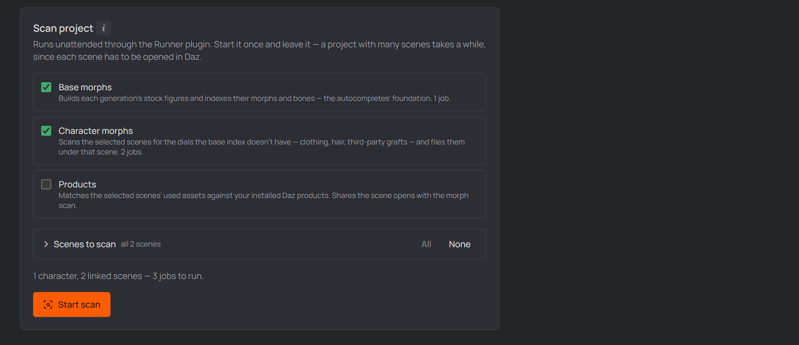
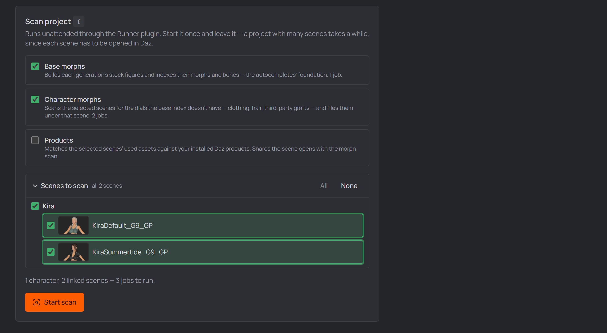
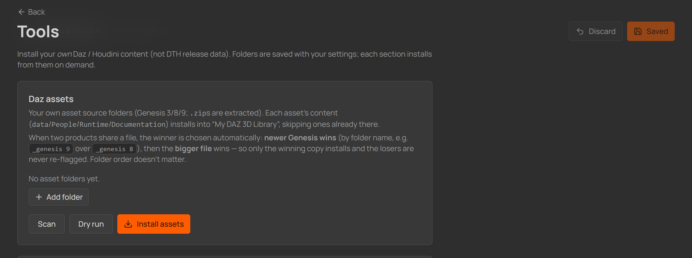
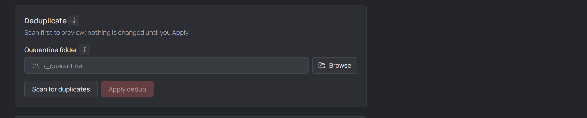
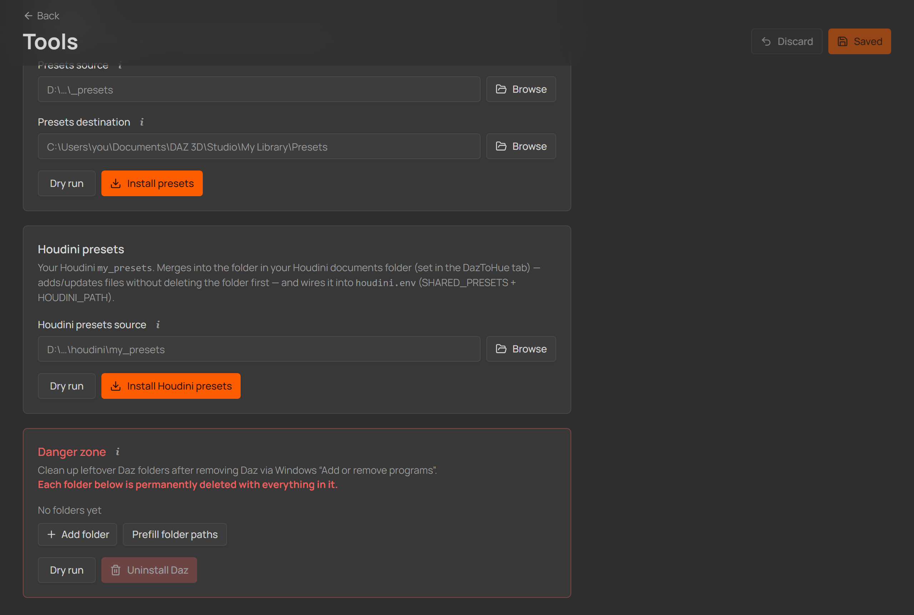
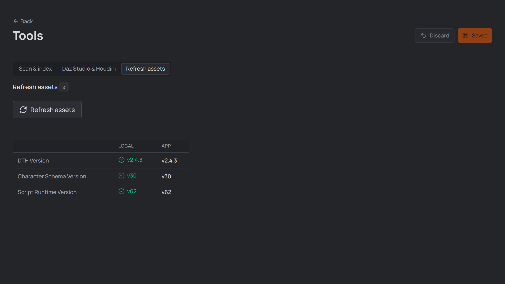

# The Tools page

The **Tools** page (top-right) is where you keep the studio's morph index
fresh, install and maintain *your own* Daz / Houdini content, and keep the
studio's generated files in sync. **Everything here
is optional** — you never need it to define a character and generate its ROM.
The [one-time setup](./02-setup.md) covered installing the DTH release +
Exporter; Tools is for the extras beyond that.

  
   
  <em>The Tools page and its tabs.</em>

&nbsp;

> [!NOTE]
> Everything the Daz side needs ships **with the studio** — the runtime and the
> visible scripts (`Build_Genesis_Index`, `Scan_Frames`,
> [`Fix_Graft_Shell_Surfaces`](./05-rom-in-daz.md#geografts-under-a-golden-palace--dicktator-shell),
> [`Kill_Animation`](./05-rom-in-daz.md#rescuing-an-old-scene-that-is-only-a-rom-animation))
> install into `Scripts/DTH-Character-Studio` automatically on Save / Refresh
> assets. There is no separate scripts download anymore.

&nbsp;

---

## Tab 1 — Scan & index

The morph and bone index behind the editor's autocompletes, and the per-scene
scans that extend it.

### Scan project

One pass over everything a project can be scanned for. Tick what you want,
press **Start scan**, and leave it — the studio hands Daz Studio a single batch
and works through it unattended, reporting progress on the button. The batch
goes through the
[**Runner plugin**](./02-setup.md#daz-studio-plugins),
so Start stays off until the Runner is installed and **My DAZ 3D Library** is
set in [Settings](./02-setup.md).

  
   
  <em>The Scan project panel: tick the passes, press Start scan, leave it.</em>

- **Base morphs** — builds each generation's stock figures and indexes their
  morphs and bones (exactly what
  [`Build_Genesis_Index`](./04-first-character.md#the-rom-definition) does). One
  job. It runs **first**, because the scene scans below filter themselves
  against it.
- **Character morphs** — opens every linked Daz scene of every character and
  indexes the dials the base index *doesn't* have: fitted clothing, hair,
  third-party geografts and add-ons. Each find is filed under the scene it was
  found in. One job per scene. A scene scan **needs** the base index of its
  generation — it works out what a scene adds by subtracting it — so with no
  base index the scan **stops and says so** rather than filing the entire stock
  figure as this scene's contribution. Build **Base morphs** first and nothing
  is lost: the next ROM or export run scans the scene by itself.
- **Products** — runs the [Daz Products scan](./product-scanning.md) for the
  same scenes. Available once a **DAZ Install Manager manifests folder** is set
  (**Settings**) — that folder is what the scan matches against. It shares the
  scene opens with the morph scan, so ticking both costs no extra time.

**Scenes to scan** — the two scene passes default to every linked scene, but
each one is a full Daz open, so a big project is a long run. Expand the list to
tick exactly what you want (per scene, or a whole character at once); **All** /
**None** are there for the extremes. The job count updates as you pick, so you
can see what you're committing to before you press Start. The picker governs
both scene passes together — a scene is opened once and runs whichever scans it
is due for. Scenes whose `.duf` is missing on disk are listed struck through and
never enqueued.

  
   
  <em>The expanded scene picker: a tri-state box per character, a card per scene.</em>

Because each scene has to be opened in Daz, a project with many scenes takes a
while — that's the point of it being one unattended run. While the batch is
still waiting for Daz to pick it up you can **Abort** it; once Daz has claimed
it, the run belongs to Daz.

Reached from the **Home** window (no project open), the two scene passes are
disabled and **Base morphs** runs on its own — that pass belongs to no project.

> [!NOTE]
> **Why scene morphs are scoped to their scene.** Two outfits in two different
> scenes both have an *Expand All* dial. Before, the autocomplete offered both
> and you had to know which was which. Now a scene-scanned morph is only
> suggested while **that** scene is the one selected in the character editor,
> marked with a small **this scene** badge. Morphs the base figure carries are
> always offered. Re-scanning a scene *replaces* what it contributed, so
> clothing you removed stops being suggested. You rarely have to re-run this
> by hand: every ROM/export run re-scans the scene it just built, so a scene's
> suggestions follow what it actually wears.

---

## Tab 2 — Daz Studio & Houdini

Install your **own** Daz / Houdini content (not DTH release data). Each section
remembers its folders in Settings and installs from them on demand. **Dry run**
everywhere previews without writing.

### Daz assets

Point it at your **asset source folders** (e.g. per-Genesis download folders;
`.zip`s are extracted). Each asset's content (`data` / `People` / `Runtime` /
`Documentation`) installs into "My DAZ 3D Library", **skipping what's already
there**. When two products ship the same file, the winner is picked
automatically — **newer Genesis wins** (by folder name), then the **bigger
file**. **Scan** lists what's found; **Install** copies only what changed.

  
   
  <em>The Daz assets install section.</em>

### Deduplicate

Finds **duplicate assets** (a folder and its identical `.zip`, or the same
product at two versions) and **conflicting shared files** (the same file
shipped by two products at different sizes). **Scan** previews; nothing changes
until you **Apply**. Apply only **quarantines** the redundant copies — it
*moves* them to a **Quarantine folder** you set, so it's reversible (pick one
*outside* your asset sources, and empty it yourself in Explorer once you're
sure). Shared-file conflicts are **never rewritten** — that would edit an
author's download — you **Accept** them instead, which tells the scan they're
legitimately shared. Store "wrapper" downloads (a zip inside a zip) are looked
inside automatically.

  
   
  <em>The Deduplicate section for redundant and conflicting assets.</em>

### Custom morphs · Daz presets

Two **merge-only** installs (add new files, never overwrite your edits): custom
morphs made with Daz's Transfer Shape Utility (source → your library's
`data/Daz 3D`), and your Daz presets.

### Houdini presets

Merges your Houdini `my_presets` into your Houdini documents folder and wires it
into that version's `houdini.env` (`SHARED_PRESETS` + `HOUDINI_PATH`).

### Danger zone

&nbsp;

> [!CAUTION]
> After you uninstall Daz Studio / DIM via Windows "Add or remove programs", leftover
> folders remain. This **permanently deletes** each listed folder recursively. Use
> **Prefill folder paths** to add the standard Daz locations, edit the list, and
> **always Dry run first**. As a safety rail the studio refuses to delete a
> drive/profile root or any folder that isn't Daz-owned.

&nbsp;

  
   
  <em>The Danger zone for removing leftover Daz folders.</em>

---

## Tab 3 — Refresh assets

Re-generates the Daz scripts and PoseAsset CSVs so every generated file matches
the **current** studio/runtime version, migrating definitions saved by an older
studio first (your ROM content is preserved). Run it after **updating the app**
or **switching DTH release**. It covers **every known (recent) project**, no
matter which window you run it from; problems per character are listed inline,
and the button pulses orange when a refresh is due. It also cleans up after
older versions — e.g. the `dth-exports` shortcut links (NTFS junctions) they
kept beside Houdini projects are removed, reported as *removed N leftover
dth-exports junction(s)*; real folders are never touched. **Ctrl+click Refresh** also
rebuilds every character's stored **avatar** from its pristine source — needed
once after an update that changes the avatar pipeline.

The detection table compares three versions, Local (your files) vs App (what
this studio generates):

- **DTH Version** governs the Houdini **PoseAsset CSV** — the only artifact
  tied to the DTH release. It's pinned to the release's CSV *era*, so a
  non-breaking release update (e.g. 2.4.3 → 2.4.4) stays current; only a
  release that changes the CSV format marks it out of date, and the CSV is
  then regenerated.
- **Character Schema Version** governs the **character definition** (its
  `.json`). A newer version means the stored shape changed: the definition is
  migrated and re-saved — and, since a migration can change generated output,
  its Daz scripts and PoseAsset CSV are regenerated too.
- **Script Runtime Version** governs the generated **Daz scripts** (the ROM /
  Export `.dsa`) and the shared **DTH runtime files**. A newer version means
  the runtime's call API changed, so the runtime files are reinstalled and
  every character's scripts regenerated.

  
   
  <em>The Refresh assets tab.</em>

[← Guide overview](./README.md)
